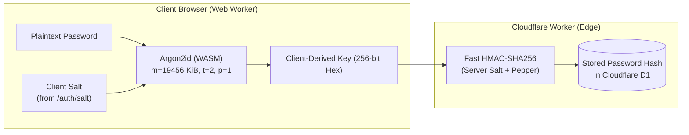

# Client-Side Password Derivation Architecture (R108, R5, R6)

## Overview & Threat Model

SightForge employs **in-browser cryptographic password hardening** via Argon2id WebAssembly running inside a dedicated Web Worker thread prior to network transmission.

This document details the engineering rationale, security threat model, and platform constraints governing this design.

---

## The Platform Constraint

In traditional server-side password authentication, the client sends the plaintext password over TLS to a backend service, which executes computationally heavy password-hashing functions (such as Argon2id with 19–64 MiB memory allocations).

SightForge's API runs serverlessly on **Cloudflare Workers**, which enforces:

1. **CPU Time Limit:** 10–50ms maximum CPU execution per subrequest on the Free/Standard tiers.
2. **Memory Bounds:** Workers run within lightweight V8 isolates where allocating 20–64 MiB of memory per request for Argon2id hashing risks isolate eviction and CPU quota exhaustion.

Running standard Argon2id on Cloudflare Workers would result in:

- Rapid execution timeouts (HTTP 504 / 1101).
- Complete CPU exhaustion under modest traffic.
- Degraded service availability.

---

## The Solution: Split Two-Tier Key Derivation

1. **Tier 1 (Client-Side Hardening - R5, KTD6):**
   - The browser executes **Argon2id** (`m=19456 KiB`, `t=2`, `parallelism=1`) in WebAssembly inside a Web Worker.
   - The client derives a 256-bit cryptographic key (`clientDerivedKey`).
   - The plaintext password **never leaves the browser** and is discarded from memory immediately after computation.

2. **Tier 2 (Edge Verification - R7, KTD13):**
   - The Cloudflare Worker receives the high-entropy `clientDerivedKey`.
   - The edge hashes it in sub-millisecond CPU time using `HMAC-SHA256` with a unique `serverSalt` and secret `pepper`.
   - Stored in Cloudflare D1 database.

---

## Defenses & Mitigations

### 1. Anti-Enumeration Constant-Time Salting (R6, AE1)

- When a user enters an email address on `/signin`, the client queries `GET /auth/salt?email=...`.
- If the email is **registered**, the server returns the user's assigned `clientSalt`.
- If the email is **unregistered**, the server returns a deterministic pseudo-salt derived as `HMAC-SHA256(pepper, "sightforge-pseudo-salt:" + canonicalEmail)[0..32]`.
- Both responses return in constant time with identical payload sizes and data structures, preventing username enumeration.

### 2. Anti-Downgrade Parameter Floor (R6)

- An attacker controlling intermediate proxies or attempting downgrade attacks cannot force the client to use weak Argon2 parameters.
- The client enforces a strict hardcoded security floor:
  - `memoryKiB >= 19456`
  - `iterations >= 2`
  - `parallelism >= 1`
  - `version === "0x13"`
- If any parameter falls below this floor, derivation aborts before any computation begins.

### 3. Worker-Thread Isolation (KTD6)

- Cryptographic derivation runs inside a Web Worker thread, ensuring:
  - The main UI thread does not freeze or drop animation frames during the 1.5s–4s derivation period.
  - The user interface provides honest progress feedback (_"Securing your password in your browser..."_).
  - Plaintext password strings are strictly confined to the worker closure and never exposed to React component state.

### 4. Session Storage Containment

- Session tokens (`sightforge_access_token` and `sightforge_refresh_token`) are delivered via `HttpOnly`, `Secure`, `SameSite=Lax` cookies.
- No tokens, keys, or credentials are stored in `localStorage` or `sessionStorage`, eliminating exposure to XSS token theft.
