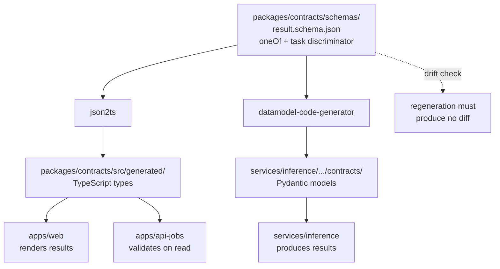
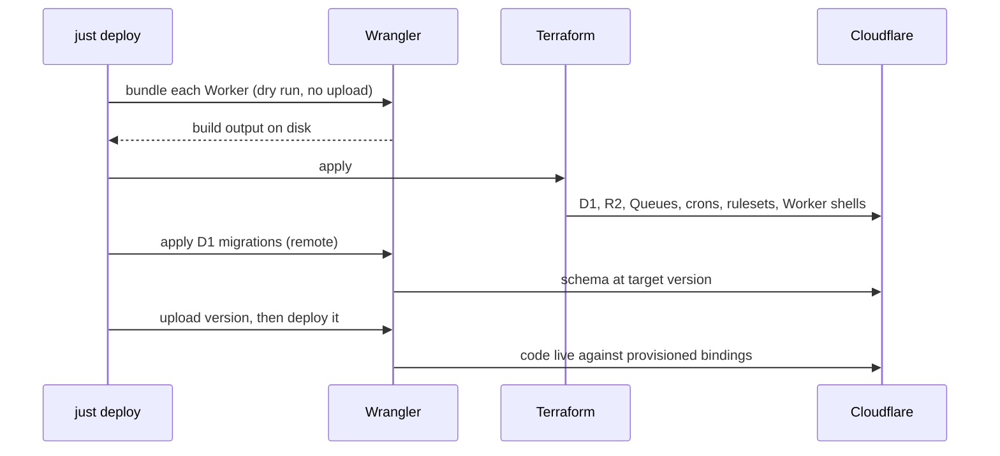

# SightForge Foundation and Contracts - Plan

## Goal Capsule

- **Objective:** The Edge API, the inference service, and the frontend each have provisioned infrastructure, a shared data contract, and a database schema to build against — so that three independent workstreams can start without inventing interfaces or waiting on each other.
- **Means:** A pnpm-plus-uv polyglot monorepo, Terraform-managed Cloudflare resources in one production account, and a JSON Schema contract that generates both TypeScript and Pydantic types (KTD1, KTD6).
- **Requirement fidelity:** Requirement text is quoted from the origin verbatim; a trailing italic clause marks a split and names the remainder's owner.
- **Product authority:** Plan 1 of an agreed 5-plan split deriving from `docs/requirements/2026-08-29-1050-sightforge-cv-platform-requirements.md`. That artifact stays `requirements-only` because plans 2 through 5 still bind to it; this plan does not enrich it in place.
- **Stop conditions:** Stop and ask before spending money on any paid tier, before adding a second deployed environment, and before changing any requirement's meaning in the origin document.
- **Tail ownership:** This plan ends when the deployment sequence runs end to end against the production account and produces empty-but-live resources. Wiring behavior into them belongs to plans 2 through 4.

---

## Product Contract

### Summary

Provision the single production Cloudflare account, define every resource in Terraform, establish the D1 schema, and publish the seven-task result contract as generated TypeScript and Pydantic types — plus the monorepo toolchain all three downstream plans build inside.

### Problem Frame

Three workstreams — the Edge API, the inference service, and the frontend — are each blocked on the same three things: infrastructure that exists, a database whose shape is agreed, and a result format both Python and TypeScript understand identically. Built independently, each would invent its own version, and the seven task shapes would drift across two languages with nothing to catch it.

The contract is the sharpest of the three. Python produces the inference results and TypeScript renders them, across seven task types with genuinely different shapes. Hand-maintaining parallel type definitions means fourteen places to make the same change, with drift surfacing as a runtime rendering failure rather than a compile error.

### Key Decisions

Carried forward from the origin Product Contract, which owns their full statements:

- **Production is the only deployed environment.** Governs origin R119.
- **Workers are TypeScript; Python is confined to the inference service.** Governs origin R120.
- **SightForge owns a dedicated Cloudflare account.** Governs origin R1, R3.
- **Terraform manages only non-secret resources.** Governs origin R75, R80.

### Requirements

Requirement IDs are preserved from the origin document. This plan advances the subset below; every other requirement belongs to plans 2 through 5.

#### Platform and account topology

R1. SightForge runs in a Cloudflare account dedicated to it alone, created under the operator's existing login.

R2. Free-plan ceilings are treated as design constraints, recorded in the repository, and monitored against approach.

R3. Every Cloudflare resource carries a `sightforge-` name prefix and an environment suffix, and the Worker set is exactly: `web`, `api-auth`, `api-jobs`, `events`, `scheduler`, plus two Durable Object classes — `JobRoom` for per-job live state and `Counter` for the per-subject rate-limit and quota counters. _The classes themselves are written by plan 2; this plan ships exported stubs so the bootstrap migration has a target._

R119. Production is the only deployed environment; development runs locally against the platform's local emulation, with infrastructure state keyed by environment from the outset.

R120. Workers are written in TypeScript and the inference service in Python. No Worker is written in Python, because the Python Workers runtime is an interpreter compiled to WebAssembly that shares the 128 MB isolate and costs more CPU per unit of work than the 10 ms budget affords.

#### Data contract and schema

R26. State transitions are written as a single D1 `batch()` call, because D1 rejects `BEGIN TRANSACTION` and `exec()` provides no rollback. This plan encodes the constraint in the schema package's documented usage, not in Worker code.

R51. Every result document carries a schema version so the viewer can render older results after the shape evolves. _Version handling in the viewer is plan 4._

R52. Result documents for tracking mode are structured by track identity rather than as a flat per-frame list, so the payload remains navigable at hundreds of frames.

#### Secrets and configuration

R75. No secret value is committed to source, embedded at build time, or persisted to Terraform state.

R76. Secrets are injected out of band by CI after infrastructure apply, using the platform-native secret mechanism on each side.

R77. The repository documents a secret inventory naming every secret, its consumer, its least-privilege scope, its rotation procedure, and its injection path. The object-storage signing credential and the credentials issued to the inference service are scoped to a single environment's bucket with only the operations each side performs, so a disclosure does not bypass per-object ownership checks. _The scoping of the media-bucket signing credential and the inference credentials is enforced by plan 2, which issues them._

R78. Every operational value is configurable without a code change, with defaults declared in one place. This plan establishes that one place; later plans populate it.

#### Infrastructure as code

R24. An R2 lifecycle rule expires incomplete multipart uploads, and expires any object past a single conservative maximum age as a backstop independent of application logic. The rule matches on key prefix and object age only, because lifecycle rules cannot read object metadata or application state and the key is fixed at presign before validation status or job outcome exists.

R79. Terraform declares every Cloudflare resource whose lifecycle it can own: Worker shells, routes, D1, R2 with CORS and lifecycle rules, Queues, cron triggers, and rulesets. Two exclusions are recorded with their reasons rather than left implicit. Worker bindings are declared in each Worker's own deployment config, because the provider attaches bindings to the code version rather than the shell, so anything Terraform declared would be superseded by the next deploy. The Turnstile widget is created out of band, because the provider returns its secret key as a computed attribute that would otherwise be persisted to state, contradicting R80.

R80. Terraform declares no secret values; it manages resource existence and non-sensitive configuration only.

R81. Worker bundling is performed by Wrangler before Terraform applies, because the provider uploads module content verbatim rather than building it.

R82. Terraform state is held in a remote backend with locking, and the chosen backend is reachable at zero cost.

R84. A documented bootstrap procedure covers the resources that must exist before the first Terraform apply, including account creation and the state backend itself.

#### Repository

R106. The monorepo contains the frontend, the Worker packages, the Modal function package, shared utilities, Terraform configuration, test suites, CI definitions, container definitions, documentation, and development tooling. This plan creates the structure; later plans populate it.

R107. The repository is published under AGPL-3.0, and the running site links prominently to its source, satisfying the network-use obligation that the chosen model family carries. The repository records which packages inherit that obligation through the inference dependency and which carry the license by the author's election. _The rendered source link is plan 5._

### Scope Boundaries

#### Owned by later plans

- Worker business logic, authentication, and the job lifecycle — plan 2.
- Modal inference code, the model adapter, and video processing — plan 3.
- The frontend, its seven visualizations, and accessibility — plan 4.
- CI/CD workflows, observability, alerting, and the architecture document (R113) — plan 5.

#### Deferred to Follow-Up Work

- A second deployed environment. State is keyed by environment so this stays additive.
- Contract evolution tooling. R51 requires a version field; migration between versions is not needed until a second version exists.

### Sources

- Origin Product Contract: `docs/plans/2026-08-29-1050-feat-sightforge-cv-platform-plan.md`.
- Cloudflare's infrastructure-as-code guidance establishes the Wrangler-bundles-then-Terraform-applies ordering and the Durable Object bind-before-deploy constraint that U4 and U6 encode.
- HashiCorp's stated position that workspaces are inappropriate for deployments requiring separate credentials rules out the workspace pattern for environment separation.
- Cloudflare's D1 documentation establishes that `BEGIN TRANSACTION` is rejected and `batch()` is the transaction primitive, which shapes how U3 documents schema usage.

---

## Planning Contract

### Key Technical Decisions

KTD1. **JSON Schema is the single source of truth for the seven result shapes**, using `oneOf` with a `task` discriminator. It is the only format both generators consume natively — `datamodel-code-generator` for Pydantic and `json2ts` for TypeScript. Zod-as-source is the runner-up and stays viable because Zod 4 can emit JSON Schema natively, but it would make the TypeScript side authoritative over a contract the Python side must satisfy equally. Governs R51.

KTD2. **Generated type files are committed to the repository**, with a CI check that regeneration produces no diff. A schema change becomes visible in review, and neither generator has to be installed wherever the types are consumed — including inside the Modal container image. (session-settled: user-approved — chosen over build-time generation: generated-file diffs are an acceptable cost for review visibility and one fewer build-time dependency.)

KTD3. **Terraform, not OpenTofu.** The BUSL licensing difference does not reach a solo project, and Terraform carries the wider example surface plus `hashicorp/setup-terraform` as the documented CI path. OpenTofu's native state encryption is the one real advantage, and it matters less here because Terraform manages no secret values at all (R80).

KTD4. **Remote state on R2 through the `s3` backend with `use_lockfile = true`.** Keeps the vendor count at one and costs nothing. R2 implements the conditional-write primitive that native S3 locking requires and returns `412 PreconditionFailed`, but no source confirms an end-to-end lock conflict against R2 — so U5 verifies it explicitly rather than assuming it. HCP Terraform's free tier is the named fallback if verification fails.

KTD5. **`packages/db` owns the schema and migrations, not any Worker.** Four Workers write to one database, so there is no single owning consumer. A dedicated Wrangler config in that package exists solely to point migration commands at the database.

KTD6. **pnpm workspaces for TypeScript, uv for Python, on disjoint subtrees.** `apps/*` and `packages/*` are claimed by pnpm; `services/*` holds Python and is claimed by uv. Keeping the globs non-overlapping means neither tool needs an exclusion rule. A thin Turborepo config earns its place for dependency-ordered fan-out across Workers, not for caching.

KTD7. **Terraform owns resources; each Worker's own deployment config owns its bindings, and Wrangler owns script content.** Terraform declares the Worker shell with `lifecycle { ignore_changes = [content] }`, because a deploy uploads a new version and a subsequent plan would otherwise want to revert it — leaving the sequence permanently non-convergent. The provider attaches bindings to a Worker _version_, not to the shell, and the version is what Wrangler uploads — so a binding declared in Terraform is superseded by the next deploy and can never converge. Terraform therefore declares the resources a binding points at, and each Worker declares which of them it binds. The provider also cannot bundle, so a build step precedes every apply. Governs R79, R81.

KTD8. **Shared Worker code ships as unbuilt TypeScript source.** An internal package exporting `./src/*.ts` directly is bundled by Wrangler's esbuild with no build step, which removes an entire ordering problem from local development. The constraint this accepts is that such packages cannot use TypeScript path aliases.

KTD9. **The Durable Object bind-before-deploy cycle is resolved once, by hand, at bootstrap.** A Durable Object binding cannot exist in a Worker version before a deployment exists, and the documented workaround is four edits, not two: comment out the binding block, apply, then uncomment the binding and comment out the migrations block, and apply again. Encoding that in automation would make every future apply carry a one-time problem.

KTD10. **Shared operational defaults live in plain JSON, read directly by both languages.** R78 requires one declaration point, and both TypeScript and Python must read it — so the file carries no comments, since Python's standard library cannot parse them. A generated TypeScript type comes from the same pipeline as the result contract (KTD2), giving the Workers type safety over values Python reads structurally. Governs R78.

KTD11. **Dense per-pixel outputs are stored as one packed artifact per job, referenced by key, never embedded in the result JSON.** Semantic segmentation and depth estimation produce a value per pixel; at inference resolution that is hundreds of thousands of numbers, which as JSON would dwarf every other payload and defeat the raw-result inspector. One packed artifact per job — not one per frame — because a 30-second clip at 10 fps would otherwise be 300 objects, and a single artifact keeps the write grant, the retention sweep, and the viewer fetch to one key each. Encodings are named rather than left open: 8-bit indexed PNG for class maps, 16-bit PNG for depth with the scale factor and unit carried in metadata. Those two branches carry an artifact key, dimensions, frame count, and encoding metadata; the other five carry their instances inline.

### High-Level Technical Design

The contract flows one way, from a single schema to two generated languages:



Deployment is a fixed four-step order, because each step produces something the next one needs:



### Assumptions

- The operator's Cloudflare login has at least seven days of tenure and fewer than five accounts, which the dashboard requires before creating another free account.
- A Cloudflare API token can be scoped to the account and the specific product permissions needed. Per-Worker scoping does not exist, so the token reaches every Worker in the account — acceptable because the account holds only this project.
- Drizzle Kit generates migrations that `wrangler d1 migrations apply` consumes without modification. If the two disagree on file layout, the migration configuration is adjusted rather than the schema definition.

### Sequencing

U1 establishes the workspace that every other unit writes into. U2 and U3 are independent of each other and can proceed in parallel once U1 lands. U4 is manual and gates U5. U6 requires U1, U3, U4, and U5, and is the unit that proves the plan.

### Risks and Dependencies

- **State locking against R2 is unverified end to end.** U5 verifies it as an explicit step. If it fails, the fallback is HCP Terraform's free tier, which changes only the backend block.
- **The Cloudflare Terraform provider's Worker resources are marked beta.** The plan uses them for resource shells only, with Wrangler owning versions and deployment, which limits exposure to the shell definition.
- **Generated contract code can drift if regeneration is skipped.** The drift check in U2 is the control; without it, committing generated files is strictly worse than generating at build.
- **The contract is committed before its consumers exist.** Plans 2 through 4 are the first code to actually use these shapes, so a shape that reads well on paper may prove awkward in a renderer or a Pydantic model. The schema version field (R51) is the release valve, and the seven fixtures written in U2 are the early warning — a shape that is hard to write a realistic fixture for is usually the wrong shape.

### System-Wide Impact

Four downstream plans inherit decisions made here, and each inheritance is a place a mistake propagates rather than staying local:

- **Every plan inherits the workspace boundary.** The disjoint `apps`/`packages` versus `services` split (KTD6) determines where each plan's code can live and which tool installs it. Moving that boundary later means moving every package.
- **Plans 3 and 4 inherit the result contract.** The inference service must produce exactly what the frontend renders, and the dense-versus-inline split (KTD11) shapes both the renderer and the inference writer. A contract change after those plans start costs work in two languages at once.
- **Plan 2 inherits the schema and its transaction constraint.** Idempotency, refresh-token rotation, and job state transitions are all expressible only because of constraints and indexes created here, and all of them must be written as batched statements (R26).
- **Plan 5 inherits the deployment sequence.** The CI pipeline wraps the same four steps U6 establishes; if the ordering is wrong here, it is wrong in automation too.
- **Everything inherits the account boundary.** One free account means one shared pool of every quota. A later decision to add an environment is additive only because state is keyed by environment from the start (R119).

---

## Open Questions

### Deferred to Planning (plan 2)

- The exact index set on the jobs table beyond the origin document's stated lookup patterns. Plan 2 writes the queries; adding an index is a migration, and an unused index costs a write per insert against the daily row budget.

### Deferred to Planning (plan 5)

- Whether the contract drift check runs on every pull request or only when schema files change. Plan 5 owns CI and the path-filter shape.

---

## Output Structure

```text
sightforge/
├── apps/                            # TypeScript workspace (pnpm)
│   ├── web/                         # created empty in U1, built in plan 4
│   ├── api-auth/                    # created empty in U1, built in plan 2
│   ├── api-jobs/
│   ├── events/
│   └── scheduler/
├── packages/
│   ├── contracts/
│   │   ├── schemas/                 # JSON Schema — the source of truth
│   │   ├── src/generated/           # committed TypeScript output
│   │   └── package.json
│   ├── db/
│   │   ├── src/schema.ts            # Drizzle schema
│   │   ├── migrations/              # generated SQL
│   │   ├── drizzle.config.ts
│   │   └── wrangler.jsonc           # migration commands only
│   ├── worker-kit/                  # created empty in U1, built in plan 2
│   └── ui/                          # created empty in U1, built in plan 4
├── services/                        # Python workspace (uv)
│   └── inference/
│       ├── src/sightforge_inference/contracts/   # committed Pydantic output
│       └── pyproject.toml
├── infra/
│   ├── terraform/
│   │   ├── modules/worker/
│   │   └── environments/prod/
│   └── scripts/
├── docs/
│   ├── runbooks/bootstrap.md
│   ├── secrets.md
│   └── adr/
├── config/defaults.json             # the one place R78 names
├── pnpm-workspace.yaml
├── turbo.json
├── justfile
├── lefthook.yml
├── tsconfig.base.json
├── .editorconfig
├── .gitattributes
├── LICENSE                          # AGPL-3.0
└── README.md
```

---

## Implementation Units

### U1. Monorepo scaffolding and toolchain

- **Goal:** A workspace that installs cleanly and gives every later unit a place to write into.
- **Requirements:** R78, R106, R107, R120.
- **Dependencies:** none.
- **Files:** `pnpm-workspace.yaml`, `package.json`, `turbo.json`, `tsconfig.base.json`, `justfile`, `lefthook.yml`, `.editorconfig`, `.gitattributes`, `.gitignore`, `LICENSE`, `README.md`, `config/defaults.json`, `docs/adr/`, for each of the five Workers a minimal `apps/<worker>/src/index.ts` placeholder and an `apps/<worker>/wrangler.jsonc` carrying its name, compatibility date, and route or trigger only — bindings and secrets are added by plan 2, so the two plans never write the same field; exported stub `JobRoom` and `Counter` classes so the bootstrap migration has a target; `packages/` scaffolds; root `pyproject.toml` with a uv workspace table and `uv.lock`; `services/inference/pyproject.toml`.
- **Approach:**
  1. Claim `apps/*` and `packages/*` in the pnpm workspace and leave `services/*` unclaimed, so uv owns the Python subtree without an exclusion rule (KTD6).
  2. Keep the Turborepo config thin — build, typecheck, test, deploy — with no remote caching.
  3. Make `just` the single task entry point; every recipe delegates rather than reimplementing.
  4. Set `.gitattributes` line-ending normalization explicitly, since the development machine is Windows and `.editorconfig` does not govern what Git stores.
  5. Give every Worker a placeholder entry module and a deployment config from the start, because the deployment sequence has nothing to bundle otherwise, and because each config is the authority for that Worker's bindings (KTD7).
  6. Add a pinned secret-scanning hook alongside the formatting hooks, so a public repository has a local credential gate from its first commit rather than from plan 5.
  7. Record in the README which packages inherit AGPL through the inference dependency and which carry it by election (R107).
- **Patterns to follow:** the `apps/` plus `packages/` layout used by Cloudflare's own multi-Worker repositories, with Python held apart under `services/`.
- **Test expectation:** none — scaffolding with no behavior. Verification is smoke-level.
- **Verification:** a clean install succeeds from the repository root; the task runner lists its recipes; the hook manager runs a no-op pre-commit pass; both workspace managers resolve without claiming each other's directories.

### U2. Result contract package

- **Goal:** One schema defines the seven result shapes, and both languages get types generated from it that cannot silently diverge.
- **Requirements:** R51, R120.
- **Dependencies:** U1.
- **Files:** `packages/contracts/schemas/`, `packages/contracts/src/generated/`, `packages/contracts/package.json`, `packages/contracts/test/`, `services/inference/src/sightforge_inference/contracts/`.
- **Approach:**
  1. Define a common envelope carrying schema version, task, model variant, source frame rate, sampled frame rate, frames processed, and timing — then a `oneOf` over seven task-specific payloads discriminated by `task`.
  2. Model detection, instance segmentation, and oriented bounding boxes as instance lists; pose as instances with keypoints; classification as a ranked label list; semantic segmentation and depth as dense per-pixel outputs with no instance array.
  3. Model tracking results as a distinct branch keyed by track identity — a collection of tracks, each carrying its own ordered per-frame observations — not a flat per-frame list with an optional identifier. R52 requires this, and three downstream plans read, render, and group by track; a flat list would force every one of them to invert it.
  4. Model the two dense branches as a reference to one packed artifact per job — object key, width, height, frame count, encoding, and for depth the unit, scale factor, and value range — rather than an inline array or one object per frame (KTD11).
  5. Generate TypeScript and Pydantic into their respective packages and commit both (KTD2).
  6. Add a drift check that regenerates and fails on any diff.
- **Technical design:** directional only — the discriminator is what lets a single parse narrow to one of seven shapes in both languages, so it must be a required literal on every branch rather than inferred from which optional fields are present.
- **Test scenarios:**
  - A valid fixture for each of the seven tasks validates against the schema.
  - A document whose `task` value is absent is rejected.
  - A document whose `task` says detection but whose payload carries a depth map is rejected.
  - A document missing the schema version field is rejected. Covers R51.
  - A tracking-mode detection fixture carrying track identifiers validates; the same fixture with track identifiers on a classification result is rejected.
  - A depth fixture referencing an artifact key with dimensions and unit metadata validates; the same fixture with an inline pixel array is rejected.
  - A semantic-segmentation fixture omitting its artifact key is rejected.
  - Regenerating types from an unmodified schema produces no diff.
  - The generated Pydantic model and the generated TypeScript type each round-trip the same fixture without loss.
- **Verification:** every task fixture validates; the drift check passes on a clean tree and fails when the schema is edited without regeneration.

### U3. Database package

- **Goal:** The D1 schema exists, is versioned as migrations, and documents the transaction constraint every consumer must respect.
- **Requirements:** R26.
- **Dependencies:** U1.
- **Files:** `packages/db/src/schema.ts`, `packages/db/drizzle.config.ts`, `packages/db/migrations/`, `packages/db/wrangler.jsonc`, `packages/db/test/`, `packages/db/README.md`.
- **Approach:**
  1. Define four tables — users, jobs, refresh tokens, and idempotency keys — with the indexes the origin document's lookup patterns require.
  2. Give the users table a unique email, the account's client-derivation salt, the recorded derivation parameters the salt endpoint returns, the server-side random salt, and the stored fast hash — so the cost can be raised later without a forced reset.
  3. Give refresh tokens a hashed-token column with a unique index as the lookup key, an owner reference cascading on account deletion, issued-at and expires-at timestamps, a family identifier, and a consumed marker — so reuse detection can revoke a whole family in one statement and the sweep has an expiry to reap against. No column ever holds a presented token verbatim.
  4. Put a unique constraint on the idempotency key scoped by user, since that constraint is what makes lock acquisition a single atomic insert rather than a read-then-write.
  5. Document in the package README that `batch()` is the only transaction primitive and that an indexed insert costs two writes against the daily row budget (R26).
  6. Keep the Wrangler config in this package minimal — a database binding and a migrations directory, used only by migration commands (KTD5).
- **Patterns to follow:** one migration per commit, which avoids a known ordering issue when multiple migration files land together.
- **Test scenarios:**
  - Migrations apply cleanly to an empty local database.
  - Migrations are idempotent — a second application is a no-op.
  - Covers AE5. Inserting a duplicate idempotency key for the same user violates the unique constraint; the same key for a different user succeeds.
  - Covers AE6. Revoking a refresh-token family updates every token sharing the family identifier in one statement.
  - A job row round-trips every status value in the origin document's state model.
  - Each declared index exists after migration.
- **Verification:** migrations apply to a fresh local database and produce the expected table and index set; constraint tests fail when a constraint is removed.

### U4. Account bootstrap and secret inventory

- **Goal:** The production account, its state backend, and its credentials exist and are documented well enough to recreate.
- **Requirements:** R1, R2, R3, R75, R76, R77, R84, R119.
- **Dependencies:** U1.
- **Files:** `docs/runbooks/bootstrap.md`, `docs/secrets.md`, `infra/scripts/`, `config/defaults.json`.
- **Approach:**
  1. Create the dedicated free account and record its identifier as non-secret configuration.
  2. Create the R2 bucket that holds Terraform state before any Terraform runs, since the backend cannot provision itself. Create it private, with no public development URL, no custom domain, and no CORS policy, and classify its contents as secret material.
  3. Issue an R2 access key scoped to object read and write on the state bucket alone. The account API token cannot substitute for it, and without this key the first `init` cannot run.
  4. Create the Turnstile widget by hand and record its secret key in the inventory, because Terraform would persist that key to state (KTD7, R79).
  5. Create the Modal workspace, issue its proxy-token pair, and record both in the inventory. Plan 2 verifies its trigger against a minimal echo endpoint in this workspace and plan 3 deploys the real App into it; neither can provision it, so bootstrap does.
  6. Issue an API token scoped to the account with only the product permissions the apply needs, and record in the inventory that per-Worker scoping does not exist.
  7. Write the secret inventory: every secret, its consumer, its least-privilege scope, its rotation procedure, and its injection path (R77).
  8. Record the free-plan ceilings in the repository as the design constraints they are (R2).
  9. Document the one-time Durable Object bind-before-deploy sequence as all four edits, explicitly marked as never belonging in automation (KTD9).
  10. State that the runbook records permission scopes, procedures, and non-secret resource identifiers only — never the operator's login address, recovery codes, or token identifiers.
- **Execution note:** this unit is largely manual. The deliverable is a runbook someone could follow to recreate the account from nothing, not a script.
- **Test expectation:** none — manual provisioning. Verification is documented outcomes.
- **Verification:** a reader following the runbook alone reaches a state where the next unit's Terraform can plan successfully; no secret value appears anywhere in the repository.

### U5. Terraform root and Worker module

- **Goal:** Every Cloudflare resource is declared, applies cleanly, and holds no secret in state.
- **Requirements:** R3, R79, R80, R82, R119.
- **Dependencies:** U4.
- **Files:** `infra/terraform/environments/prod/`, `infra/terraform/modules/worker/`.
- **Approach:**
  1. Write one local module for a Worker, because that shape repeats five times; keep everything else flat and split by concern across files rather than wrapped in thin modules.
  2. Declare D1, R2 with its CORS and lifecycle rules, Queues, cron triggers, rulesets, the Analytics Engine dataset plan 5's alerting reads, and the five Worker shells. Declare no bindings and no Turnstile widget, per KTD7 and R79.
  3. Constrain the media bucket's CORS policy to the frontend origin, allowing `PUT` for the signed upload and `GET`/`HEAD` for the result and dense-artifact reads the browser performs, and exposing `ETag`. Upload-only methods would fail every result fetch at preflight and taint the canvas that reads depth pixels. A wildcard origin would let any page drive those flows.
  4. Configure the R2 backend with the flags an S3-compatible endpoint requires, and key state by environment so a second environment is additive (R119, KTD4).
  5. Verify state locking explicitly: hold a lock, run a second apply, and confirm it is refused rather than silently succeeding. If it is not refused, switch the backend to the documented fallback and record why.
  6. Pass the lifecycle rule a single conservative maximum age only, since lifecycle rules cannot read application state.
- **Test scenarios:**
  - Formatting and validation pass.
  - The linter reports no findings.
  - The configuration scanner reports no high-severity findings.
  - A plan against the bootstrapped account produces the expected resource set and no unexpected replacements.
  - A second concurrent apply is refused while a lock is held.
  - Inspecting state after apply reveals no secret value.
- **Verification:** apply succeeds against the production account; a follow-up plan reports no drift; the lock test behaves as documented or the fallback is adopted and recorded.

### U6. Deployment sequence

- **Goal:** One command takes the repository to a live, empty, correctly-bound deployment — proving the four steps compose.
- **Requirements:** R81, R84.
- **Dependencies:** U1, U3, U4, U5.
- **Files:** `justfile`, `infra/scripts/`, `docs/runbooks/deploy.md`.
- **Approach:**
  1. Encode the fixed order: build the frontend static export, bundle each Worker without uploading, apply infrastructure, inject platform-native secrets from the inventory, apply database migrations against the remote database, then upload and deploy Worker versions (KTD7). The export build comes first because the asset Worker serves its output; omitting it publishes against a stale or absent build while every gate reports green.
  2. Read the provisioned database identifier from the infrastructure outputs after the apply and inject it into the migration invocation, since the database does not exist until the step before.
  3. Make the sequence safe to re-run — each step either converges or reports no change.
  4. Fail fast and loudly if bundling produces no output, rather than applying infrastructure that will bind to nothing.
  5. Document the sequence as a runbook so it is reproducible without the task runner.
- **Execution note:** this is packaging and orchestration. Prove it by running it end to end against the real account rather than by unit-testing the script.
- **Test scenarios:**
  - The sequence run against a bootstrapped account completes and leaves all five Workers deployed and bound.
  - A second run is a no-op at every step.
  - A run with a deliberately broken Worker source fails at the bundling step before any infrastructure changes.
  - Migrations applied twice leave the schema unchanged.
- **Verification:** the sequence completes end to end; every Worker responds at its route with its placeholder; database schema is at the expected version; a repeat run reports no changes.

---

## Verification Contract

| Gate | Applies to | Passing signal |
| --- | --- | --- |
| Workspace install | U1 | Both workspace managers resolve from a clean tree without overlapping claims |
| Schema validation | U2 | All seven task fixtures validate; malformed discriminators are rejected |
| Contract drift check | U2 | Regeneration produces no diff on a clean tree, and fails when the schema is edited alone |
| Migration apply | U3 | Migrations apply to an empty local database and are idempotent on re-run |
| Constraint tests | U3 | Unique and family-revocation behavior holds; tests fail when a constraint is removed |
| Terraform static checks | U5 | Format, validate, lint, and configuration scan all pass |
| Terraform plan | U5 | Plan against the bootstrapped account shows the expected set and no unexpected replacements |
| State locking | U5 | A concurrent apply is refused, or the documented fallback is adopted and recorded |
| Deployment sequence | U6 | End-to-end run completes; a repeat run reports no changes |
| Secret absence | U4, U5 | No secret value appears in the repository or in Terraform state |

Every gate is runnable locally. No gate depends on CI, which plan 5 adds around this same sequence.

---

## Definition of Done

### Global

- All six units are complete and their verification signals hold.
- The production account exists, is dedicated to this project, and its bootstrap is reproducible from the runbook alone.
- Terraform applies cleanly and a follow-up plan reports no drift.
- The result contract validates fixtures for all seven tasks, and generated TypeScript and Pydantic are committed and drift-free.
- The database schema is applied and its transaction constraint is documented where consumers will read it.
- The deployment sequence has been run end to end at least once against the real account.
- No secret value exists in the repository, in Terraform state, or in any build artifact.
- The repository carries its AGPL-3.0 license and records which packages inherit the obligation versus carry it by election.
- Abandoned scaffolding and dead-end experiments are removed rather than left in the tree.

### Per unit

Each unit is done when its verification line holds and its test scenarios pass. Units with no behavioral change — U1 and U4 — are done when their smoke and documentation outcomes hold, which is stated in their verification lines rather than inferred from absent tests.

### Explicitly not done here

Nothing in this plan serves a user request. Every Worker deployed by U6 is a placeholder. Behavior arrives in plans 2 through 4, and CI wraps this sequence in plan 5.
