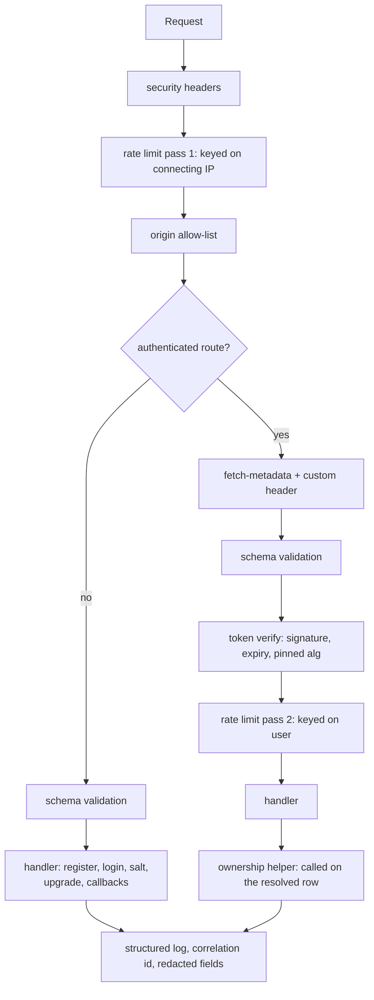
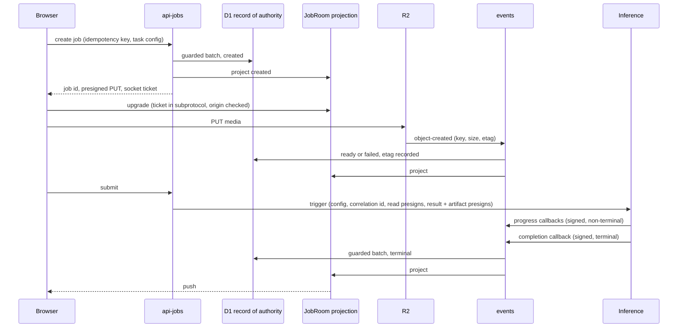

# SightForge Edge API - Plan

## Goal Capsule

- **Objective:** An authenticated user can register, sign in, submit an image or clip for one of seven tasks, watch it progress live, and retrieve the result — with every request authorized, rate-limited, and bounded by the free plan's per-invocation budget.
- **Means:** Five TypeScript Workers over a shared middleware package, a per-job Durable Object projecting live state, and a queue consumer that quarantines uploads until they validate (KTD1, KTD4).
- **Product authority:** Plan 2 of a five-plan split deriving from `docs/requirements/2026-08-29-1050-sightforge-cv-platform-requirements.md`, which stays `requirements-only`. Plan 1 at `docs/plans/2026-08-29-1145-sightforge-foundation-contracts-plan.md` supplies the account, schema, result contract, and Worker configs this plan fills.
- **Requirement fidelity:** Requirement text is quoted from the origin verbatim. Where this plan owns only part of a requirement, a scope clause is appended in italics and the remainder attributed. Rewriting origin wording is how qualifiers get lost, so it is not done here.
- **Stop conditions:** Stop and ask before adding a sixth Worker or a second cron trigger, before changing the result contract plan 1 froze, and before any change that would place a standing storage credential on a third-party platform.
- **Tail ownership:** This plan ends when a user can complete the whole flow against real infrastructure with inference stubbed, and every Worker's deployed CPU percentile has been read against the ceiling. Real inference is plan 3; the interface a human uses is plan 4.

---

## Product Contract

### Summary

Build the five Cloudflare Workers and the middleware they share: authentication with client-derived credentials and rotating refresh tokens, the job lifecycle with idempotent creation and presigned upload, post-upload quarantine driven by object-created events, live status over a hibernating WebSocket projected from the database of record, and one scheduled Worker enforcing every retention window.

### Problem Frame

Everything here runs under a 10 ms CPU ceiling per invocation. That ceiling is not incidental — it is what pushed password derivation into the browser, inference onto another platform, and rate limiting out of the edge into application code. The Workers are I/O brokers, and the design problem is keeping them that way while still enforcing every rule the product requires.

Four constraints shape the units more than anything else. The database rejects interactive transactions, and a batch is a sequence rather than a conditional — so a guard on one statement does not stop the rest. The presigned upload cannot cap its own size, so validation happens after the bytes land. The free plan's single edge rate-limiting rule matches an address and a path over a ten-second window, which cannot express per-user policy. And Durable Objects meter on their own daily budget, separate from Workers — so the component holding live state is also the one that runs out first.

### Key Decisions

Carried forward from the origin Product Contract, which owns their full statements:

- **Job status is pushed over a WebSocket held by a Durable Object.** Governs origin R29, R30.
- **Password hardening runs in the browser; the Worker stores a fast hash.** Governs origin R5, R6, R7.
- **Workers are TypeScript.** Governs origin R120.
- **Five Workers, split by who is allowed to call them.** Governs origin R3, R46.

### Requirements

Quoted from the origin. A trailing italic clause marks a split and names who owns the remainder.

#### Identity and sessions

R5. The browser derives a key from the password using Argon2id in WebAssembly before transmission; the plaintext password never leaves the client. _Server side of the exchange only; the browser implementation and the parameter floor are plan 4._

R6. The pre-authentication salt lookup returns a salt for every syntactically valid email, deriving a deterministic HMAC-based pseudo-salt for addresses that are not registered, so the endpoint cannot be used to enumerate accounts. The response also carries the account's recorded derivation parameters — algorithm version, memory, iterations, and parallelism — which are stored per account at registration and re-recorded on any credential change, so the cost can be raised later without a forced reset. The client rejects any response whose parameters fall below a hardcoded floor, so the unauthenticated endpoint cannot be used to downgrade derivation cost. _The client-side floor is plan 4._

R7. The server stores a salted fast hash of the client-derived value using a server-side random salt, so a database disclosure does not yield a replayable credential.

R8. Access tokens are stateless JWTs signed with a `kid`-tagged key, with a configurable time to live defaulting to 15 minutes, verified without a database read.

R9. Refresh tokens are stored server-side as hashes, rotate on every use, and a presented token that has already been consumed revokes its entire token family.

R10. Tokens are carried in a `__Host-`-prefixed, `HttpOnly`, `Secure`, `SameSite` cookie; no token is ever written to `localStorage` or `sessionStorage`.

R11. Registration validates email syntax and enforces a configurable password policy including a minimum length and a maximum length bound.

R12. Every authenticated endpoint verifies the token's signature, expiry, and pinned algorithm, rejecting tokens whose header declares any other algorithm.

R13. A user can read, modify, and delete only their own jobs, media, and results; ownership is checked on every access rather than inferred from an unguessable identifier.

R14. Failed authentication returns a single generic message and is throttled on both the target account and the request source, so neither a targeted lockout of a known account nor password spraying across many accounts falls outside every counter. The documented behavior states what a legitimate user experiences while their own account is under attack.

R15. Signing keys support a two-key overlap so a key can be rotated by deployment without invalidating live sessions.

R109. The client-derived credential value is treated as password-equivalent at every point before the server-side fast hash: it is never written to logs, error responses, analytics, or any store other than the hashing step, because it is directly replayable until hashed.

#### Media intake and job configuration

R16. Accepted formats are JPEG, PNG, and WebP for images, and MP4 with H.264 video for clips.

R17. Configurable limits default to 10 MB per image, 50 MB per video, and 30 seconds of video duration, and additionally bound maximum pixel dimensions and total pixel count, read from the image header and rejected before any full decode. _Header-derived bounds are enforced here; duration, codec, and the decode-time timeout are plan 3._

R18. Media is uploaded directly from the browser to R2 using a presigned PUT with a signed `Content-Type`, a short configurable expiry, and an object key chosen by the server that the client cannot influence.

R19. Object keys are user-scoped UUID paths; the client-supplied filename is never used as a key and is stored only as sanitized display metadata with paths stripped, unicode normalized, and traversal sequences rejected.

R20. Because R2 presigned PUT cannot express a maximum content length, size is enforced after upload from the size reported by the R2 event notification, and an oversized object is deleted and its job failed.

R21. Uploaded media is validated by reading its leading bytes and matching the format signature — `89 50 4E 47 0D 0A 1A 0A` for PNG, `FF D8 FF` for JPEG, `RIFF`/`WEBP` at offsets 0 and 8 for WebP, and `ftyp` at offset 4 for MP4 — with the declared content type treated as untrusted.

R23. A media object is not readable by inference or by the user until its database row is marked ready by the post-upload validator.

R36. Model variant is user-selectable per job across the available size tiers, with a configurable default per task. _Accepted and validated at job creation here; the variants themselves are plan 3._

R41. Per-frame video mode samples at a configurable rate defaulting within 2–10 frames per second, is available for all seven tasks. _Accepted and validated here; sampling is plan 3._

R42. Tracking mode runs at the source frame rate up to a configurable cap, is available only for detection, instance segmentation, pose, and oriented bounding box. _Accepted and validated here; tracking is plan 3._

R43. Classification, semantic segmentation, and depth estimation are per-frame only; the interface does not offer tracking for them and the API rejects the combination rather than silently ignoring it.

#### Job lifecycle

R25. A job moves through `created`, `uploading`, `queued`, `processing`, and terminates in `completed`, `failed`, or `cancelled`; no other states exist and no transition skips the terminal set.

R26. State transitions are written as a single D1 `batch()` call, because D1 rejects `BEGIN TRANSACTION` and `exec()` provides no rollback. _Plan 1 documents the constraint in the schema package; this plan implements it in Worker code._

R27. Job creation accepts an `Idempotency-Key`, unique per user rather than globally, and replays the stored response for a repeated key, returns 422 when the same key arrives with a different request fingerprint, and returns 409 while the first request is still in flight.

R28. An idempotency lock is acquired by a single atomic insert against a unique constraint, never by a read followed by a write, and a lock whose lease has expired is reclaimable so a crashed invocation cannot wedge a key permanently.

R29. Job status reaches the browser over a WebSocket served by a per-job Durable Object, which holds the authoritative live state and fans out transitions as they occur, using the WebSocket Hibernation API so an idle connection accrues no duration against the daily budget.

R30. A polling status endpoint remains available as an automatic fallback when the WebSocket cannot be established, using adaptive backoff that widens as the job ages. _The widening interval is computed and advertised here; the client honors it and pauses while the tab is hidden — plan 4._

R31. Video jobs report progress as frames completed against frames total; image jobs report state only.

R32. The interface communicates serverless cold start honestly, showing an expected wait derived from the measured container start rather than an asserted figure. _The cold-start component is measured and reported by plan 3 on the completion callback; this plan keeps a rolling estimate per task from those reports and serves it; plan 4 displays it._

R33. A user can cancel a job that has not reached a terminal state, and cancellation is recorded rather than silently dropping the job.

R115. The WebSocket upgrade rejects any request whose `Origin` is not the frontend origin, and is authorized by a single-use, short-lived, job-scoped ticket issued after an ownership check rather than by the session cookie alone, because a handshake cannot carry the custom header the CSRF defense relies on.

#### Inference boundary

R46. The Modal completion callback is authenticated by an HMAC computed over the timestamp concatenated with the request body, so the timestamp cannot be advanced independently of the signature. Each callback carries a unique delivery identifier that is recorded and rejected on repeat, and a terminal transition is applied only from a non-terminal state, so a replay inside the time window cannot re-drive a completed, cancelled, or swept job. Two callback secrets are accepted concurrently during a rotation overlap.

#### Results

R49. Structured results are written to R2 as JSON under a user-scoped key, and D1 stores only the key, never the payload.

R50. Results are retrieved by the browser through a time-scoped, read-only presigned GET issued by the API after an ownership check.

R52. Result documents for tracking mode are structured by track identity rather than as a flat per-frame list, so the payload remains navigable at hundreds of frames. _The shape is defined by plan 1's result contract; this plan reads and serves it without flattening._

#### Security controls

R67. CORS is restricted to the frontend origin; wildcard origins are never served on an authenticated endpoint.

R68. State-changing requests require a custom header, are rejected when `Sec-Fetch-Site` indicates a cross-site origin, and fall back to an `Origin` allow-list when fetch metadata is absent rather than failing open.

R69. No state-changing operation is reachable by GET.

R70. Rate limiting is enforced inside Workers against a durable counter, because the free plan provides a single edge rule limited to IP and path over a fixed ten-second window, which cannot express per-user or per-endpoint policy.

R71. Registration and login are protected by Turnstile.

R72. All API input is validated against an explicit schema at the boundary, and validation failure returns a structured error without echoing input.

R73. All user-controlled values are output-encoded at render time; result data is treated as untrusted when drawn or displayed. _Rendering is plan 4; this plan ensures the served response cannot be interpreted as markup._

R74. Secret comparison uses a constant-time primitive.

R110. Every HTML and API response carries a defined security header set: a Content-Security-Policy restricting script sources with no inline execution, Strict-Transport-Security, X-Content-Type-Options, a no-referrer Referrer-Policy, and a frame-ancestors restriction.

R111. A configurable per-user daily inference-job quota is enforced against the same durable counter as rate limiting, and a configurable cumulative inference spend ceiling halts new job dispatch and surfaces the same explicit capacity state as quota exhaustion.

#### Retention and deletion

R100. Input media is retained for a configurable period after job completion, defaulting to 7 days.

R101. Input media for failed jobs is retained for a longer configurable debug period, defaulting to 14 days.

R102. Completed results are retained for a configurable period, defaulting to 30 days.

R103. The scheduled database-driven sweep is authoritative for every state-dependent retention window, since those depend on job outcome and validation status that no lifecycle rule can see. _The maximum-age lifecycle backstop beneath it is plan 1's R24._

R104. The scheduled work is consolidated into a single cron-triggered Worker that dispatches each sweep internally, because the free plan allows only five cron triggers per account.

R105. A user can delete their own job and its associated media and results before the retention window elapses.

R112. A user can delete their own account, cascading to every job, media object, result, refresh-token family, and idempotency record they own, with the same scheduled-sweep backstop that retention uses so an orphaned object is still reclaimed.

### Scope Boundaries

#### Owned by other plans

- Account, Terraform, database schema, result contract — plan 1.
- Inference, the model adapter, video decode and sampling — plan 3. This plan defines three inference-facing contracts and exercises them against a stub plus one live call.
- Every browser surface: password derivation, the parameter floor, polling backoff behavior, wait display, result rendering — plan 4.
- CI, observability, alerting — plan 5. This plan emits structured logs and reads deployed CPU metrics manually; nothing consumes them automatically yet.

#### Deferred to Follow-Up Work

- An abort channel to in-flight inference. Cancellation is recorded locally and spend accounting treats cancelled-but-running work as spent; an abort would be a fourth inference contract and is not worth defining before plan 3 exists.
- Partial results for a video job that fails midway. Frames already written are preserved rather than deleted, so either answer stays available.

### Sources

- Origin Product Contract: `docs/plans/2026-08-29-1050-feat-sightforge-cv-platform-plan.md`.
- Plan 1: `docs/plans/2026-08-29-1145-feat-sightforge-foundation-contracts-plan.md`.
- Cloudflare bills active computation only — network waits are not CPU — which is what makes the middleware chain fit inside 10 ms despite its stage count.
- Durable Objects meter separately from Workers on the free plan, at 100,000 requests and 13,000 GB-s per day.
- R2's Workers binding exposes no presign method; presigning requires the S3-compatible credentials and a SigV4 implementation.

---

## Planning Contract

### Key Technical Decisions

KTD1. **Each Worker's own deployment config is the authority for its bindings.** The provider attaches bindings to a Worker version, not the shell, and the version is what the deploy tool uploads — so a binding declared in infrastructure code is superseded on the next deploy. Plan 1's review surfaced this; the origin's R79 is amended accordingly.

KTD2. **Shared middleware ships as unbuilt TypeScript source.** The bundler compiles workspace source directly, so no build step orders local development. The accepted constraint is that the package cannot use path aliases.

KTD3. **Authorization is two tiers, and the second is a handler-level call, not a chain stage.** The access token proves identity without a database read. Ownership is checked against the resolved row — which only a handler knows how to resolve — so the shared package exports an ownership helper handlers invoke, rather than a middleware that guesses the resource. Governs R12, R13.

KTD4. **The database row is the record of authority; the Durable Object is a live projection of it.** Both are written on every transition and the two writes cannot be atomic, so precedence is stated rather than left to a race: the batch commits first, the object is updated after, and on any read where the object holds no state it rehydrates from the row. The polling endpoint reads the object, and falls back to reading the row directly — marked possibly-stale — when the object call fails, because a fallback that depends on the component whose failure it covers is not a fallback. Governs R29, R30.

KTD5. **The socket upgrade is authorized by a job-scoped ticket carried in the subprotocol header.** A handshake carries cookies but cannot carry the custom header the cross-site defense relies on, so cookie-only authorization would leave that surface uncovered. The browser WebSocket API cannot set arbitrary headers, so the ticket travels in the subprotocol field rather than the URL — a ticket in a query string lands in every request log. Governs R115.

KTD6. **Rate limit and quota counters live in a Durable Object class keyed by subject, and the limiter runs in two passes.** A counter needs read-then-write atomicity across an await, which the database cannot give. The first pass is keyed on the platform's connecting-IP value and runs _before_ token verification, so garbage tokens cannot force a signature verification per request; the second is keyed on the authenticated user and runs after. The unauthenticated subject is never taken from a client-supplied forwarding header. The signed-callback routes are exempt from both the connecting-address pass and the origin allow-list, and are gated instead on their signature and per-job delivery-identifier guard — inference delivers every callback from a small pool of egress addresses, so an address-keyed counter would throttle the only messages that can advance a job, and a machine-to-machine POST carries no origin at all. Both passes refuse the request when the counter is unreachable, matching the fail-closed posture R68 already sets. Governs R70, R111.

KTD7. **Upload validation is an event-driven quarantine, and the validated object is pinned by entity tag.** The presign cannot cap size, so the object lands first and the row stays unready until it passes. But the presigned PUT remains valid for its whole expiry, so the uploader could overwrite the validated bytes and race inference — the validator therefore records the object's entity tag, and dispatch refuses if it no longer matches. Governs R20, R21, R23.

KTD8. **Every statement in a guarded transition batch repeats the same state predicate, and the caller confirms the affected-row count.** A D1 batch is a sequence, not a conditional: a guard on the first statement affects zero rows when it fails, but the remaining statements still execute. Guarding only the first would let a replayed completion write a result key and timestamp onto a cancelled job while correctly leaving its state alone. Governs R26, R46.

KTD9. **The scheduler is one Worker, one trigger, and an internal dispatch table with per-sweep subrequest allowances.** The account allows five cron triggers across every project. A cron invocation gets the same 10 ms CPU and 50 subrequests as any other, and every query and delete is a subrequest — so each sweep receives a stated allowance out of that 50 and persists a resumption cursor. Governs R104.

KTD10. **Structured logs carry a correlation identifier minted at job creation and passed to inference.** It is the only thing that will join a Worker log to an inference log across two platforms. Redaction covers the client-derived credential and the socket ticket by field name, and no handler serializes a whole request body into an error.

KTD11. **The inference trigger is an authenticated call that returns immediately, carrying keys rather than bytes, and grants write access to exactly one result key.** The Worker posts the job's configuration and correlation identifier to a Modal web endpoint authenticated by `Modal-Key` and `Modal-Secret` proxy headers; that endpoint spawns the work and returns a call identifier at once. The payload carries three grants, not one: a time-scoped presigned **GET** per input object, conditional on the entity tag recorded at validation, so the service can read the media it must decode; a presigned **PUT** for the result document; and a second presigned **PUT** for the job's packed dense artifact, because two of the seven tasks write one (plan 1 KTD11) and a single-key grant would make them impossible. The forcing constraint is Modal's 150-second web-endpoint request limit, far shorter than a video job — at which point Modal returns a 303 continuation rather than failing, so the trigger fetch must not follow redirects, since the endpoint is contracted to answer immediately. Its 4 GiB body limit is not a constraint, though the separate cap on spawned function inputs is why keys travel rather than frames. The trigger also issues a presigned PUT scoped to the single result key and expiring with the job, so the inference platform holds no standing storage credential. Governs R46, R49.

KTD12. **The inference boundary has exactly three shapes, all signed the same way.** Trigger out; progress callback in, non-terminal, carrying frames completed and total; completion callback in, terminal. Progress exists because only inference knows frame counts and R31 requires them — without it, plan 3 would have to invent a channel after the other two shapes were frozen. All three share the timestamp-plus-body signature, the delivery-identifier replay guard, and the state predicate. Governs R31, R46.

KTD13. **The server-side fast hash is an HMAC-SHA256 whose key is a dedicated server-side pepper, computed over the client-derived value concatenated with a per-account random salt.** The pepper is the key; the salt is part of the message. Using the per-account salt as the key would delete the pepper property entirely and leave a database disclosure directly attackable at HMAC speed, which is the whole reason for keying rather than merely salting. Workers' WebCrypto offers no Argon2, scrypt, or bcrypt, and PBKDF2 at a defensible iteration count would breach the CPU ceiling — but no expensive server-side derivation is wanted here, because the browser already paid that cost (R5). What is needed is a fast, constant-time-comparable transform making a database disclosure non-replayable, which HMAC provides. Governs R7.

KTD14. **Failure and capacity outcomes are a closed enumeration generated into both languages from plan 1's contract package, not a TypeScript constant.** The inference service must emit these codes too, so hand-copying string literals across a language boundary would reintroduce exactly the drift the contract pipeline exists to prevent — the enumeration goes through the same generator and drift check as the result shapes. Quota-exhausted, spend-ceiling, and counter-unavailable are distinct capacity states; size, format, duration, codec-unsupported, source-changed, timeout, and inference-error are distinct failure reasons. Authentication, authorization, and not-found outcomes collapse to one opaque code, because a machine-readable channel that distinguishes them reopens the enumeration oracle the generic message closes. The list carries a stated extension procedure — add the code, regenerate, extend the mapping test — so a downstream plan needing a new one is not blocked on reopening this contract.

### High-Level Technical Design

Two chains, not one — a single chain left every unauthenticated endpoint unspecified and put the rate limiter behind an expensive verification:

State is written to the database first and projected to the object second:

### Assumptions

- The frontend and the API share one registrable domain — `app.<domain>` and `api.<domain>` — so the host-prefixed `SameSite` cookies are sent on API calls. Responses carry `Access-Control-Allow-Credentials: true` with an explicit allowed origin, never a wildcard, and answer preflight with a long max-age, because the custom CSRF header preflights every mutation and each preflight is a billable request.
- Plan 1 has landed with its blocker fixes: the account exists, the schema includes the users and refresh-token columns this plan needs, the result contract is generated, and each Worker has a config and placeholder entry module. Plan 1's only R2 access key is scoped to the state bucket, so the media-bucket presigning credential is issued here, not inherited.
- The task, mode, model-variant, and frame-rate columns on the jobs table are this plan's own migration against the shared schema package, consistent with plan 1 assigning jobs-table decisions beyond the origin's stated lookup patterns to this plan.
- Inference is stubbed until plan 3. All three contracts in KTD12 are built and tested against a stub, plus one live authenticated trigger call against the real platform to disconfirm the auth and payload assumptions before plan 3 commits.

### Sequencing

U1 and U2 are the substrate everything imports, and U2 is the critical path — every later unit depends on it. U3 and U4 are independent of each other. U5 depends on U4. U6 depends on U4 and U5. U7 depends on U4 for the delete cascade it shares. Nothing depends on plan 3.

### Risks and Dependencies

- **Durable Objects meter separately and bind first.** KTD6 puts a counter round trip on every rate-limited request and KTD4 answers every poll from the object, so the Durable Object budget is consumed at least once per API request — ahead of the Worker request budget, not behind it.
- **Cron invocations get the same 50 subrequests as any other.** Every sweep, query, and delete shares that one budget, which is why KTD9 allocates it explicitly.
- **Queue retention is 24 hours and non-configurable.** An object-created message not consumed within a day is lost, leaving a quarantined object no event will ever validate. The reconciliation sweep is the recovery path.
- **A Worker may have only six connections simultaneously awaiting response headers.** Any parallelism in the consumer or the sweeps is bounded by this.
- **The trigger contract is written before its consumer exists.** One live call against the real platform in U6 is what keeps it from being validated only against its own stub.

---

## System-Wide Impact

- **Plan 3 binds to three shapes** — the trigger, the progress callback, and the completion callback (KTD11, KTD12) — plus the single-key result presign. Changing any after plan 3 starts costs work on both sides of a third-party boundary.
- **Plan 4 binds to the socket handshake** (ticket in the subprotocol, single-use, origin-checked), the polling interval this API advertises, and the closed reason-code enumeration (KTD14) it renders copy against.
- **Plan 5 inherits the correlation identifier and log shape**, and the CPU-percentile check performed manually here becomes automated there.
- **Plan 1 must have landed its binding-ownership fix**, or U1's first deploy silently supersedes infrastructure-declared bindings by exactly the mechanism KTD1 describes.

---

## Open Questions

### Deferred to Planning

- The concrete per-user daily job quota and the spend thresholds separating warning from critical. The mechanism is built here; the numbers belong with plan 5's alerting.
- The cron interval for the scheduler, which determines whether each sweep's per-run allowance keeps pace with its backlog.
- Whether a job's socket closes on terminal state or stays open for an authorized viewer. Affects the Durable Object duration budget more than correctness.

---

## Implementation Units

### U1. Worker configs, bindings, secrets, and the asset Worker

- **Goal:** Each Worker declares its own bindings, secrets, and triggers; static assets serve at no request cost.
- **Requirements:** R67, R110.
- **Dependencies:** none within this plan.
- **Files:** `apps/api-auth/wrangler.jsonc`, `apps/api-jobs/wrangler.jsonc`, `apps/events/wrangler.jsonc`, `apps/scheduler/wrangler.jsonc`, `apps/web/wrangler.jsonc`, `apps/web/src/index.ts`.
- **Approach:**
  1. Declare in each config only the bindings that Worker imports, so a compromised Worker cannot reach a store it has no business touching (KTD1).
  2. Introduce every Durable Object class with a SQLite-backed migration in exactly one owning Worker's config, because the free plan supports only that storage backend and because a class declared in more than one config becomes more than one namespace. Other Workers bind to the owning namespace by script name and declare no migration for it.
  3. Enumerate the secrets each Worker needs, which are not bindings and are easy to miss: the R2 S3 access key and secret for presigning, both JWT signing keys with their identifiers, both callback signing secrets, the pseudo-salt key, the credential-hash pepper, the Modal proxy key and secret, the Turnstile secret, the Slack webhook URL, and a Cloudflare API token scoped to Account Analytics: Read for the alert evaluator's queries. Each is scoped to the least privilege its consumer needs — the media-bucket signing credential reaches the media bucket and no other, and cannot read the Terraform state bucket (R77). The pepper rotates by two-key overlap with a pepper identifier stored alongside each account's hash and a re-hash at next successful login, because it cannot be re-keyed without a client-derived input that exists only during authentication. Register each in plan 1's inventory with consumer, scope, injection path, and rotation procedure.
  4. Configure the asset Worker to serve the static build without invoking a script on asset paths — which means no Worker runs on an HTML response, so R110's header set cannot come from middleware. The headers for asset responses come from a `_headers` file authored alongside the frontend (plan 4 owns the file; this plan owns the policy it states), and its `script-src` must include `'wasm-unsafe-eval'` with `worker-src 'self' blob:`, because the browser derives credentials in a WebAssembly worker and a policy without them breaks login.
  5. Set one cron trigger, on the scheduler only (KTD9).
- **Test scenarios:**
  - Each Worker's config declares every binding its code imports and no others.
  - Every Durable Object class is declared with a SQLite-backed migration.
  - An asset path resolves through the asset route rather than the script route in the deployed configuration.
  - Exactly one cron trigger exists across all five configs.
  - Every secret this plan uses appears in the inventory with a named consumer and rotation procedure.
- **Verification:** every Worker deploys and resolves its bindings and secrets; the asset route configuration excludes script invocation.

### U2. Shared middleware and the counter Durable Object

- **Goal:** One implementation of every cross-cutting rule, plus the counter class the limiter and quota both depend on.
- **Requirements:** R8, R10, R12, R14, R15, R67, R68, R69, R70, R72, R73, R74, R109, R110, R111.
- **Dependencies:** U1.
- **Files:** `packages/worker-kit/src/`, `packages/worker-kit/src/counter.ts`, `packages/worker-kit/package.json`, `packages/worker-kit/test/`.
- **Approach:**
  1. Export each concern as its own composable middleware, and export both chains from the design section — one authenticated, one not — so no endpoint is left without a stated chain.
  2. Implement the counter Durable Object class here and declare it — with its migration — in exactly one owning Worker's config; every other Worker binds to that namespace by script name. Re-exporting and re-migrating the class per Worker would create a separate namespace each, so the same subject would hold one counter in each Worker and an attacker's budget would multiply by the Worker count (KTD6).
  3. Run the limiter in two passes: first keyed on the platform's connecting address before token verification, then on the user after. Normalize that address to a network prefix — the full address for IPv4, the /64 for IPv6 — because a routed /64 is a normal residential allocation and keying on raw addresses would let a single client present a fresh subject per request. Refuse the request when the counter is unreachable rather than admitting it.
  4. Pin the accepted signing algorithm at verification and reject any token declaring another; never read the algorithm from the token.
  5. Support two concurrently valid signing keys selected by identifier (R15).
  6. Export the ownership helper for handlers to call on a resolved row, rather than a chain middleware that cannot know the resource (KTD3).
  7. Consume the generated reason-code enumeration from the contract package and export the error envelope carrying it; the enumeration itself is generated into TypeScript and Python alike, not defined here (KTD14).
  8. Redact the client-derived credential and the socket ticket by field name, and never serialize a whole request body into an error response (KTD10, R109).
  9. Record a per-stage budget for the composed chain; the authoritative check is the post-deploy percentile in the Verification Contract, since no in-harness CPU measurement exists.
- **Test scenarios:**
  - A token signed with a disallowed algorithm is rejected even when otherwise valid.
  - A token signed with the previous key verifies while both are configured, and stops when the old key is removed.
  - An expired token is rejected; one expiring a second in the future is accepted.
  - A state-changing request without the custom header is rejected.
  - A request whose fetch metadata indicates cross-site is rejected on a non-safe method.
  - A request with absent fetch metadata and a disallowed origin is rejected, not admitted.
  - Every response carries the full security header set, including on error paths and on both chains.
  - A flood of requests bearing invalid tokens is rejected by the first limiter pass without any signature verification occurring.
  - The unauthenticated subject derives from the platform value and ignores a client-supplied forwarding header.
  - A request is refused when the counter object errors or times out.
  - Counts are isolated per subject and per policy name.
  - A payload failing schema validation returns the structured error and does not echo the submitted value.
  - The client-derived credential and the socket ticket appear in no emitted log line, including on an unhandled error path.
  - Every failure the package can emit maps to a code in the exported enumeration.
- **Verification:** every middleware and the counter class have direct coverage; a Worker composing either chain passes an end-to-end request in a runtime-accurate harness.

### U3. Authentication Worker

- **Goal:** Register, sign in, refresh, and sign out — with credentials the server cannot replay and sessions it can genuinely end.
- **Requirements:** R5, R6, R7, R9, R11, R13, R14, R71, R109. Realizes origin flows F1 and F2.
- **Dependencies:** U2.
- **Files:** `apps/api-auth/src/`, `apps/api-auth/test/`.
- **Approach:**
  1. Registration validates address and policy, generates the client-derivation salt and parameters, applies the server-side keyed HMAC under a fresh random salt, and stores both (KTD13, R7, R11).
  2. Apply one documented address canonicalization — lowercase and unicode-normalize, nothing else — identically at registration, salt lookup, and login, since divergence both locks users out and reopens the enumeration oracle.
  3. The salt endpoint returns a salt and parameters for any syntactically valid address, deriving a keyed pseudo-salt for unknown ones, performing the same database read and derivation on both paths.
  4. Return the _current default_ parameters on the unknown-address path, and converge registered accounts onto the current set at their next successful login — otherwise raising the cost makes older accounts distinguishable from unknown addresses by parameter value alone (R6).
  5. Verify the Turnstile token server-side against the provider's verification endpoint using the site secret, rejecting absent, reused, or expired tokens before any credential work (R71).
  6. Login recomputes the HMAC, compares in constant time, and issues access and refresh tokens in cookies (R8, R10).
  7. Refresh looks the token up by hash; if already consumed, revoke the whole family in one guarded batch and reject (R9, KTD8).
  8. Give each token family an absolute expiry set at creation and copied unchanged across every rotation, refusing refresh past it — rotation alone bounds nothing, so a stolen token rotated forever would never expire.
  9. Throttle failures on both account and source, and document what a legitimate user experiences during an attack on their account (R14).
- **Test scenarios:**
  - Covers AE1. A salt request for an unregistered address returns a well-formed salt, and both paths execute the same lookup and derivation steps.
  - The unknown-address path returns the current default parameters, and a registered account on stale parameters converges after its next login.
  - Addresses differing only in case or unicode form resolve to one account at registration, salt lookup, and login.
  - Registration rejects a malformed address, a password below the minimum, and one above the maximum bound.
  - A login attempt with an absent, reused, or expired challenge token is refused before any credential comparison.
  - Login with a correct derived value succeeds; an incorrect one returns the same generic message as an unknown account.
  - Covers AE6. A refresh token presented twice is rejected and its whole family revoked.
  - A refresh token from a revoked family is rejected even if never itself used.
  - Refresh is refused once the family's absolute expiry passes, however recently the token was rotated.
  - An access token minted before sign-out stops being accepted once its lifetime elapses, and that window is documented as the accepted revocation delay.
  - Repeated failures throttle the account; distributed attempts throttle the source.
  - No response body or log line contains the client-derived credential.
- **Verification:** the full cycle passes against a local database; family revocation and absolute expiry are both observable in the stored rows.

### U4. Job lifecycle Worker

- **Goal:** Create, configure, submit, track, cancel, retrieve, and delete a job — with duplicates free and invalid configurations refused at the boundary.
- **Requirements:** R13, R17, R18, R19, R25, R26, R27, R28, R30, R31, R32, R33, R36, R41, R42, R43, R49, R50, R52, R105, R111, R112, R115. Realizes the create-and-submit half of origin flows F3 and F4.
- **Dependencies:** U2.
- **Files:** `apps/api-jobs/src/`, `apps/api-jobs/test/`.
- **Approach:**
  1. Validate task, mode, model variant, frame rate, and confidence threshold at creation, rejecting tracking mode on classification, semantic segmentation, or depth estimation with a message naming the four eligible tasks (R36, R41, R42, R43). The threshold is a single per-job value rather than per-task, and it is carried through to the trigger — the configuration panel exposes it, so an API that dropped it would make the panel lie.
  2. Acquire the idempotency lock with a single insert against the per-user unique constraint; on violation read the row and replay, reject, or conflict as its state dictates (R27, R28).
  3. Acquire the lock by a single atomic insert and nothing more. A crashed-invocation lease-reclaim state machine is deliberately not built: the window it guards is vanishingly rare at this traffic, and the recovery path is the idempotency record's ordinary expiry.
  4. Issue the presigned PUT using the R2 S3 credentials and a SigV4 signer — the Workers binding has no presign method — against a server-chosen key with a signed content type and short expiry (R18, R19).
  5. Reject an image whose header-declared dimensions or total pixels exceed the configured bound, before anything decodes it (R17).
  6. Write every transition as a guarded batch in which every statement repeats the state predicate, confirm the affected-row count, then project the new state onto the Durable Object — including `created`, `uploading`, `queued`, and `cancelled` (KTD4, KTD8).
  7. Expose an authenticated per-job ticket endpoint that mints a fresh single-use, short-lived ticket after an ownership check, callable while the job is non-terminal, and record its single-use state in the job's Durable Object. Minting only at creation would leave a dropped connection unable to reattach and a second viewer unable to attach at all. Encode the ticket as base64url or hex, since a subprotocol value must be a valid HTTP token. Exclude the ticket and the presigned URL from the response stored for idempotency replay, re-minting both when a replay is served (R115, KTD5).
  8. Answer the polling endpoint from the Durable Object, falling back to the row marked possibly-stale when the object call fails, and advertise the next poll interval in the response — computed as a function of job age so it widens as the job ages, which is where R30's adaptive backoff actually lives. The client honors the advertised interval; it does not invent a schedule (KTD4, R30).
  9. Own the outbound inference trigger — this Worker holds the proxy credentials and the presigning key, and dispatch happens here (KTD11). Mint and include the three grants the service needs: a read presign per input object conditional on its recorded entity tag, a write presign for the result document, and a write presign for the packed dense artifact. Increment the spend counter from the cost the completion callback reports, against two subjects — the user and a single global platform total — and refuse dispatch when either ceiling is reached. A two-phase reserve-and-reconcile ledger is deliberately not built: at one job costing fractions of a cent against a stated ceiling of roughly a hundred a day, post-hoc counting plus the alert is the honest control. Reserve an estimated cost against the spend counter when dispatching, so the ceiling can halt something rather than only being read (R111). Include each input object's recorded entity tag in the trigger payload so the reader can enforce the pin conditionally at read time, since dispatch-time comparison alone leaves a window open.
  10. Refuse dispatch if the object's current entity tag differs from the one recorded at validation (KTD7).
  11. Keep a global daily job counter alongside the per-user one, keyed on nothing, because deleting and re-registering an account resets a per-user counter and open registration makes that free. Document an operator reset for the spend ceiling in the runbook — a ceiling that halts dispatch with no way to clear it takes the demonstration offline until someone notices.
  12. Serve results through a presigned GET issued after an ownership check. The result document is pinned to JSON as an attachment so it cannot be sniffed as markup; the dense artifact is served by a separate endpoint that mints a presigned GET only for a key the caller's own result actually references — never a raw client-supplied key — with its image content type and an inline disposition (R50, R73).
  13. Expose authenticated job-deletion and account-deletion endpoints, sharing the cascade implementation with the scheduler (R105, R112).
  14. Maintain a rolling estimate per task from the cold-start and inference durations the completion callback reports, keeping the container-start component separate from total duration, and return it as the wait estimate (R32).
- **Test scenarios:**
  - Covers AE4. Requesting tracking mode on depth estimation is rejected with a message naming the four eligible tasks; requesting it on detection succeeds.
  - An unsupported model variant or an out-of-range frame rate is rejected at the boundary.
  - Covers AE5. A repeated request with the same key replays the stored response; the same key with a different payload returns 422; a repeat while in flight returns 409.
  - An expired lease is reclaimable and exactly one concurrent request wins.
  - Covers AE3. An upload sending a content type other than the signed one is rejected by storage.
  - An image whose header dimensions exceed the bound is rejected before decode.
  - Every transition — created, uploading, queued, processing, and each terminal state — is observable on the Durable Object immediately after the request returns.
  - A guarded transition attempted from the wrong current state changes no row, and no later statement in the same batch writes anything.
  - Covers AE7. With the socket unavailable, polling returns the same states in the same order and advertises an interval.
  - When the Durable Object call fails, polling returns the row's state marked possibly-stale rather than an error.
  - A ticket request for another user's job is refused; a ticket replayed after use is refused.
  - A video job reports frames completed against frames total; an image job reports state only.
  - Cancelling a non-terminal job records it; cancelling a completed job is refused.
  - Covers AE9. With the quota exhausted, creation returns the quota-exhausted code; with the spend ceiling reached, it returns the distinct spend-ceiling code.
  - Dispatching a job reserves cost against the spend counter, and the ceiling halts dispatch once reached.
  - Dispatch is refused when the object's entity tag differs from the recorded one.
  - A fetched result response carries a JSON content type and attachment disposition.
  - A user requesting another user's job, result, status, or deletion receives the same response as for a job that does not exist.
  - Deleting a job removes its media and results; deleting an account cascades to every owned record including live-state and counter objects.
  - A tracking result is served track-keyed without flattening.
- **Verification:** a full create-configure-upload-submit-track-retrieve-delete cycle passes against local storage and database with inference stubbed.

### U5. Live status Durable Object

- **Goal:** A browser sees state changes as they happen, without polling and without billing for an idle connection.
- **Requirements:** R29, R30, R31, R115.
- **Dependencies:** U4.
- **Files:** `apps/api-jobs/src/job-room.ts`, `apps/api-jobs/test/`.
- **Approach:**
  1. Use the hibernation interface, and register no timer inside the object — any interval or timeout disqualifies hibernation and reintroduces the duration billing this avoids.
  2. Reject an upgrade whose origin is not the frontend, and read the ticket from the subprotocol header rather than the URL. Echo a selected `Sec-WebSocket-Protocol` value in the handshake response — a browser closes the connection when the server does not, regardless of the 101 — and require the ticket to be unpadded base64url, since padding is not a valid HTTP token (KTD5).
  3. Serve the upgrade and the plain polling read from the same instance by inspecting the upgrade header.
  4. Rehydrate from the database row on any read where the object holds no state, so an evicted or cold object recovers rather than reporting nothing (KTD4).
  5. Record consumed ticket identifiers and callback delivery identifiers in the object's own storage, retained at least as long as the signature replay window — nothing else in the system has a home for them.
  6. Send current state immediately on connect, and tolerate zero or several concurrent sockets.
- **Test scenarios:**
  - An upgrade from a disallowed origin is rejected.
  - An upgrade without a ticket is rejected even with a valid session cookie.
  - A ticket replayed after use, past expiry, or issued for another job is rejected.
  - A client connecting mid-job receives current state immediately.
  - An object with empty storage rehydrates from the row rather than returning nothing.
  - A transition recorded with no socket attached is delivered to a client connecting afterwards.
  - Two sockets on one job both receive each transition.
  - The object enters hibernation via the platform interface, and no timer is registered.
- **Verification:** transitions arrive within a bounded interval; a viewer who disconnects and reconnects loses nothing; an evicted object recovers state on next read.

### U6. Upload validation and inference callbacks

- **Goal:** Nothing unvalidated becomes readable, and only genuine inference messages move a job.
- **Requirements:** R16, R20, R21, R23, R31, R46 (inbound callbacks only; the outbound trigger belongs to U4). Realizes the validate-and-complete half of origin flows F3 and F4.
- **Dependencies:** U4, U5.
- **Files:** `apps/events/src/`, `apps/events/test/`.
- **Approach:**
  1. Consume object-created messages, read the leading bytes with a ranged request, match the signature against the accepted format list, and compare the reported size against policy (R16, R20, R21).
  2. Record the object's entity tag on the row when marking it ready; on failure delete the object and fail the job with a code from the enumeration (KTD7, KTD14).
  3. Bound the batch size explicitly against the 50-subrequest ceiling, counting the rejection path rather than the happy path: a failing message costs four subrequests — ranged read, object delete, guarded batch, projection — so the configured maximum is twelve, not sixteen.
  4. Authenticate every callback over timestamp-concatenated-with-body, accept either of two secrets during rotation, and reject a replayed delivery identifier recorded in the job's Durable Object (R46, KTD12).
  5. Apply the terminal transition only from a non-terminal state using a fully guarded batch, then project onto the object (KTD8, KTD4).
  6. Handle the progress callback as a non-terminal update carrying frames completed and total, projected onto the object without touching the database row (KTD12, R31).
  7. Reconcile the reserved cost against the reported cost as the completion callback applies (R111).
  8. Answer a duplicate delivery identifier or a state-guard refusal as successfully handled so the sender does not retry forever; answer a signature or timestamp failure as a rejection.
  9. Make one live authenticated trigger call against the real inference platform, returning a fixed response, before the stub is accepted as proof of the contract.
  10. Note deliberately: this Worker serves an internal queue and a public endpoint because the Worker count is fixed at five. The callback path performs no object deletion, which is asserted rather than assumed.
- **Test scenarios:**
  - Covers AE2. An object exceeding the size limit is deleted and its job failed with the size code.
  - A file whose bytes do not match its declared type is rejected regardless of the declared value.
  - Each accepted format is recognized from its signature, including one whose marker is not at the start of the file.
  - A format outside the accepted list is rejected.
  - A job whose media failed validation is never readable by the trigger.
  - Covers AE12. A callback with absent, malformed, or stale signature is rejected and no state changes.
  - A validly signed callback replayed within its window is rejected on its delivery identifier and answered as handled.
  - A callback signed with the previous secret is accepted during overlap and rejected after.
  - A completion for a cancelled job changes no state, and no later statement in its batch writes a result key or timestamp.
  - A progress callback updates frames completed on the object without altering the database row or the job's state.
  - The callback handler path performs no object deletion regardless of payload.
  - A batch at the configured maximum stays within the subrequest ceiling.
  - The live trigger call against the real platform succeeds with proxy-header authentication.
- **Verification:** a valid upload reaches ready with its entity tag recorded; oversized and mistyped files are rejected and their jobs failed; a replayed callback is refused and acknowledged; the live trigger call authenticates.

### U7. Scheduled maintenance Worker

- **Goal:** Every retention window enforced and every orphan reclaimed, from one trigger inside one invocation budget.
- **Requirements:** R100, R101, R102, R103, R104, R112. Realizes origin flow F5.
- **Dependencies:** U4.
- **Files:** `apps/scheduler/src/`, `apps/scheduler/test/`.
- **Approach:**
  1. Dispatch each sweep from one handler behind an internal table, giving each a fixed subrequest allowance out of the 50 available. Alert evaluation is one of the entries and receives 8 of the 50 (six condition reads plus up to two deliveries); plan 5 supplies its conditions and thresholds. A sweep that exhausts its allowance logs the truncation and resumes next run — a persisted cursor is not built, because the backlogs here are single-digit rows and an alert on truncation is the cheaper control (KTD9).
  2. Make the sweep authoritative for state-dependent windows, since the lifecycle rule can match only prefix and age (R103).
  3. Fail jobs stuck in a non-terminal state past threshold, and project that terminal state onto the Durable Object — a swept job that never reaches the object shows "processing" to every live viewer forever.
  4. Reconcile quarantined objects whose object-created message was never consumed, since queue retention is 24 hours and non-configurable.
  5. Reap consumed refresh tokens, expired idempotency records, and recorded delivery identifiers past their replay window.
  6. Reclaim orphaned result objects whose job row is cancelled or absent, including results written by inference that completed after a cancellation.
  7. Run the shared deletion cascade as the backstop R112 requires, reclaiming anything a user-initiated delete left behind.
- **Test scenarios:**
  - Covers AE8. A job processing past threshold is failed with the timeout code, and a client attached to it receives the terminal transition.
  - Completed-job media past its window is deleted; media inside its window is retained.
  - Failed-job media is retained for the debug window and deleted after it.
  - Results past their window are deleted while the job row remains.
  - A quarantined object whose event was never consumed is reconciled rather than left indefinitely.
  - Consumed refresh tokens, expired idempotency records, and expired delivery identifiers are reclaimed.
  - A result object whose job was cancelled is reclaimed.
  - An account-deletion cascade interrupted midway is completed by the backstop sweep.
  - A sweep exceeding its subrequest allowance persists a cursor and resumes on the next run rather than truncating silently.
  - A failure in one sweep does not prevent the remaining sweeps from running.
- **Verification:** each sweep produces its expected deletions against seeded data; a truncated sweep resumes; a failure in one is recorded and the others complete.

---

## Verification Contract

| Gate | Applies to | Passing signal |
| --- | --- | --- |
| Binding and secret declaration | U1 | Each Worker declares the bindings its code imports and every secret it reads; every Durable Object class uses a SQLite-backed migration |
| Middleware suite | U2 | Every middleware and the counter class have direct coverage, including algorithm pinning, key overlap, and both limiter passes |
| Fail-closed limiting | U2 | A request is refused when the counter is unreachable, and the unauthenticated subject ignores client-supplied headers |
| Credential non-disclosure | U2, U3 | The client-derived value and the socket ticket appear in no response or log, including on unhandled error paths |
| Auth cycle | U3 | Register, login, refresh, logout pass end to end; family revocation and absolute expiry observable in rows |
| Enumeration resistance | U3 | Registered and unregistered salt lookups execute the same steps and return the same parameter values |
| Challenge verification | U3 | An absent, reused, or expired challenge token is refused before credential work |
| Idempotency | U4 | Replay, mismatch, in-flight conflict, and lease reclaim all behave as specified |
| Configuration validation | U4 | Tracking on an ineligible task is refused with the eligible list named |
| State projection | U4, U5, U7 | Every transition written by any Worker is observable on the Durable Object |
| Guarded batch | U4, U6 | A refused transition writes nothing from any statement in its batch |
| Ownership isolation | U3, U4 | A cross-user request is indistinguishable from a missing resource |
| Live status | U5 | Transitions arrive; reconnect loses nothing; an evicted object rehydrates; hibernation is entered and no timer is registered |
| Upload quarantine | U6 | Oversized, mistyped, and unlisted-format uploads are rejected; the entity tag is recorded and re-checked at dispatch |
| Callback authenticity | U6 | Absent, malformed, stale, and replayed callbacks are refused, and refusals are acknowledged rather than retried |
| Live trigger | U6 | One authenticated call against the real inference platform succeeds |
| Retention sweeps | U7 | Each window produces its deletions; a truncated sweep resumes; cascades leave no orphan |
| CPU percentile | all | After deploy, each Worker's CPU-time P99 read from platform metrics sits under the ceiling |

Worker tests run in a runtime-accurate harness. The CPU gate is deliberately post-deploy: nothing in the harness reports CPU time, and timing APIs inside a Worker do not advance on computation.

---

## Definition of Done

### Global

- All seven units complete and their verification signals hold.
- A user can register, sign in, configure and create a job, upload media, watch it progress live, retrieve a result, and delete it — against real infrastructure, with inference stubbed.
- AE1, AE2, AE3, AE4, AE5, AE6, and AE12 pass in full. The server-side half of AE7, AE8, and AE9 passes; the client fallback in AE7, the alert in AE8, and the frontend capacity message in AE9 are completed by plans 4 and 5.
- Every Worker's deployed CPU P99 has been read against the ceiling, and the event consumer stays within the subrequest ceiling at its configured batch size.
- Ownership is enforced on every path reaching a job, its media, or its result.
- The client-derived credential and the socket ticket appear in no log, response, or store other than their intended one.
- Every secret this plan introduces is registered in the inventory with a rotation procedure.
- One live authenticated trigger call against the real inference platform has succeeded.
- Abandoned scaffolding and dead-end experiments are removed rather than left in the diff.

### Per unit

Each unit is done when its verification line holds and its test scenarios pass.

### Explicitly not done here

No real inference runs. No browser interface exists — every flow is driven by tests. Nothing consumes the logs automatically until plan 5.
