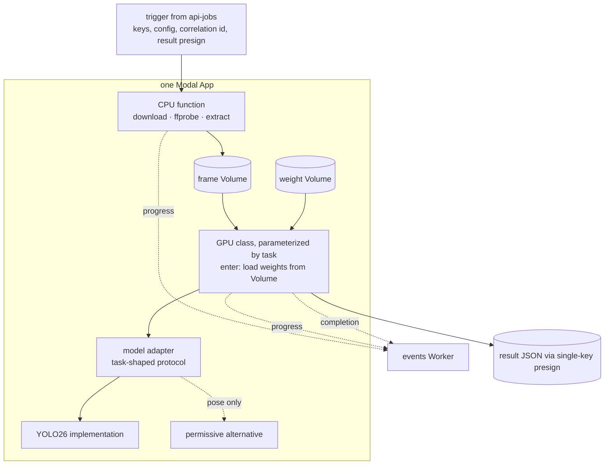
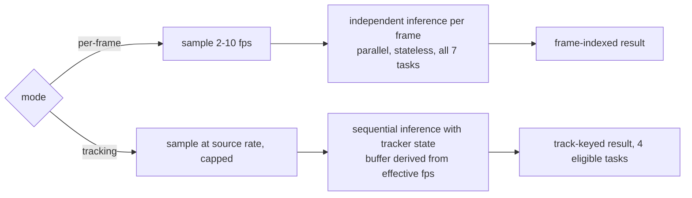

# SightForge Inference Service - Plan

## Goal Capsule

- **Objective:** A submitted image or clip is turned into a structured result for any of the seven tasks, written to object storage in the agreed contract shape, with the job's progress and outcome reported back — at a cost per job measured in fractions of a cent.
- **Means:** One Modal App containing a CPU function for probe, decode, and frame extraction and a GPU class for inference, with weights on a Volume and the model behind a task-shaped adapter (KTD1, KTD3, KTD5).
- **Product authority:** Plan 3 of a five-plan split deriving from `docs/requirements/2026-08-29-1050-sightforge-cv-platform-requirements.md`, which stays `requirements-only`. Plan 1 supplies the result contract; plan 2 supplies the three inference-facing shapes this service implements.
- **Requirement fidelity:** Requirement text is quoted from the origin verbatim; a trailing italic clause marks a split and names the remainder's owner.
- **Stop conditions:** Stop and ask before keeping any container warm, before adding a GPU tier above the one benchmarked, and before changing any of the three contracts plan 2 defined.
- **Tail ownership:** This plan ends when all seven tasks produce contract-valid results for real media through the real trigger, and the cost per job is measured rather than estimated. Deploying it from CI is plan 5.

---

## Product Contract

### Summary

Build the Modal App that plan 2's trigger calls: a CPU function that validates and decodes media, a GPU class parameterized by task that runs YOLO26 and emits the contract shape, weights served from a Volume rather than baked into the image, and a model-adapter boundary that makes the AGPL dependency reversible rather than merely documented as such.

### Problem Frame

Cold start dominates this service, not inference. A three-second GPU inference costs about $0.00067; a fifteen-second cold start on the same accelerator costs roughly six times that. Every design choice here is really a choice about how often a container starts and how much it loads when it does.

That pressure collides with the seven-task requirement. A parameterized class gives each task-and-variant combination its own container pool — which is the right way to load one weight file at container start, but it multiplies cold starts by the size of that matrix and makes any weight baked into the image a cost paid by every pool. It is why weights live on a Volume and why the shipped variant set is bounded to two tiers.

The second pressure is the license. The whole seven-task story rests on one AGPL dependency, and the origin's answer is an adapter interface plus a documented replacement per task. A documented replacement that has never been executed is not a hedge, which is why one task must actually run on its alternative.

### Key Decisions

Carried forward from the origin Product Contract, which owns their full statements:

- **YOLO26 is the sole model family, accepted under AGPL-3.0, behind a model-adapter interface.** Governs origin R34, R40, R107.
- **Modal work is split into a CPU function and a GPU function within one App.** Governs origin R37, R38.
- **Video has two distinct modes with different defaults.** Governs origin R41, R42, R44.
- **Workers are TypeScript; Python is confined to the inference service.** Governs origin R120.

### Requirements

#### Model and tasks

R34. All seven tasks are supported: detection, instance segmentation, semantic segmentation, classification, pose estimation, oriented bounding box, and monocular depth estimation.

R35. The `ultralytics` dependency is floored at a version that carries every one of the seven tasks. The exact floor is determined at U1 from the changelog entry that first ships the semantic-segmentation and depth task heads, recorded as a `>=` constraint with the precise version pinned in the lockfile.

R36. Model variant is user-selectable per job across the available size tiers, with a configurable default per task. _Accepted and validated at the API by plan 2; the variants, their pools, and the bounded shipped set are here._

R39. Model weights are held on a Modal Volume mounted into the inference container, not baked into the container image, because a parameterized inference class pools containers per task and an image carrying every task-by-variant weight would inflate every pool. The runtime must never fetch weights from an external registry on first use. Every weight is pinned to a specific published release and verified against a checksum recorded in the repository before it is written to the Volume, with the pipeline failing on mismatch, because checkpoints execute code when loaded.

R40. Inference is reached through a model-adapter interface that isolates YOLO26 behind a task-shaped contract. For each of the seven tasks the repository documents the full reversal surface, not the replacement model alone: the permissive model, the tracker substitution for the four tracking-eligible tasks, the class-vocabulary mapping, the pose skeleton topology, and the result-schema version bump each swap would require.

R117. At least one task ships a working non-default adapter implementation backed by its documented permissive alternative, exercised in the test suite, so the interface is proven against a second model rather than asserted to fit one.

#### Media processing

R17. Configurable limits default to 10 MB per image, 50 MB per video, and 30 seconds of video duration, and additionally bound maximum pixel dimensions and total pixel count. Every Modal function declares an explicit wall-clock timeout so a malformed input fails fast. _The header-derived bounds are enforced by plan 2; the duration and codec checks and both function timeouts are here._

R22. Video duration and codec are confirmed authoritatively by `ffprobe` in the Modal CPU function before any GPU time is spent, with the Worker-side check acting only as a fast reject.

R37. A Modal CPU function downloads the media, runs `ffprobe` validation, extracts frames at the mode's frame rate, and writes them to a Modal Volume, returning a manifest rather than the frames themselves.

R38. A Modal GPU function reads frames from the Volume, runs inference, writes structured results to R2, and reports completion; frames are never passed as function arguments, because Modal caps argument payloads well below the size of an extracted frame set.

R41. Per-frame video mode samples at a configurable rate defaulting within 2–10 frames per second, is available for all seven tasks, and produces independent results per frame with no identity across frames. _Accepted and validated at the API by plan 2; sampling and inference are here._

R42. Tracking mode runs at the source frame rate up to a configurable cap, is available only for detection, instance segmentation, pose, and oriented bounding box, and produces stable track identifiers. _Accepted and validated at the API by plan 2; tracking is here._

R44. Tracking configuration is derived from the effective frame rate rather than left at library defaults, because the tracker's buffer is measured in frames and a default tuned for 30 fps becomes an order of magnitude too permissive at low rates.

#### Results and reporting

R45. Results record processing metadata: model variant, task, source frame rate, sampled frame rate, frames processed, inference duration, and container cold-start duration.

R47. Inference failures are retried a configurable number of times before the job is marked failed, and the failure reason is recorded in a form the user can act on without exposing internals.

#### Cost and operations

R48. GPU containers scale to zero; no container is kept warm, because a persistently warm accelerator would cost more per month than the entire compute budget.

R114. The task-by-variant weight matrix, wherever it is held, and the resulting container start cost are bounded by a declared cold-start budget, listed among the configurable operational values, so growth is a design input rather than a late discovery. _The budget is measured and declared here from U7; plan 5 enforces it at deploy time against the declared figures._

R83. Modal infrastructure is defined in Python decorators, which are the only definition mechanism Modal provides, and is deployed by CI rather than by Terraform. _The decorator definitions are here; the CI pipeline that deploys them is plan 5._

### Scope Boundaries

#### Owned by other plans

- The result contract's JSON Schema and generated Pydantic models — plan 1. This service imports them and must not redefine a shape.
- The trigger, progress callback, and completion callback contracts — plan 2. This service implements the receiving and sending sides of shapes plan 2 already fixed.
- Every browser surface — plan 4.
- The CI pipeline that runs `modal deploy`, and all alerting on inference failure rate — plan 5.

#### Deferred to Follow-Up Work

- GPU memory snapshotting. It is an alpha capability with published cold-start gains that would matter here, but adopting an alpha mechanism on the one component whose cost is dominated by cold start is a decision worth taking with measurements in hand rather than before.
- Model fine-tuning or custom training. Pretrained weights only.

### Sources

- Origin Product Contract: `docs/plans/2026-08-29-1050-feat-sightforge-cv-platform-plan.md`.
- Plan 1 (result contract): `docs/plans/2026-08-29-1145-feat-sightforge-foundation-contracts-plan.md`.
- Plan 2 (inference boundary): `docs/plans/2026-08-29-1217-feat-sightforge-edge-api-plan.md`.
- Ultralytics publishes CPU ONNX benchmarks showing roughly a sevenfold spread across the seven tasks — classification around 5 ms, detection 39 ms, depth 272 ms — against single-digit milliseconds for all seven on a T4.
- Tracking accuracy degrades steeply with frame rate: ByteTrack on MOT17 scores 77.0 MOTA at 30 fps and 59.1 at 2 fps, because association fails once an object moves further than its own box between frames.
- `modal.Mount` was removed in Modal 1.0; `add_local_python_source` is the current mechanism.

---

## Planning Contract

### Key Technical Decisions

KTD1. **One Modal App holds both functions.** GPU is requested per function, not per App, so a CPU-only probe-and-decode function and a GPU inference class coexist while only the latter bills GPU. They share code, the weight Volume, and the frame Volume, and deploy as one unit.

KTD2. **Modal glue is thin and the computer vision is pure.** App, image, volume, and secret definitions live in one module that contains no task logic; every task implementation is ordinary Python importing nothing from Modal. This is what makes the seven tasks unit-testable without deploying, which is otherwise the hardest thing about this service to test.

KTD3. **The GPU class is parameterized by `(task, variant)`, and weights load at container enter.** A parameterized class gives each distinct parameter combination its own container pool, so the enter hook loads exactly one weight file per container rather than one per call — but the enter hook cannot know the variant unless the variant is a parameter, and R36 makes variant user-selectable. Both are strings, well inside Modal's primitives-only, 16 KiB constraint. The cost is task-count × variant-count pools, so the service ships a bounded default variant set — nano and small only, larger tiers deferred — giving fourteen pools rather than thirty-five, which is why R39 also keeps weights off the image.

KTD4. **Frames travel by Volume, never as arguments, with explicit commit and reload.** The CPU function writes frames to a Volume and returns a manifest; the GPU function reads them by path. Frames travel this way because a retry would otherwise re-serialize and re-upload the whole set, both functions would hold them in memory at once, and a manifest is what lets the GPU function stream rather than materialize. The Volume's consistency model is not implicit: a container mounts the Volume state as of its own creation, so the writer commits before returning and the reader reloads at the start of every call — not in the enter hook, which runs once and would pin a stale mount for the container's life. Without this a warm container reads a missing frame, which passes every cold test and fails only once containers are reused.

KTD5. **The adapter boundary is a task-shaped protocol, and one task is implemented twice.** The interface takes decoded frames and configuration and returns the contract shape — it does not expose model objects, tracker state, or library types, because anything leaking through becomes part of the swap cost. Depth is the task implemented against its permissive alternative as well. Pose looks like the model-specific choice but is not — every credible permissive pose model is pretrained on the same 17-keypoint topology, so the mapping would be the identity function and would prove nothing. Depth is the honest test because the permissive alternatives emit _relative inverse_ depth while the contract declares a unit and a value range, so the swap forces the adapter to own a normalization the default implementation never needed.

KTD6. **Tracking configuration is computed from effective frame rate, not defaulted.** The tracker's buffer is counted in frames, so a default tuned for 30 fps becomes fifteen seconds of tolerance at 2 fps and fuses unrelated objects. The service derives buffer and association thresholds from the rate it actually sampled at.

KTD7. **Per-frame mode and tracking mode are different pipelines, not one pipeline with a flag.** Per-frame is stateless; tracking is sequential and carries state between frames. Expressing them as one path with a conditional would make the parallel case carry the sequential case's constraints. Per-frame parallelism is batching _within one container_, not fan-out across containers: each fan-out unit would pay its own cold start, which is the dominant cost this plan is organized against, and out-of-order progress would break the monotonic counter. One job occupies one container and owns one progress counter.

KTD8. **Cost is measured, not estimated, and reported on the completion callback rather than written into the result document.** The origin's cost claims came from published rates; this service measures actual duration and cost per job and reports both to plan 2, which already counts spend from the callback. The result envelope is plan 1's frozen contract and carries only the metadata R45 names — adding a field to it to satisfy a measurement the callback already carries would reopen a contract for no gain.

### High-Level Technical Design

The two video pipelines diverge because their constraints do:

### Assumptions

- Plan 1's result contract is generated and importable, including the dense-output branch referencing one packed artifact per job rather than inlining pixels, and the tracking branch keyed by track identity rather than a flat per-frame list.
- Plan 2's trigger carries three grants: a read presign per input object conditional on its entity tag, a write presign for the result document, and a write presign for the packed dense artifact.
- Plan 2's three contracts are fixed: the trigger payload shape, the signed progress callback, and the signed completion callback, all sharing one signature scheme.
- The Modal workspace and its proxy-auth token pair exist, provisioned during plan 2's live trigger verification.
- Published CPU and GPU latency figures are indicative, not measured on this workload. The benchmark unit exists because the seven-task spread is wide enough that a wrong assumption changes the GPU tier.

### Sequencing

U1 establishes the App and its images. U2 is the adapter boundary every task implementation fills. U3 through U5 implement the seven tasks, image processing, and the two video pipelines. U6 wires the plan-2 contracts. U7 is the permissive second implementation and the benchmark, which together prove the two claims this plan makes that documentation cannot.

### Risks and Dependencies

- **Seven container pools mean seven cold starts.** A user exercising all seven tasks in a demo pays cold start seven times. The Volume-resident weights bound how bad each one is; nothing bounds the count.
- **The AGPL adapter is only as real as its second implementation.** If the pose alternative proves impossible behind the same interface, the hedge is not a hedge and the origin's licensing decision should be revisited with that evidence.
- **Tracking quality at any sampled rate is a product judgment, not a correctness property.** The benchmark reports it; nobody has decided what number is unacceptable.
- **Dense outputs are large.** Semantic segmentation and depth write a per-pixel artifact per frame; a 30-second clip at 10 fps is 300 of them. Nothing currently bounds that.

---

## System-Wide Impact

- **Plan 2 inherits the measured cost and duration** that its spend reservation reconciles against, and the progress cadence its Durable Object projects.
- **Plan 4 inherits the actual result payloads** — including how large a dense-output result really is, which determines whether the raw inspector can hold one in memory.
- **Plan 5 inherits the deploy target** and the inference failure rate its alerting watches.
- **Plan 1's contract is load-bearing here.** Any shape this service cannot naturally produce is a contract defect to report upstream, not to work around locally.

---

## Open Questions

### Deferred to Planning

- Whether the dense-output artifact per frame is written individually or as one packed artifact per job. The contract references a key; it does not say how many.
- The GPU tier. The benchmark in U7 decides it; the origin's cost arithmetic assumed an L4.
- Whether the seven container pools should be reduced by grouping tasks that share weights, at the cost of loading more per container.

---

## Implementation Units

### U1. Modal App, images, and volumes

- **Goal:** A deployable App with a CPU image, a GPU image, and the two Volumes, holding no task logic.
- **Requirements:** R35, R39, R83.
- **Dependencies:** none within this plan.
- **Files:** `services/inference/src/sightforge_inference/app.py`, `services/inference/pyproject.toml`, `services/inference/tests/`.
- **Approach:**
  1. Define the App, both images, both Volumes, and the secrets in one module containing no task logic (KTD2).
  2. Floor the model dependency at the version carrying all seven tasks, and pin it exactly in the lockfile.
  3. Build the CPU image with the media toolchain — the `ffmpeg` system package, which is what provides `ffprobe`; no base image carries it — and no inference stack. Build the GPU image with the inference stack plus the shared libraries OpenCV needs when pulled in transitively, and no media toolchain. Keeping them separate is what stops the CPU function paying for the GPU image's size.
  4. Populate the weight Volume from pinned releases, verifying each checksum before writing, and fail the population step on mismatch (R39).
  5. Use the current local-source mechanism rather than the removed mount API.
- **Test scenarios:**
  - The App imports and its object graph resolves without a deploy.
  - Every weight written to the Volume matches its recorded checksum, and a deliberately corrupted file fails the step.
  - The dependency version satisfies the floor for all seven tasks.
  - The CPU image contains no inference stack and the GPU image contains no unnecessary media tooling.
- **Verification:** the App deploys; the weight Volume holds a verified file for every task-variant the service offers.

### U2. Model adapter boundary

- **Goal:** One interface every task implementation satisfies, exposing no library types.
- **Requirements:** R40.
- **Dependencies:** U1.
- **Files:** `services/inference/src/sightforge_inference/adapter.py`, `services/inference/tests/`.
- **Approach:**
  1. Define the protocol as decoded frames plus configuration in, contract shape out — no model objects, tracker state, or library types crossing it (KTD5).
  2. Import the generated contract models from plan 1 rather than restating any shape.
  3. Document the full reversal surface per task: replacement model, tracker substitution, class-vocabulary mapping, skeleton topology, schema version bump (R40).
  4. Make the adapter responsible for producing the contract shape, so a task implementation cannot emit a near-miss.
- **Test scenarios:**
  - A conforming implementation satisfies the protocol under static checking.
  - An implementation returning a shape outside the contract fails validation at the boundary rather than downstream.
  - No library type appears in the protocol's signature.
  - The documented reversal surface names all five elements for each of the seven tasks.
- **Verification:** the protocol type-checks; a deliberately non-conforming implementation is rejected at the boundary.

### U3. The seven task implementations

- **Goal:** Every task produces a contract-valid result from a single image.
- **Requirements:** R34, R45.
- **Dependencies:** U2.
- **Files:** `services/inference/src/sightforge_inference/tasks/`, `services/inference/tests/`.
- **Approach:**
  1. Implement each task behind the adapter, as ordinary Python importing nothing from Modal (KTD2).
  2. Emit instances inline for the five sparse tasks; write a dense artifact and reference it by key for semantic segmentation and depth, per the contract.
  3. Record processing metadata on every result: variant, task, frame rates, frames processed, inference duration, cold-start duration (R45).
  4. Map each model's class vocabulary onto the contract's declared vocabulary rather than passing indices through.
  5. Produce and commit the fixture set plan 4's public gallery renders: seven permissively-licensed or public-domain source assets plus one short clip, with provenance recorded, and the result document each produces. This is the only place real results exist before the system is live, and the gallery is the first thing an evaluator sees.
- **Test scenarios:**
  - Each of the seven tasks produces a result validating against the contract, from a real fixture image.
  - Detection, instance segmentation, and oriented bounding box emit instances; classification emits a ranked list; pose emits keypoints in the declared topology.
  - Semantic segmentation and depth write an artifact and reference it, embedding no pixel array.
  - Depth values carry their declared unit and fall in the declared range.
  - Every result carries complete processing metadata.
  - A task run twice on one image produces the same result.
- **Verification:** all seven tasks pass contract validation on real images without deploying.

### U4. CPU function — probe, decode, extract

- **Goal:** Media is validated authoritatively and turned into frames on a Volume.
- **Requirements:** R22, R37.
- **Dependencies:** U1.
- **Files:** `services/inference/src/sightforge_inference/media.py`, `services/inference/tests/`.
- **Approach:**
  1. Fetch each input object over the time-scoped presigned GET the trigger supplies per key, issuing the request conditional on the entity tag the trigger carries so bytes changed after validation are refused. Never accept an arbitrary URL and never hold a standing storage credential.
  2. Confirm duration and codec with `ffprobe` before any GPU work is dispatched, treating the Worker's check as a fast reject only (R22).
  3. Read each input object conditionally on the entity tag the trigger carries, failing the job if it no longer matches — the upload's presigned write stays valid, so the bytes can change after the API checked them.
  4. Extract frames at the mode's rate into a per-job directory on the frame Volume, commit, and return a manifest of paths and timestamps (KTD4). The GPU function deletes that directory in a `finally` block on both success and failure and commits again — a 30-second clip at source rate is roughly 900 files, so a few hundred uncleaned jobs would reach the Volume's file ceiling and every write after that fails.
  5. Declare an explicit wall-clock timeout on the CPU function so malformed input fails fast rather than running to the platform maximum. The header-derived pixel bounds are plan 2's and are not re-enforced here.
- **Test scenarios:**
  - A clip exceeding the duration limit is rejected before any GPU dispatch.
  - A file whose container claims one codec and carries another is rejected.
  - An input whose entity tag no longer matches the trigger's is rejected.
  - Extraction at a requested rate produces the expected frame count with correct timestamps.
  - A malformed file fails within the declared timeout rather than running to the platform maximum.
  - Extraction of a still image produces exactly one frame.
- **Verification:** real clips extract at the requested rate; every rejection path fires before GPU dispatch.

### U5. GPU class and the two video pipelines

- **Goal:** Inference runs per task with weights loaded once per container, across both video modes.
- **Requirements:** R38, R41, R42, R44, R48.
- **Dependencies:** U3, U4.
- **Files:** `services/inference/src/sightforge_inference/infer.py`, `services/inference/tests/`.
- **Approach:**
  1. Parameterize the class by `(task, variant)` so each combination gets its own pool, and load that weight file from the Volume by absolute path in the enter hook — by path, never by asset name, because a name the library recognizes triggers a download from its asset registry (KTD3, R39). Point the library's config directory at a writable in-image path and disable its sync check, since weights are not the only thing it fetches at runtime. Record a module-import timestamp and an enter-completion timestamp as container globals; the first call a container serves reports their difference as its cold-start duration and sets a flag so later calls report zero, since that figure exists nowhere else. Declare the GPU tier as one named constant, provisionally the mid-tier accelerator the origin's arithmetic assumed, so U7 can override it in one place.
  2. Read frames from the Volume by path; never accept them as arguments (KTD4).
  3. Implement per-frame mode as independent parallel inference producing frame-indexed results, and tracking mode as a sequential pass carrying tracker state and producing track-keyed results (KTD7).
  4. Derive the tracker's buffer and association thresholds from the effective sampled rate and write them to a per-job tracker configuration file passed to the tracking call — the library reads these from a file, not from keyword arguments, so 'derived' means materialized per job. Buffer is tolerance-in-seconds multiplied by effective frame rate, with the tolerance as the configurable value. Default to BoT-SORT with appearance re-identification off, since it adds a second model to every cold start (KTD6, R44).
  5. Construct a fresh tracker per job and reset predictor state before the first frame — tracker state lives on the model instance, so a pooled container serving a second job would continue the first job's identifiers.
  6. Refuse tracking on the three ineligible tasks at this layer too, so a bypassed API check cannot produce a nonsense result.
  7. Declare an explicit timeout on the GPU function, sized from U7's measured worst case — depth estimation at the largest shipped variant on a source-rate clip — rather than inheriting the platform default, which is plausibly shorter than that job.
  8. Keep containers scaling to zero; register no warm pool (R48).
- **Test scenarios:**
  - Weights load once per container rather than once per call.
  - Each task's pool loads only that task's weights.
  - Per-frame mode on a clip produces one independent result per sampled frame with no identity across frames.
  - Tracking mode produces stable identifiers across frames, and an object leaving and re-entering behaves per the configured buffer.
  - The tracker buffer computed for 2 fps differs from the one computed for 30 fps.
  - Tracking requested on depth estimation is refused at this layer.
  - No container is kept warm.
- **Verification:** both pipelines produce contract-valid results for real clips; tracker configuration varies with sampled rate.

### U6. Contract wiring — trigger, progress, completion

- **Goal:** The service speaks exactly the three shapes plan 2 defined.
- **Requirements:** R38, R47, R83.
- **Dependencies:** U4, U5.
- **Files:** `services/inference/src/sightforge_inference/endpoint.py`, `services/inference/tests/`.
- **Approach:**
  1. Expose the web endpoint plan 2's trigger calls, authenticated by proxy tokens, spawning the work and answering with a call identifier immediately.
  2. Emit progress callbacks during video processing carrying frames completed and total, signed with the shared scheme and a unique delivery identifier (KTD8 metadata, R31 from plan 2).
  3. Write the result to the single-key presigned destination the trigger supplied, holding no standing storage credential.
  4. Emit the completion callback with the same signature scheme, carrying the measured duration and cost.
  5. Retry inside the spawned function around the inference call, with the count read from configuration so it is a runtime value rather than a deploy constant, and leave the platform's own retry at zero — a platform retry restarts the function and would replay progress callbacks from frame zero against plan 2's monotonic expectation. Resume progress from the last reported frame across retries, and report a reason drawn from the generated enumeration rather than an internal message (R47).
  6. Report a refused result write as an inference error through the completion callback rather than leaving the job to be swept.
- **Test scenarios:**
  - The endpoint answers with a call identifier without waiting for inference.
  - A request without valid proxy authentication is refused.
  - Progress callbacks are emitted during a video job and carry monotonically increasing frame counts.
  - Every callback carries a unique delivery identifier and a valid signature over timestamp and body.
  - The result is written to the supplied presigned destination and nowhere else.
  - A transient failure is retried and then succeeds; a persistent one reports failure with an enumerated reason.
  - A refused result write reports an inference error rather than timing out.
- **Verification:** an end-to-end job driven by plan 2's real trigger produces progress, a written result, and a completion the events Worker accepts.

### U7. Permissive second adapter and the cost benchmark

- **Goal:** Prove the two claims this plan makes that documentation cannot — that the adapter boundary holds, and what a job actually costs.
- **Requirements:** R117, R114, R48.
- **Dependencies:** U5, U6.
- **Files:** `services/inference/src/sightforge_inference/tasks/pose_alternative.py`, `services/inference/benchmarks/`, `services/inference/tests/`.
- **Approach:**
  1. Implement depth against its documented permissive alternative behind the same adapter, in its own image and its own pool so it never inflates the production pools or the cold-start budget, and run the same contract-shape tests against both (R117, KTD5).
  2. Normalize the alternative's relative inverse depth onto the contract's declared metric unit and range, since that normalization is the substantive part of the swap. The shared tests assert contract shape; content differs by construction between two models, so each implementation carries its own content test.
  3. Benchmark cold start and warm inference per task and variant, on the candidate GPU tiers, and record the measured cost per job.
  4. Compare measured cost against the origin's published-rate arithmetic and record the difference, and measure idle monthly cost as well as per-job cost — Volume storage for the weight matrix bills continuously, so "zero cost at rest" is true of Cloudflare and not of this service, and the architecture document should say which.
  5. Declare the cold-start budget from the measurement and record it among the configurable operational values (R114).
  6. Measure tracking accuracy at the sampled rates the service offers, so the frame-rate tradeoff is a number rather than a citation.
- **Execution note:** this unit is measurement. Its output is recorded figures the other plans consume, not new behavior.
- **Test scenarios:**
  - The pose alternative satisfies the adapter protocol and passes the same contract tests as the default.
  - Both pose implementations produce results validating against one contract version.
  - The benchmark produces per-task cold-start and warm-inference figures for each candidate tier.
  - The measured per-job cost is recorded alongside the origin's estimate.
- **Verification:** two pose implementations pass identical tests; measured cost and cold-start figures are recorded and consumable by plans 2, 4, and 5.

---

## Verification Contract

| Gate | Applies to | Passing signal |
| --- | --- | --- |
| App integrity | U1 | The App deploys; every weight on the Volume matches its recorded checksum |
| Adapter boundary | U2 | The protocol exposes no library type; a non-conforming implementation is rejected |
| Seven tasks | U3 | All seven produce contract-valid results from real images |
| Media validation | U4 | Duration, codec, entity tag, and pixel bounds all reject before GPU dispatch |
| Two pipelines | U5 | Per-frame produces independent results; tracking produces stable identifiers with rate-derived configuration |
| Contract wiring | U6 | An end-to-end job driven by plan 2's real trigger completes and is accepted |
| Adapter proven | U7 | Two pose implementations pass identical contract tests |
| Cost measured | U7 | Per-task cold-start and per-job cost recorded from measurement |
| Scale to zero | U5, U7 | No warm container exists between jobs |

Task logic is tested without deploying, because it imports nothing from the platform. Only U6's wiring requires a deployed App.

---

## Definition of Done

### Global

- All seven units complete and their verification signals hold.
- All seven tasks produce contract-valid results for real media, driven end to end by plan 2's real trigger.
- Both video modes work, with tracker configuration derived from the sampled rate rather than defaulted.
- Weights live on the Volume, every one checksum-verified, with no runtime fetch from an external registry.
- One task runs on its permissive alternative behind the same adapter and passes identical tests.
- Cost per job and cold start per task are measured and recorded, and the cold-start budget is declared from measurement.
- No container is kept warm.
- Abandoned scaffolding and dead-end experiments are removed rather than left in the diff.

### Per unit

Each unit is done when its verification line holds and its test scenarios pass.

### Explicitly not done here

Nothing deploys from CI until plan 5. No browser displays any of this until plan 4. No alerting watches the failure rate this service reports until plan 5.
