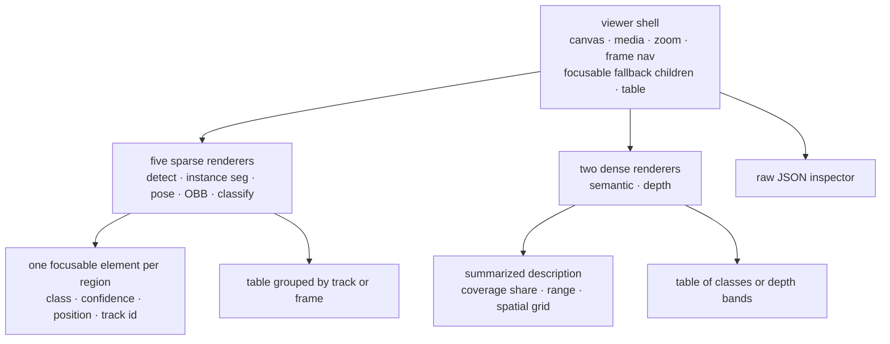
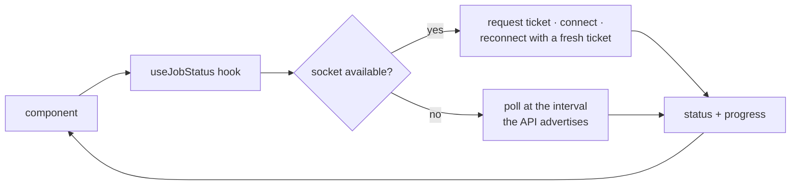

# SightForge Frontend - Plan

## Goal Capsule

- **Objective:** Someone who has never seen this project arrives, understands what it does within seconds, sees a real inference result without signing up, and — if they choose to register — can run all seven tasks on their own media and read the output as either a picture or a table.
- **Means:** A statically exported Next.js application served from the edge, rendering all seven result shapes on canvas with a parallel accessible representation, over a live socket with automatic polling fallback (KTD1, KTD3, KTD5).
- **Product authority:** Plan 4 of a five-plan split deriving from `docs/requirements/2026-08-29-1050-sightforge-cv-platform-requirements.md`, which stays `requirements-only`. Plan 1 supplies the result contract, plan 2 the API and socket handshake, plan 3 the results themselves.
- **Requirement fidelity:** Requirement text is quoted from the origin verbatim; a trailing italic clause marks a split and names the remainder's owner.
- **Stop conditions:** Stop and ask before adding a server-rendered route to the critical path, before shipping a visualization that has no accessible equivalent, and before any change that would send a password to the server.
- **Tail ownership:** This plan ends when an evaluator can reach a rendered result unauthenticated, and an authenticated user can run all seven tasks and read every output by keyboard alone.

---

## Product Contract

### Summary

Build the statically exported interface: a landing page that explains the project, a public gallery that shows real results without an account, authenticated pages for upload and job history, a task configuration panel, and a results viewer that renders all seven output shapes on canvas with an equivalent table beside each — meeting WCAG 2.1 AA throughout.

### Problem Frame

This is the only part of the system anyone will look at. Everything else is judged through it or through the repository, and an evaluator who cannot reach a working result in the first minute will not reach one at all.

That produces the plan's sharpest constraint, which is not technical. The origin's own success criterion says a first-time visitor reaches a rendered result without registering — but every task, result, and viewer sits behind authentication, a bot challenge, a browser-side key derivation, and a cold start measured in seconds. The public gallery is what makes the criterion reachable, and it is the highest-value thing in this plan.

The second constraint is that seven visualizations are not one visualization with a switch. Boxes, instance masks, a dense per-pixel class overlay, a ranked label list, a keypoint skeleton, rotated quadrilaterals, and a colorized depth map share almost nothing — and two of them are dense fields with no discrete regions, which breaks the accessible pattern that works for the other five.

### Key Decisions

Carried forward from the origin Product Contract, which owns their full statements:

- **The frontend is a static export served by Workers Static Assets.** Governs origin R53.
- **Password hardening runs in the browser; the Worker stores a fast hash.** Governs origin R5, R6, R7.
- **Job status is pushed over a WebSocket held by a Durable Object.** Governs origin R29, R30.
- **Video has two distinct modes with different defaults.** Governs origin R41, R42.

### Requirements

#### Interface surface

R53. The frontend is a Next.js static export deployed to Workers Static Assets, with no server-rendered route on the critical path.

R54. The application provides a landing page, register and login pages, a job history dashboard with status and timestamps, a drag-and-drop upload interface with progress, a task configuration panel, and a results viewer.

R116. An unauthenticated demo gallery is reachable in one click from the landing page, covering all seven tasks with pre-computed results rendered by the same viewer components and raw inspector as authenticated results, so an evaluator reaches a working result without registering or waiting on a cold start.

R60. The task configuration panel exposes every per-job configurable value — task, model variant, mode, frame rate, confidence threshold — rather than hiding defaults.

R59. The interface is responsive and degrades gracefully on mobile, where canvas overlays and the raw inspector are the constrained surfaces.

R58. Every view handles loading, error, and empty states explicitly, including the case where a job exists but its results have passed their retention window.

R4. The system degrades legibly rather than silently when a daily quota is exhausted: the static frontend detects a Cloudflare 1027 response or a Worker-bypassed route and renders an explicit capacity message, because no Worker-authored response is reachable in that state. _The alerting half is plan 5._

#### Result visualization

R55. Each of the seven tasks has a purpose-built client-side visualization: boxes for detection, per-instance masks for instance segmentation, a per-pixel class overlay for semantic segmentation, a ranked label list for classification, a keypoint skeleton for pose, rotated quadrilaterals for oriented bounding boxes, and a colorized depth map with a metric scale.

R56. Tracking results render with persistent per-track color and identity across frames, so temporal association is visible rather than merely present in the data.

R57. A raw result inspector exposes the underlying JSON with structural navigation, so the structured output can be examined directly.

R32. The interface communicates serverless cold start honestly, showing an expected wait derived from the measured container start rather than an asserted figure. _The measurement is supplied by plans 2 and 3; displaying it is here._

#### Accessibility

R31. Video jobs report progress as frames completed against frames total; image jobs report state only. _The reporting channel is plan 2; the display is here._

R33. A user can cancel a job that has not reached a terminal state. _The endpoint is plan 2; the surface offering it is here._

R51. Every result document carries a schema version so the viewer can render older results after the shape evolves. _The field is plan 1; reading it and rendering a stated older-result state for an unknown version is here._

R71. Registration and login are protected by Turnstile. _Server-side verification is plan 2; mounting the widget is here._

R61. The application meets WCAG 2.1 AA.

R62. Canvas overlays emit one focusable element per detected region as canvas fallback content in reading order, each named with class, confidence, position, and — in tracking mode — its track identifier, so assistive technology receives the temporal association that persistent color conveys to sighted users. This single mechanism carries keyboard access, focus visibility, and name/role/value together.

R63. Drawn overlays are dual-encoded so that color is never the sole carrier of meaning: class is conveyed by an attached text label and a line style, and masks by a distinguishable fill pattern rather than hue alone.

R64. Overlay strokes are drawn with a dark halo beneath a light stroke so that some contiguous edge maintains a 3:1 contrast ratio against arbitrary user imagery, whose adjacent color cannot be known in advance.

R65. Text drawn onto the canvas sits on an opaque label chip so its contrast is measured against a controlled background.

R66. Each visualization is accompanied by an equivalent data table outside the canvas element, grouped by track or by frame rather than rendered as one row per detection per frame.

#### Client-side credential handling

R5. The browser derives a key from the password using Argon2id in WebAssembly before transmission; the plaintext password never leaves the client. _The server side is plan 2; the browser implementation is here._

R6. The client rejects any response whose parameters fall below a hardcoded floor, so the unauthenticated endpoint cannot be used to downgrade derivation cost. _The endpoint is plan 2; the client-side floor is here._

R30. A polling status endpoint remains available as an automatic fallback when the WebSocket cannot be established, using adaptive backoff that widens as the job ages. _The endpoint and its advertised interval are plan 2; the client's fallback and backoff behavior are here._

R68. State-changing requests require a custom header. _The server-side check is plan 2; attaching the header on every mutation is here._

R73. All user-controlled values are output-encoded at render time; result data is treated as untrusted when drawn or displayed. _The served response is pinned by plan 2; rendering is here._

#### Documentation

R108. Documentation explains the client-side password derivation design and its rationale explicitly, so a reader evaluates it as a deliberate response to a platform constraint rather than as an error. _The rationale document is here, adjacent to the code it explains; the architecture document is plan 5._

### Scope Boundaries

#### Owned by other plans

- Every API endpoint, the socket handshake, and the reason-code enumeration this interface renders against — plan 2.
- The inference that produces the results — plan 3.
- The build pipeline, deployment, and the architecture document — plan 5.

#### Deferred to Follow-Up Work

- Result sharing, public result links, and any multi-user surface. The origin places these outside the product's identity.
- Client-side result caching beyond a session. Retention windows make a stale cached result a wrong answer rather than a fast one.

### Sources

- Origin Product Contract: `docs/plans/2026-08-29-1050-feat-sightforge-cv-platform-plan.md`.
- Plan 1 (result contract), plan 2 (API and handshake), plan 3 (result payloads).
- Screen-by-screen design prompts, the design tokens they share, and the full screen inventory: `docs/design/sightforge-stitch-prompts.md`.
- WCAG technique G209 sanctions a border achieving 3:1 against each adjoining color, including a two-color black-and-white border. It is not scoped to photographic backgrounds, so the conformance argument here is stated arithmetically instead — see U3.
- The short-plus-long description pattern the dense renderers use is established W3C guidance for complex images, not an invention of this plan.
- Canvas hit regions were removed from the standard; the current accepted pattern is focusable fallback children paired with the focus-drawing call, which satisfies keyboard access, focus visibility, and name/role/value together.
- A data table must sit outside the canvas element — one nested inside is announced as a single run of text.

---

## Planning Contract

### Key Technical Decisions

KTD1. **Static export, no server-rendered route on the critical path.** Static assets cost nothing against the account's daily request budget, so page views leave the whole budget for real API traffic. Every dynamic surface is client-side against plan 2's API.

KTD2. **The public gallery uses the same viewer components as authenticated results, fed from committed fixtures.** If the gallery had its own renderer it would drift from the real one and become a demo of something that does not exist. Reusing the components means the gallery is a live test of the viewer, and the fixtures double as the visual regression corpus.

KTD3. **Three kinds of renderer behind one viewer shell, not one renderer with a switch.** Region renderers — detection, instance segmentation, pose, oriented bounding box — populate the canvas and the region layer. Dense renderers — semantic segmentation, depth — populate the canvas and a summarized description, producing no focusable regions. And one non-spatial renderer, classification, bypasses the canvas entirely: a ranked list has no geometry and no regions, and forcing it through the region machinery would produce a fake layer. The shell owns the canvas, the media beneath it, zoom, frame navigation, and the accessible scaffolding; each renderer owns only its own shape.

KTD4. **Dense outputs get a summarized accessible representation, not an enumerated one.** Depth and semantic segmentation have no discrete regions to enumerate and no natural table row. Depth is described by its range, its statistics, and a coarse spatial grid; semantic segmentation by per-class coverage share and the regions each class occupies. This is the open question the round-1 review raised, answered here because the viewer cannot ship without an answer.

KTD5. **The socket is preferred and polling is automatic, with the transport invisible above a status hook.** Components ask for job status; the hook decides how it arrives, requests a fresh ticket on reconnect, and falls back to polling at the interval the API advertises. A component that knew which transport it was using would have to handle both.

KTD6. **The credential derivation runs in a worker thread at named parameters, not the main thread.** Argon2id at m=19456 KiB, t=2, p=1 — the published baseline — using a maintained WebAssembly implementation that works inside a worker. The larger 47 MiB configuration is rejected deliberately: mobile browsers impose memory ceilings that make it a device-dependent failure rather than a slower success, and parallelism above one buys nothing in a single WebAssembly instance. Budget one and a half to four seconds on a low-end phone, so the worker reports progress and the button states the wait rather than showing a spinner. The client floor is exactly these values; anything lower is refused before derivation begins.

KTD7. **Track identity drives color, and color never carries meaning alone.** A stable identifier maps to a stable hue so a viewer can follow one object across frames, but every region also carries its label, a line style, and a table row — because color-only encoding fails both the accessibility requirement and anyone viewing on a poor screen.

KTD8. **The accessible table is grouped, never flat.** One row per detection per frame is thousands of rows for a short clip, which is technically an equivalent and practically unusable. Tracking results group by track with a summary row; per-frame results group by frame.

### High-Level Technical Design

Status arrives over whichever transport works, and components never know which:

### Assumptions

- Plan 2's API is deployed and the generated reason-code enumeration is importable, so failure and capacity states render against a fixed list rather than invented copy.
- The media bucket allows `GET` from the frontend origin and exposes `ETag`; without that CORS rule every presigned result and artifact fetch fails at preflight, and the canvas that reads depth pixels is tainted.
- Plan 2 exposes an ownership-checked presign for dense artifact keys — a key referenced by a result the caller owns, never a raw client-supplied key.
- The socket ticket is obtainable on demand from an authenticated endpoint, not only at job creation — this plan's reconnect behavior depends on it.
- Plan 1's generated TypeScript types are importable, so every renderer binds to the contract rather than to a hand-written shape.
- Real result fixtures for all seven tasks exist from plan 3. Until they do, the gallery and the renderers are built against plan 1's schema fixtures, which are structurally valid but not visually representative.

### Sequencing

U1 is the shell and design system. U2 is the credential path, independent of everything visual. U3 builds the five sparse renderers, U4 the two dense ones and their summarized representation. U5 is the application surface — pages, upload, configuration, history. U6 is the public gallery, which depends on the renderers existing. U7 is the accessibility and responsive pass across everything.

### Risks and Dependencies

- **The gallery is the highest-value item and depends on real fixtures.** Built against schema fixtures alone it will look synthetic, which defeats its purpose.
- **Dense result payloads may be large.** A depth artifact per frame across a clip could exceed what a browser tab holds comfortably; nothing has measured this yet.
- **Argon2id in WebAssembly on a low-end phone may be slow enough to feel broken.** The parameter choice is a real tradeoff between derivation cost and perceived responsiveness, and it is not settled.
- **Seven renderers plus their accessible equivalents is the largest single body of work in the five plans.** It has no external dependency, so it is also the most schedulable.

---

## System-Wide Impact

- **This plan consumes contracts from all three earlier plans** and defines none that others consume — it is the terminal surface.
- **Plan 5 inherits the build output** and the static-asset deployment target, plus the accessibility gates worth running in CI.
- **A contract shape that cannot be rendered usefully is a defect to report upstream to plan 1**, not to work around in a renderer. The seven renderers are the first real test of whether the contract was well shaped.
- **This plan makes the origin's evaluator-facing success criteria checkable** for the first time; until the gallery exists, none of them can be verified.

---

## Open Questions

### Deferred to Planning

- How many frames of a video result the viewer holds in memory at once, which depends on measured payload sizes from plan 3.
- Whether the viewer plays video with a live overlay or steps frames. It steps frames for now, because a live overlay changes the region layer's rebinding cost by an order of magnitude.

---

## Implementation Units

### U1. Application shell and design system

- **Goal:** A statically exported application with routing, layout, a design system, and the state and error primitives every later unit uses.
- **Requirements:** R53, R58, R4.
- **Dependencies:** none within this plan.
- **Files:** `apps/web/src/app/`, `apps/web/src/components/`, `apps/web/src/lib/`, `apps/web/next.config.*`, `apps/web/test/`.
- **Approach:**
  1. Configure static export with no server-rendered route on the critical path (KTD1, R53). Job-scoped views are query-parameterized on static routes — `/jobs?id=…`, `/results?id=…` — read client-side inside a suspense boundary, because a dynamic route segment cannot be prerendered when the identifiers are unknowable at build time and static export rejects it outright. The only parameterized segment is the gallery's, whose values are the seven known task slugs and are enumerated at build. Set unoptimized images and trailing slashes, since neither optimization nor middleware exists under export.
  2. Build loading, error, and empty primitives once, including the expired-results state, so no view invents its own (R58).
  3. Import plan 2's reason-code enumeration and map each code to user-facing copy in one place, so no component writes an error string.
  4. Infer capacity exhaustion rather than reading it: the platform's over-limit response is generated upstream of the Worker and carries no cross-origin headers, so a fetch against it rejects opaquely and the status is unreadable. When an API call fails opaquely while the browser reports itself online, probe a same-origin static file; if the probe succeeds and the API still fails, render the capacity message, and render the offline state otherwise (R4).
  5. Author the static-asset headers file carrying plan 2's security header set, because Next's own header configuration is unsupported under static export and no Worker runs on an asset path. Its `script-src` includes `'wasm-unsafe-eval'` and it sets `worker-src 'self' blob:` — without both, the credential derivation worker never instantiates and login fails — and `connect-src` enumerates the API origin, the storage endpoint, and the socket origin.
  6. Build one API client module that attaches the custom header plan 2's cross-site defense requires and sends credentials, and is the only thing in the application that calls the API directly.
  7. Establish the type scale, spacing, and color tokens the visualizations will draw against, defining overlay colors alongside interface colors so the canvas and the page share one palette.
- **Test scenarios:**
  - The build produces a static export with no server-rendered route.
  - Each state primitive renders from its own props without a network call.
  - A platform capacity response renders the capacity message rather than a generic failure.
  - Every reason code in plan 2's enumeration maps to copy, and an unmapped code renders a safe fallback rather than the raw code.
- **Verification:** the export builds and serves; every state primitive is reachable in isolation.

### U2. Credential derivation and session handling

- **Goal:** A password is derived in the browser and never sent, and sessions survive a reload.
- **Requirements:** R5, R6.
- **Dependencies:** U1.
- **Files:** `apps/web/src/lib/auth/`, `apps/web/src/app/(auth)/`, `apps/web/test/`.
- **Approach:**
  1. Run Argon2id in a worker thread so sign-in does not block the interface, showing honest progress while it runs (KTD6).
  2. Fetch the account's salt and parameters, reject any parameter set below the hardcoded floor before deriving, and surface a clear failure if the floor is violated (R6).
  3. Submit only the derived value; the plaintext never leaves the worker thread and is never placed in component state (R5).
  4. Keep session tokens entirely in the cookies plan 2 sets; store nothing in browser storage.
  5. Handle the parameter-convergence exchange plan 2 defines, deriving a second value under current parameters when the server signals stale ones.
  6. Mount the bot challenge on register and login, and surface its failure distinguishably from a credential failure.
- **Test scenarios:**
  - The plaintext password never appears outside the worker thread — asserted against component state and network payloads.
  - A parameter set below the floor is refused before any derivation runs.
  - Derivation runs off the main thread and the interface stays responsive throughout.
  - A stale-parameter signal triggers the convergence exchange and the account converges.
  - No token is written to browser storage.
  - A challenge failure and a credential failure render distinguishably to the user while remaining indistinguishable in what they reveal about the account.
- **Verification:** the full register and login flow works against plan 2's deployed API with no plaintext leaving the worker thread.

### U3. The five sparse visualizations

- **Goal:** Detection, instance segmentation, pose, oriented bounding box, and classification each render correctly and are fully reachable by keyboard.
- **Requirements:** R55, R56, R62, R63, R64, R65, R66, R73.
- **Dependencies:** U1.
- **Files:** `packages/ui/src/viewer/`, `packages/ui/src/viewer/renderers/`, `packages/ui/test/`.
- **Approach:**
  1. Build the viewer shell first — canvas, underlying media, zoom, frame navigation, and the accessible scaffolding — then implement renderers against it (KTD3). Layer a transparent overlay canvas over the media element rather than redrawing the media per frame, size the backing store by device pixel ratio with a matching scale, coalesce every draw into one animation frame so a zoom drag does not queue hundreds, and create patterns and fonts once rather than per region per frame.
  2. Make the region layer one composite widget rather than one tab stop per region: a listbox in the canvas's fallback content with roving focus — one tab stop into the layer, arrow keys between regions, the active region named by class, confidence, position, and track identifier where present, and the focus ring painted with the focus-drawing call against the active region's path. Option elements are pooled and reused across frames rather than rebuilt, and the active region is preserved across a frame change by track identity. Hundreds of individual tab stops would make it impossible to tab past the canvas and would destroy focus on every frame advance (R62).
  3. Draw a pure-black halo beneath a pure-white stroke on every region — not tinted variants, which void the guarantee. The conformance argument is arithmetic rather than a citation: any background failing 3:1 against white necessarily exceeds 7:1 against black, so one of the two edges always clears, and the white-against-black boundary of the halo itself is maximal. Size the canvas backing store by device pixel ratio, since an unscaled canvas draws sub-pixel strokes whose measured contrast is not the drawn contrast (R64).
  4. Carry class on the attached text label, which satisfies the use-of-color criterion on its own — line style encodes only a small closed set such as selected versus unselected, never class, whose cardinality runs to dozens and exceeds the handful of distinguishable dash patterns. Distinguish instance masks by a rotating hatch pattern combined with outline and label rather than by hue (R63).
  5. Draw every text label on an opaque chip so its contrast is measured against a controlled background (R65).
  6. Map track identity to stable hue so an object is followable across frames, while never letting hue carry meaning alone (KTD7, R56).
  7. Render the accessible table grouped by track for tracking results and by frame otherwise, with a summary row per group (KTD8, R66).
  8. Treat every string in a result as untrusted when drawing or displaying it (R73).
- **Test scenarios:**
  - Each of the five renders correctly from a real fixture for its task.
  - Tab moves through one focusable element per region in reading order, and each announces class, confidence, and position.
  - A tracking result's focusable elements also announce track identity.
  - Every region's stroke maintains a contiguous 3:1 edge against both a white and a black background.
  - Class is distinguishable with color removed.
  - A text label's contrast is measured against its chip and passes.
  - The accessible table groups by track for tracking results and by frame otherwise, and a hundred-frame result produces a navigable table rather than thousands of rows.
  - A result containing markup-shaped text renders as text.
  - Focus is visible on every focusable region.
- **Verification:** all five render from real fixtures; every result is reachable and comprehensible by keyboard and screen reader alone.

### U4. The two dense visualizations

- **Goal:** Semantic segmentation and depth render usefully and have a real accessible equivalent despite having no discrete regions.
- **Requirements:** R55, R57, R66.
- **Dependencies:** U3.
- **Files:** `packages/ui/src/viewer/renderers/`, `packages/ui/src/viewer/inspector/`, `packages/ui/test/`.
- **Approach:**
  1. Resolve the dense artifact through an injected resolver the shell is handed rather than constructing a URL — the authenticated app supplies a resolver backed by plan 2's artifact-presign endpoint, the gallery supplies a static-path resolver, and no renderer ever builds a URL itself. Render it as an overlay with adjustable opacity against the source media, decoding off the main thread and holding a bounded cache of frames.
  2. Render semantic segmentation as a per-pixel class overlay with a legend, and depth as a colorized map with a metric scale showing real units.
  3. Describe dense outputs by summary rather than enumeration: per-class coverage share and occupied regions for segmentation; range, distribution, and a coarse spatial grid for depth (KTD4).
  4. Give each a data table of classes or depth bands rather than pixels.
  5. Build the raw inspector as structural navigation over the result document, able to open a large document without freezing the tab (R57).
  6. Apply the same pattern-not-hue rule to the class overlay's legend.
- **Test scenarios:**
  - A semantic segmentation result renders its overlay with a legend and per-class coverage.
  - A depth result renders with a metric scale whose units match the contract's declared unit.
  - The accessible description for each conveys what the image shows without enumerating pixels.
  - The dense table lists classes or depth bands, not per-pixel rows.
  - The raw inspector opens a large result document and navigates it without freezing.
  - A missing or expired dense artifact renders the expired state rather than a broken overlay.
- **Verification:** both dense tasks render and are comprehensible via their summarized description alone.

### U5. Application surface

- **Goal:** Upload, configure, submit, watch, and browse — the authenticated product.
- **Requirements:** R54, R60, R30, R32, R58.
- **Dependencies:** U2, U3.
- **Files:** `apps/web/src/app/`, `apps/web/src/components/`, `apps/web/test/`.
- **Approach:**
  1. Build drag-and-drop upload with real progress, uploading directly to storage with the presigned URL the API returns.
  2. Validate format, size, and duration client-side before upload as a courtesy, while treating the server's post-upload verdict as authoritative.
  3. Build the configuration panel exposing task, variant, mode, frame rate, and confidence threshold, disabling tracking on the three ineligible tasks with a stated reason rather than hiding it (R60).
  4. Implement the status hook so components never know their transport: prefer the socket, request a fresh ticket on every connect and reconnect, and pass it as the WebSocket subprotocol value — never in the URL, where it would land in every request log — encoded unpadded base64url, since padding is not a valid protocol token and throws before the request is sent. Treat a handshake the server does not echo a subprotocol on as a transport failure and fall back rather than looping. Poll at the interval the API advertises, which already widens with job age, pausing while the tab is hidden and resuming on visibility (KTD5, R30).
  5. Render status transitions and upload progress into a live region so a change is announced without stealing focus, throttling progress so every tick is not announced — status arriving asynchronously is exactly the case that criterion exists for, and it is the one this whole plan is built around.
  6. Show an honest wait built from the measured duration the API reports, and explain cold start plainly rather than showing a spinner that implies immediacy (R32).
  7. Build job history with status, timestamps, and filtering, handling the empty and expired states from U1's primitives.
  8. Offer cancellation on any non-terminal job, and job and account deletion with a confirmation that states exactly what is removed.
  9. Render video progress as frames completed against frames total, and state only for image jobs.
- **Test scenarios:**
  - Upload reports real progress and surfaces a failed upload distinguishably from a failed job.
  - A file failing client-side validation is refused with the reason, and a file that passes client-side but fails server-side surfaces the server's reason.
  - Selecting an ineligible task disables tracking with a stated reason rather than silently.
  - With the socket blocked, status still advances via polling and the user sees no difference.
  - A dropped socket reconnects with a fresh ticket and loses no transition.
  - The wait estimate reflects the reported measurement rather than a constant.
  - History renders empty, populated, and expired states correctly.
  - Deleting a job or account states what will be removed before it happens.
- **Verification:** a user completes the whole flow against the deployed API for both an image and a video job.

### U6. Public demo gallery

- **Goal:** An evaluator reaches a real rendered result in one click, with no account and no waiting.
- **Requirements:** R116, R54.
- **Dependencies:** U3, U4.
- **Files:** `apps/web/src/app/gallery/`, `apps/web/fixtures/`, `apps/web/test/`.
- **Approach:**
  1. Commit eight entries — the seven tasks plus one tracking example — from the fixture set plan 3 produces: permissively-licensed source assets, the result document each yields, and any packed dense artifact. Keep each file inside the static-asset per-file limit and the whole build inside the per-version file count, which is why a dense entry commits a bounded frame window rather than a full clip.
  2. Render them with the same viewer components and raw inspector as authenticated results — never a separate gallery renderer (KTD2).
  3. Reach it in one click from the landing page, with no authentication and no API call on the path.
  4. Show one tracking example so temporal association is visible without an account.
  5. Explain beside each what the task does and what the viewer is looking at, since the audience will not know the difference between instance and semantic segmentation.
  6. Use the fixtures as the visual regression corpus, so a renderer change that breaks the gallery fails a test rather than shipping.
- **Test scenarios:**
  - Every gallery entry renders through the same components as an authenticated result.
  - The gallery is reachable in one click from the landing page with no authentication.
  - No API call is required to render any gallery entry.
  - All seven tasks appear, and at least one shows tracking.
  - A renderer change altering gallery output fails the regression test.
  - Gallery results are keyboard-navigable to the same standard as authenticated ones.
- **Verification:** an unauthenticated visitor reaches a rendered result for every task in one click.

### U7. Accessibility conformance and responsive pass

- **Goal:** WCAG 2.1 AA across the whole application, and graceful degradation on a phone.
- **Requirements:** R61, R59, R62, R63, R64, R65, R66, R108.
- **Dependencies:** U5, U6.
- **Files:** `apps/web/src/`, `packages/ui/src/`, `apps/web/test/`, `docs/`.
- **Approach:**
  1. Audit every view against the criteria most at risk here — non-text contrast, use of color, contrast minimum, images of text, resize text, reflow, content on hover or focus, non-text content, name/role/value, status messages, keyboard, focus visible, pointer gestures, and error identification — rather than running a generic checker and calling it done. Canvas-drawn label text is an image of text, so it scales with the user's root font size and a viewer-level label-size control, and the same text is always present in the region layer and the table, which is the primary conformance path. Zoom and pan have keyboard and single-pointer equivalents; pinch is an enhancement only.
  2. Verify the canvas pattern end to end with an actual screen reader on at least one result per task family, since automated tools cannot evaluate whether a description is meaningful.
  3. Make the constrained mobile surfaces work: the canvas overlay and the raw inspector, which are the two that do not shrink gracefully.
  4. Ensure a dense overlay remains legible at mobile width or degrades to its summarized representation rather than becoming an unreadable smear.
  5. Write the client-side derivation rationale document adjacent to the code it explains, so a reader encountering the unusual design finds the reasoning immediately (R108).
- **Execution note:** the automated pass finds violations; the screen-reader pass finds whether the output is comprehensible. Both are required, and only the second can judge the dense descriptions.
- **Test scenarios:**
  - Automated checks pass on every view with no violations at the AA level.
  - A screen reader conveys a detection, a pose, and a depth result comprehensibly.
  - Every interactive element is reachable and operable by keyboard, with visible focus.
  - Removing color leaves every result comprehensible.
  - Each view is usable at mobile width, with the canvas and inspector degrading rather than breaking.
  - The derivation rationale document explains the design and the constraint that forced it.
- **Verification:** the application conforms at AA; a keyboard and screen-reader user completes the full flow including reading a result.

---

## Verification Contract

| Gate | Applies to | Passing signal |
| --- | --- | --- |
| Static export | U1 | The build produces a static export with no server-rendered route on the critical path |
| Credential containment | U2 | The plaintext password appears in no component state or network payload |
| Parameter floor | U2 | A below-floor parameter set is refused before derivation |
| Sparse renderers | U3 | All five render from real fixtures with focusable regions in reading order |
| Contrast over unknown imagery | U3 | Every region keeps a contiguous 3:1 edge against both white and black backgrounds |
| Color independence | U3, U4, U7 | Every result stays comprehensible with color removed |
| Dense equivalence | U4 | Depth and semantic segmentation are comprehensible from their summarized description alone |
| Grouped tables | U3, U4 | A hundred-frame result produces a navigable grouped table, not thousands of rows |
| Transport transparency | U5 | With the socket blocked, status advances identically via polling |
| Reconnect | U5 | A dropped socket reconnects with a fresh ticket and loses no transition |
| Gallery reach | U6 | An unauthenticated visitor renders a result for every task in one click |
| Visual regression | U6 | A renderer change altering gallery output fails a test |
| WCAG 2.1 AA | U7 | Automated checks pass and a screen reader conveys each result family comprehensibly |
| Mobile degradation | U7 | Every view is usable at mobile width |

Automated accessibility checks are necessary and not sufficient — the dense-output descriptions can only be judged by a person using a screen reader.

---

## Definition of Done

### Global

- All seven units complete and their verification signals hold.
- An unauthenticated visitor reaches a real rendered result for every task in one click from the landing page.
- An authenticated user completes upload, configuration, submission, live tracking, and retrieval for both an image and a video job.
- All seven visualizations render from real results, and every one has an accessible equivalent a screen-reader user can actually understand.
- The application conforms to WCAG 2.1 AA, verified by automated checks and by a screen reader.
- The plaintext password never leaves the worker thread, and the parameter floor is enforced before derivation.
- Status transport is invisible to components: the socket is preferred, polling is automatic, reconnect loses nothing.
- The derivation rationale document sits adjacent to the code it explains.
- Abandoned scaffolding and dead-end experiments are removed rather than left in the diff.

### Per unit

Each unit is done when its verification line holds and its test scenarios pass.

### Explicitly not done here

Nothing is deployed by CI until plan 5, and no accessibility gate runs automatically until plan 5. The architecture document explaining the whole system is plan 5's.

---

## Motion and Interaction Strategy

Appended after the Definition of Done because it describes how the built product should feel, not what it must contain. Nothing here is a requirement; everything here is subordinate to the requirements above. If an animation conflicts with an accessibility gate, the gate wins.

### The rule everything else follows

**Motion in this product exists to explain state, never to decorate it.** Three things are genuinely happening that a user cannot see — a job is queued behind a container that is cold-starting, a socket is delivering transitions from somewhere else, and a region in a table corresponds to a region in an image. Motion's job is to make those three legible. Anything that does not serve one of them is a candidate for deletion.

That test is what keeps a portfolio project from crossing into the uncanny valley where an evaluator notices the animation instead of the work.

### The non-negotiable

**Every animation respects the reduced-motion preference.** Not "most" — every one. Under that preference, transforms and movement are removed entirely while opacity fades are kept at a shortened duration, because a fade carries state change without inducing symptoms. This is a conformance matter, not a nicety, and it is the first thing to implement rather than the last.

The second constraint is the accessibility mechanism itself: the region layer is a single roving-focus widget, so focus movement between regions must be instant. Animating a focus ring across a canvas would make keyboard navigation feel laggy and would fight the very affordance it decorates.

### Where motion earns its place

**The cold start is the single best motion opportunity in the product**, because it is the one moment where the user is definitely waiting and definitely wondering whether something broke. The stage tracker fills its connector line as each stage completes, the active stage carries a slow pulsing dot, and the cold-start explanation fades in only _after_ about three seconds — appearing immediately would make it look like a canned message rather than a response to a real delay. For video, the frame counter animates between values rather than jumping, which reads as continuous progress rather than discrete polling.

**Status pill transitions on the dashboard.** When a job moves from processing to completed, the pill cross-fades its colour and its icon morphs from an arc to a check over roughly 240ms. Because state arrives over a socket, this is the moment a user learns something changed without having done anything — the transition is what makes that legible rather than startling. The row itself gets a single soft cyan flash that decays over about a second, so a change is noticeable in peripheral vision on a long list.

**The table-to-image link in the results viewer.** This is the interaction that makes the product feel like an instrument. Hovering or focusing a table row brightens the corresponding region and dims the others over about 120ms; selecting a region scrolls the table to its row with a brief highlight. The dimming is what does the work — isolating one region among fourteen by lowering everything else reads instantly, where highlighting alone does not.

**Overlay reveal on results load.** When a result first renders, regions draw in over about 400ms with a very short stagger between them — roughly 20ms apart, capped so a result with 200 regions does not take four seconds. This is the one moment of deliberate delight in the product, and it earns its place because it communicates something true: these regions were found, individually, by a model. It should feel like the result arriving, not like a slideshow.

**The opacity slider on dense results.** Fading between the photograph and the depth map is direct manipulation with no animation of its own — the value tracks the pointer exactly. Motion here would introduce lag between input and result, which is precisely wrong for a comparison control.

**Drag-and-drop feedback.** The drop zone's border and background tint transition over 150ms on drag-enter and drag-leave. On drop, the zone cross-fades into the file preview rather than swapping instantly, which makes the transition feel like the same object changing rather than one element replacing another.

**The reconnection indicator.** When the socket drops, a slim banner slides down from the top over 200ms reading "Reconnecting", with a quiet indeterminate indicator. On recovery it slides away after a brief confirmation. Because the polling fallback is automatic and invisible, this banner is the only place a user learns that anything happened — it should be calm rather than alarming.

### Micro-interactions worth building

- **Buttons** shift background over 150ms on hover and scale to 0.98 for the duration of a press. Nothing more.
- **Cards in the demo gallery** lift 2px and brighten their border over 200ms on hover. The lift is small deliberately — a large one reads as a consumer product.
- **Task tiles** in the configuration panel snap their border to cyan instantly on selection, with the background tint fading in behind it over 150ms. Selection feedback must feel immediate; the tint can be gentle.
- **Numeric values** that change — the frame counter, the usage figure, confidence values — count rather than jump, over roughly 300ms. This is a small effect that disproportionately signals care.
- **Skeleton loaders** carry a slow shimmer sweeping every 1.5 seconds, at low contrast so it reads as pending rather than active.
- **Drawer and sheet entry** — the raw inspector slides in over 250ms with an ease-out curve and the content behind it dims to 40%. Exit is faster, around 180ms, because dismissing should feel more immediate than opening.
- **Confirmation dialogs** scale from 96% with a fade over 180ms. Fast enough not to delay a destructive decision, slow enough to register.

### The landing page, treated separately

The landing page is the only surface where motion may exceed what state changes require, because its job is different — it has ten seconds to establish that this is a serious piece of engineering.

The hero visual should animate its overlays in on load, using the same draw-in used in the results viewer. Reusing that exact motion is the point: the landing page is showing the real product behaviour, not a marketing animation. Sections fade and rise 16px as they enter the viewport, once, with a stagger between siblings. The task strip cards animate individually rather than as a block.

Nothing on the landing page should loop indefinitely. Perpetual motion is what makes a page feel like a template.

### What not to build

Named explicitly, because each is tempting and each would cost more than it returns:

- **Page transitions between routes.** In a statically exported application these add perceived latency to navigation that is otherwise instant.
- **Parallax scrolling** anywhere, including the landing page.
- **Animated background gradients or particle fields.** They read as 2021 and they cost battery on the mobile devices where the canvas work is already expensive.
- **A typewriter effect** on any headline.
- **Spinners as a primary loading state.** Skeletons carry layout information; spinners carry none.
- **Physics-based or spring motion** on interface chrome. It is enjoyable to build and it makes a precision instrument feel loose.
- **Animating anything on the results canvas during video playback.** The canvas is already redrawing per frame with pattern fills and hundreds of regions; decorative motion there directly costs frame rate.

### Implementation posture

Prefer CSS transitions and keyframes for everything listed above; almost none of it needs a JavaScript animation library. Restrict animated properties to `transform` and `opacity`, which the compositor can handle without layout work — animating `width`, `height`, `top`, or `left` on a page that is simultaneously drawing a canvas is where a smooth interface becomes a stuttering one.

Canvas-side motion — the overlay draw-in, the region dim-and-highlight — runs inside the same coalesced animation frame the renderers already use, never on its own timer. A second independent loop competing with the render loop is the most likely source of jank in this product.

Define durations and easing curves as tokens alongside the colour tokens, so the whole product shares one motion vocabulary: 120ms for state feedback, 150–200ms for hover and small transitions, 250ms for entrances, 400ms for the overlay reveal. Consistency across those four values does more for perceived quality than any individual effect.

**Build order.** The reduced-motion handling and the four motion tokens come first, before any animation. Then the three that carry meaning — the stage tracker, the status pill transition, and the table-to-image link. Everything else is polish applied last, and any of it can be dropped without the product feeling unfinished.
