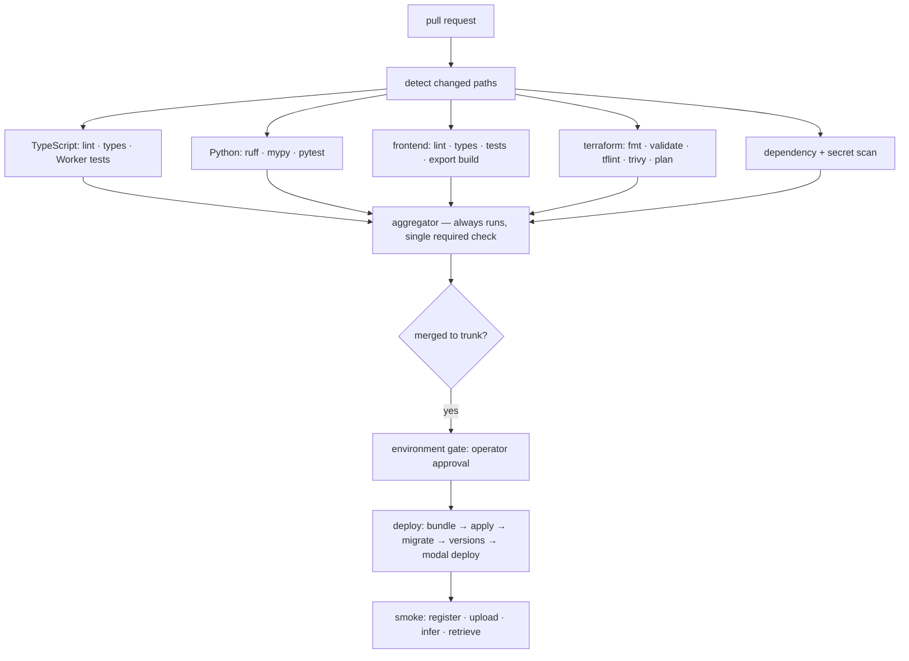
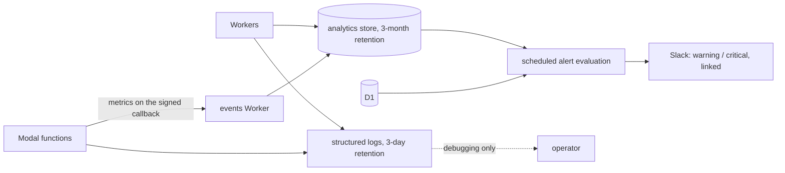

# SightForge Delivery and Operations - Plan

## Goal Capsule

- **Objective:** A change goes from commit to production through checks that would catch it being wrong, the running system reports its own health, the operator hears about a problem before a user does, and a reader can reconstruct why the whole thing is built the way it is.
- **Means:** One pull-request workflow with per-job path conditions and a single always-running aggregator as the sole required check, a separate deploy workflow on trunk, a gated deploy that reuses the sequence plan 1 established, observability on the free tier's durable analytics rather than short-lived logs, and one architecture document written last because it describes what exists (KTD1, KTD4, KTD6).
- **Product authority:** Plan 5 of a five-plan split deriving from `docs/requirements/2026-08-29-1050-sightforge-cv-platform-requirements.md`, which stays `requirements-only`. It deploys and observes what plans 1 through 4 built.
- **Requirement fidelity:** Requirement text is quoted from the origin verbatim; a trailing italic clause marks a split and names the remainder's owner.
- **Stop conditions:** Stop and ask before any workflow gains permission to deploy from a forked pull request, before adding a paid observability tier, and before a required check is made path-conditional.
- **Tail ownership:** This plan ends when a merge deploys automatically behind an approval gate, an induced failure produces an alert, a rollback has actually been executed, and the architecture document is written. It is the last plan.

---

## Product Contract

### Summary

Build the delivery and operations layer: one workflow that lints, type-checks, and tests each language only when it changed; Terraform planning on pull requests and applying behind an approval gate; deployment that reuses the four-step sequence plan 1 established; structured logs and durable metrics; Slack alerting on conditions evaluated against the analytics store rather than logs; a rehearsed rollback; and the architecture document explaining the compute boundary and the cost arithmetic.

### Problem Frame

Four plans built a system across two platforms, three languages, and one free tier. This plan makes it deployable by someone other than the person who wrote it, and observable by someone who is not watching.

The free tier shapes observability more than anything else. Log retention is three days, and log-based alerting is a paid feature — so an alert evaluated by searching logs is both impossible and, at three days, useless for anything trending. The durable analytics store retains for three months at no cost, which makes it the record and logs the debugging aid.

The second shaping constraint is subtler than it looks. A required check that is never _reported_ blocks a pull request indefinitely — a workflow-level path filter leaves the check pending, and pending blocks merge forever. A job-level skip reports success instead, which is safe for that job but unsafe for an aggregator, because a skipped aggregator reads as a green pipeline. The fix is one workflow with no workflow-level path filter, per-job conditions, and one aggregator that always runs and reports what actually happened.

### Key Decisions

Carried forward from the origin Product Contract, which owns their full statements:

- **Production is the only deployed environment.** Governs origin R119.
- **Terraform manages only non-secret resources.** Governs origin R75, R80.
- **Cloudflare free plan with Modal pay-per-use.** Governs origin R2.
- **SightForge owns a dedicated Cloudflare account.** Governs origin R1.

### Requirements

#### Continuous integration

R85. The frontend pipeline runs linting, type checking, unit tests, and the static export build.

R86. The Python pipeline runs `ruff`, `mypy`, and `pytest` across the inference service and shared Python utilities.

R118. The TypeScript pipeline runs linting, type checking, and unit tests for every Worker and shared package, executing Worker tests in a runtime-accurate harness rather than a plain Node environment, so behavior that depends on the Workers runtime is actually exercised.

R87. Dependency and secret scanning run on every pull request, and the pipeline fails on a detected secret.

R88. The Terraform pipeline runs `fmt`, `validate`, `tflint`, and Trivy in configuration-scan mode, and publishes the plan for review before apply. The scanner is named because two once-common choices are no longer maintained, and a scanner whose ruleset targets other cloud providers would produce noise rather than signal against a Cloudflare-only configuration.

#### Deployment

R89. Production deployment is gated behind a GitHub Environment with the operator as a required reviewer, and deployment credentials are environment-scoped rather than repository-scoped.

R90. Workflows triggered by forked pull requests never receive deployment credentials, and the privileged path is separated from the untrusted-code path.

R91. Post-deployment smoke tests exercise registration, upload, an image inference job, and result retrieval against the deployed environment.

R92. Rollback is performed by redeploying a previously released commit, and the procedure is documented for both Cloudflare and Modal, because Modal managed rollback is unavailable on the plan in use and only a small number of prior versions are retained. The documented procedure is executed at least once against both platforms as a verification drill before the release is considered complete.

R93. Cloudflare and Modal credentials are long-lived API tokens stored as environment secrets, since neither platform accepts GitHub Actions OIDC for inbound authentication; the tokens are least-privilege and time-bounded where the platform allows.

R76. Secrets are injected out of band by CI after infrastructure apply, using the platform-native secret mechanism on each side. _The inventory and the scoping are plan 1; the pipeline step that performs the injection is here._

R83. Modal infrastructure is defined in Python decorators, which are the only definition mechanism Modal provides, and is deployed by CI rather than by Terraform. _The decorator definitions are plan 3; the pipeline that deploys them is here._

#### Observability

R94. Every Worker and every Modal function emits structured JSON logs carrying a correlation identifier that follows a job across both platforms. _The emission is built into each component by plans 2 and 3; the schema, retention posture, and consumption are here._

R95. Operational metrics are written to a durable analytics store rather than inferred from logs, because log retention on the free plan is short enough that alert evaluation cannot depend on it.

R96. Alerts are delivered to Slack by webhook and distinguish warning from critical severity.

R97. Alert conditions cover: inference failure rate above a threshold, Worker error rate spike, cleanup failure, a job stuck in a non-terminal state beyond its expected duration, approach of a daily account quota, and cumulative inference spend against remaining credit at both warning and critical thresholds.

R98. Alert evaluation runs on a schedule against the analytics store and the database, never against log search.

R99. Every alert names the affected job or resource and links to where the operator can act on it.

R4. The critical alert fires on the quota-approach condition before exhaustion, while the scheduled Worker can still be invoked. _The frontend capacity message is plan 4._

#### Documentation

R107. The running site links prominently to its source, satisfying the network-use obligation that the chosen model family carries. _The license and package-inheritance record are plan 1; the rendered link is here, coordinated with plan 4's layout._

R113. The repository contains an architecture document covering the compute boundary rationale for each component, the per-job cost arithmetic with the calculation shown, and the specific free-plan constraint that forced each key decision.

R114. The baked task-by-variant weight matrix and the resulting container image size are bounded by a declared cold-start budget, listed among the configurable operational values, so image growth is a design input rather than a late discovery. _The budget is measured and declared by plan 3; enforcing it as a build-time check is here._

### Scope Boundaries

#### Owned by other plans

- Terraform configuration itself and the deployment sequence's definition — plan 1. This plan automates the sequence; it does not redefine it.
- The log lines each component produces — plans 2 and 3. This plan defines the schema they conform to, adds the metric-write module to the shared Worker package and the metric fields to the inference callback, and consumes both.
- The scheduler Worker itself and its dispatch table — plan 2, which allocates alert evaluation 8 of its 50 subrequests. This plan writes the evaluation module that runs in that slot, plus the conditions, thresholds, and delivery.

#### Deferred to Follow-Up Work

- A second deployed environment and any promotion pipeline. One environment is settled; the workflow is written so adding a second is a matter of a second environment target rather than a restructure.
- Log forwarding to an external aggregator. It is a paid feature, and the durable analytics store covers what alerting needs.
- Automated dependency updates. Worth having, not worth blocking the first release on.

### Sources

- Origin Product Contract: `docs/requirements/2026-08-29-1050-sightforge-cv-platform-requirements.md`.
- Plans 1 through 4, which supply the deployment sequence, the components, and the build outputs this plan automates.
- A workflow-level path filter leaves a required check pending and blocks merge indefinitely; a job-level skip reports success, and a skipped aggregator therefore reads as a passing pipeline. Both behaviors argue for one always-running aggregator as the sole required check.
- GitHub Actions is free for public repositories on standard runners, and Environments with required reviewers are available on the free plan **only** for public repositories — which this one is, under AGPL-3.0.
- Neither Cloudflare nor Modal accepts GitHub Actions OIDC for inbound authentication; both require long-lived tokens.
- Workers log retention is three days on the free plan and log-based forwarding is paid, while the analytics store retains three months at no cost.

---

## Planning Contract

### Key Technical Decisions

KTD1. **One pull-request workflow with per-job path conditions and one always-running aggregator as the sole required check, plus a separate deploy workflow on trunk.** The split is deliberate: the deploy workflow must never be reachable from a pull-request event. Within the pull-request workflow, a setup job computes which paths changed and exposes them as outputs — there is no native per-job path filter — and every language job conditions on one. The aggregator is the only check branch protection references, which is what makes the skip-reads-as-success trap survivable.

KTD2. **Each language's pipeline runs only when its paths change, but the contract package triggers everything.** A schema change regenerates types consumed by TypeScript and Python and rendered by the frontend, so it is the one path that fans out to every job.

KTD3. **The privileged path never runs untrusted code.** Forked pull requests build and test with no credentials; deployment runs only from the trusted branch behind the environment gate. This is the single most consequential setting in the repository, because credentials that reach a forked pull request are credentials given to anyone.

KTD4. **Deployment automates plan 1's sequence rather than reinventing it.** Bundle, apply infrastructure, apply migrations, upload and deploy versions — the same four steps, in the same order, with the one-time Durable Object bootstrap deliberately excluded because it is a one-time manual step.

KTD5. **Modal deploys in the same job, tagged with the commit.** One release means one commit deployed to both platforms; a Worker version and a Modal deployment that came from different commits is exactly the state the correlation identifier cannot help debug.

KTD6. **Metrics go to the durable analytics store; logs are for debugging.** Three-day log retention cannot support alerting on anything trending, and log-based forwarding is paid. The analytics store retains three months at no cost, so it holds the operational record and alerting reads only from it and the database.

KTD7. **Alerts carry a link to the thing they are about.** An alert naming a job identifier with no way to reach it makes the operator do the lookup the alert should have done. Every alert links to the job, the resource, or the run that produced it.

KTD8. **The rollback is rehearsed against production, because there is nowhere else.** One environment means the drill runs where it matters. For a project with no users this is acceptable and is the only way the origin's "executed at least once" criterion can be met honestly.

KTD9. **The architecture document is written last and states the constraint behind each decision.** It is the artifact an evaluating engineer reads first and the one most likely to be squeezed out, so it is a unit with a verification gate rather than a task. Written before the system exists it would describe intentions; written last it describes what is true, including where measurement contradicted the original estimate.

### High-Level Technical Design

Observability reads from the durable store, never from logs:

### Assumptions

- The repository is public, which is what makes both GitHub Actions minutes free on standard runners and Environments with required reviewers available on the free plan. If it were private, the approval gate would not exist.
- Plans 2 and 3 emit the correlation identifier on every log line. This plan adds the metric writes themselves — to the shared Worker package and to the inference service's callback payload — rather than assuming they already exist.
- Plan 2's scheduler Worker has capacity within its subrequest allowance for the alert-evaluation sweep. If it does not, the allowance is re-cut rather than a second cron trigger added.
- Plan 3 has produced measured cold-start and cost figures, which the architecture document reports and the image-size check enforces against.

### Sequencing

U1 establishes the workflow skeleton and the aggregator, which every later job attaches to. U2 through U4 add the language pipelines, scanning, and Terraform checks. U5 is deployment and the gate. U6 is observability and alerting. U7 is the rollback drill and the architecture document — deliberately last, because both describe a system that must already exist.

One exception to the plan ordering, and it matters: **U1, U3, and the lint-and-test half of U2 are built immediately after plan 1's scaffolding, not at the end.** The repository is public from its first commit, and a local hook is bypassable — the window between first commit and plan 5 is exactly when an accidental credential would land in a public history that no later gate can undo. Those three cost about a day and depend on nothing else in this plan.

### Risks and Dependencies

- **Long-lived deployment tokens are unavoidable.** Neither platform accepts short-lived federated credentials, so the controls available are least-privilege scoping, environment binding, expiry where supported, and never exposing them to a forked pull request.
- **One environment means the deploy that gets approved is the one that ships.** Smoke tests run after deployment, not before, so they detect rather than prevent. The gate is a human reading a plan.
- **Alerting depends on components emitting what it reads.** Nothing here can alert on a metric that was never written.
- **The rollback drill runs against production.** Acceptable with no users; it should be done deliberately and at a chosen moment rather than discovered during an incident.

---

## System-Wide Impact

- **This plan consumes from all four others and produces one thing they all depend on: a repeatable path to production.** Until it exists, every deployment is manual and unreproducible.
- **The architecture document is the artifact the evaluating audience most likely reads first**, and it is the only place the whole compute-boundary argument appears in one piece.
- **Alert thresholds encode operating assumptions** — what failure rate is normal, what duration is stuck, what spend is alarming. Wrong numbers make alerting noise, and noisy alerting is ignored alerting.
- **The image-size check enforces plan 3's measured cold-start budget at build time**, converting a measurement into a constraint that cannot silently erode.

---

## Open Questions

### Deferred to Planning

- Concrete alert thresholds: what inference failure rate, what error-rate spike, what stuck duration, what remaining-credit levels separate warning from critical. Plan 3's measurements inform these and did not exist when the requirements were written.
- Whether the smoke test creates a real job on every deploy, and if so how its cost and its retention interact with the sweeps.
- Whether dependency scanning blocks a merge on a vulnerability with no available fix, or reports it. Blocking on an unfixable finding stops all work.

---

## Implementation Units

### U1. Workflow skeleton and the aggregator check

- **Goal:** One workflow with path detection and a single always-running required check.
- **Requirements:** R85, R86, R118.
- **Dependencies:** none within this plan.
- **Files:** `.github/workflows/ci.yml`, `.github/workflows/`, `docs/runbooks/ci.md`.
- **Approach:**
  1. Detect changed paths within one workflow run and expose per-language flags, rather than filtering the whole workflow — a workflow-level filter would skip the run entirely and leave the required check unreported (KTD1).
  2. Make every language job conditional on its flag, and the aggregator run unconditionally — explicitly, with an always-run condition, not merely by omitting one. A job that only depends on others is itself skipped when any dependency fails, and a skipped required check is reported to branch protection as **success**, so a pull request with a red pipeline would merge. The aggregator reads each dependency's result and fails unless every one is either success or skipped.
  3. Point branch protection at the aggregator alone.
  4. Treat any change under the contract package as touching every language, since generated types fan out to all of them (KTD2).
  5. Cache each toolchain's dependencies by lockfile.
- **Test scenarios:**
  - A frontend-only pull request runs the frontend job, skips the others, and the aggregator reports success.
  - A Python-only pull request runs only the Python job and the aggregator still reports.
  - A contract-package change runs every language job.
  - A failing job causes the aggregator to report failure rather than be skipped — asserted by inducing a failure and checking the aggregator's own reported conclusion, not just the run's.
  - A pull request touching only documentation still produces a reported aggregator result.
- **Verification:** pull requests touching each path produce a correct aggregator result, and none hangs waiting on a skipped check.

### U2. Language pipelines

- **Goal:** Each language is linted, type-checked, and tested in an environment that reflects where it runs.
- **Requirements:** R85, R86, R118.
- **Dependencies:** U1.
- **Files:** `.github/workflows/ci.yml`, tool configuration at each package root.
- **Approach:**
  1. Run the TypeScript pipeline across every Worker and shared package, executing Worker tests in a runtime-accurate harness rather than a plain Node environment — a Worker test passing under Node proves very little (R118).
  2. Run `ruff`, `mypy`, and `pytest` across the inference service, with task tests running without deploying because that code imports nothing from the platform (R86).
  3. Run the frontend pipeline including the static export build, since a build failure is the most common way a static export breaks (R85).
  4. Add the contract drift check: regenerate types and fail if the tree changes — this arms the control that makes committing generated files defensible, which until now nothing triggered automatically.
  5. Run accessibility checks against the frontend build, since plan 4's conformance is otherwise only ever verified by hand.
  6. Enforce plan 3's declared cold-start budget against the quantities plan 3 actually declares — the weight matrix resident on the Volume and the measured container start — in the deploy job, where the inference image is built. A lint-job image-size check would measure bytes that no longer carry the weights and would pass permanently while the real driver grew unchecked (R114).
- **Test scenarios:**
  - A lint, type, or test failure in any language fails its job.
  - A Worker test depending on runtime behavior passes in the harness and would fail under a plain Node runner.
  - An edited schema without regenerated types fails the drift check.
  - An accessibility violation in the built frontend fails the job.
  - An image exceeding the declared cold-start budget fails the build.
- **Verification:** each pipeline catches a deliberately introduced failure of its own kind.

### U3. Dependency and secret scanning

- **Goal:** No credential reaches a public repository's history, and dependency risk is visible.
- **Requirements:** R87.
- **Dependencies:** U1.
- **Files:** `.github/workflows/ci.yml`, `lefthook.yml`, scanner configuration.
- **Approach:**
  1. Run a named, maintained secret scanner in CI and fail the job on detection — a secret committed and later removed still lives in a public history, which no later gate can undo (R87). The provider's own scanning and push protection are free and on by default for public repositories and already cover full history, so they are the first gate; the CI scanner exists because native alerts do not fail a pipeline, which R87 requires.
  2. Scan the full history on the first run, not only the diff, since the repository is public from its first commit.
  3. Keep the local pre-commit secret hook plan 1 installed as the first line, with CI as the backstop rather than the only gate.
  4. Run dependency scanning across all three ecosystems and report findings without blocking on an unfixable one.
  5. Mask any value derived from a secret explicitly, since only registered secret strings are redacted automatically and a transformed one will print.
- **Test scenarios:**
  - A pull request containing a credential-shaped string fails the scan.
  - The first run scans full history, not only the diff.
  - A known-vulnerable dependency is reported.
  - A base64-encoded secret is masked rather than printed.
  - The local hook catches a credential before it is committed.
- **Verification:** a deliberately planted test credential is caught locally and again in CI.

### U4. Terraform checks and plan publication

- **Goal:** Infrastructure changes are reviewable before they are applied.
- **Requirements:** R88.
- **Dependencies:** U1.
- **Files:** `.github/workflows/ci.yml`, `.tflint.hcl`, scanner configuration.
- **Approach:**
  1. Run format, validate, lint, and configuration scan on any change under the infrastructure path (R88).
  2. Produce a plan on pull requests and publish it where a reviewer sees it without leaving the review.
  3. Save the plan as an artifact so the apply runs the reviewed plan rather than re-planning against possibly-changed state.
  4. Run Trivy in configuration-scan mode over the infrastructure directory and the saved plan output, and record plainly that it ships no checks for this provider — its value here is the container, workflow, and generic-secret scanners, not resource rules. Anything provider-specific worth asserting — no public bucket, no wildcard CORS origin, no secret in a variable default — is written as a custom check, because a scanner that finds nothing by construction is not a gate.
  5. Condition the plan and its publication on the pull request originating from this repository. A forked infrastructure pull request runs format, validation, lint, and the configuration scan — none of which need credentials — and reports that the plan is deferred to a maintainer, rather than failing on a token it was never going to receive (KTD3).
- **Test scenarios:**
  - A formatting or validation error fails the job.
  - A pull request touching infrastructure publishes a readable plan.
  - A plan artifact is produced and consumed by the apply rather than re-planned.
  - A forked pull request runs no credentialed step.
  - A deliberately wildcarded bucket CORS origin in the plan output is flagged by a custom check.
- **Verification:** an infrastructure pull request publishes a plan a reviewer can read and approve.

### U5. Deployment and the approval gate

- **Goal:** A merge deploys both platforms from one commit, behind human approval, and is verified afterwards.
- **Requirements:** R89, R90, R91, R93, R83.
- **Dependencies:** U2, U3, U4.
- **Files:** `.github/workflows/deploy.yml`, `docs/runbooks/deploy.md`.
- **Approach:**
  1. Run deployment only from the trusted branch, in a job bound to the environment carrying the approval gate and the deployment secrets (R89, KTD3).
  2. Keep credentials in environment secrets rather than repository secrets, so no other workflow can read them.
  3. Automate plan 1's sequence exactly — build the frontend export, bundle each Worker, apply infrastructure, inject secrets, apply migrations, upload and deploy versions — excluding the one-time Durable Object bootstrap (KTD4). The secret-injection step is the one nothing else builds: it pushes every secret named in the inventory to Workers and to the inference platform after apply and before deploy, so a newly added secret is an inventory change rather than a manual dashboard visit. Without it every Worker deploys with unset secrets and succeeds while every authenticated request fails.
  4. Upload each Worker version tagged with the commit and deploy it non-interactively — the deploy command prompts by default, and the plain deploy command bypasses the version model the rollback procedure depends on. Deploy the inference service in the same job, tagged with the same commit, so one release is one commit on both platforms (KTD5, R83).
  5. Run smoke tests after deployment covering registration, upload, an image inference job, and result retrieval, and fail the deployment visibly when they fail (R91). They run as a dedicated pre-created account carrying a marker flag — exempt from the spend ceiling, not from the per-user quota — whose jobs the retention sweep reclaims on its next run, so a deploy on every merge does not accumulate accounts or silently consume the budget the ceiling protects. The bot challenge accepts its documented test key on this path. They run as a dedicated pre-created account carrying a marker flag — exempt from the spend ceiling, not from the per-user quota — whose jobs the retention sweep reclaims on its next run, so a deploy on every merge does not accumulate accounts or silently consume the budget the ceiling protects. The bot challenge accepts its documented test key on this path.
  6. Issue the platform tokens least-privilege and time-bounded where supported, and record their rotation in the inventory (R93).
- **Test scenarios:**
  - A merge to trunk requires approval before deploying.
  - A forked pull request cannot reach the deployment job or its secrets.
  - The deployment runs the four steps in order and fails visibly if any step fails.
  - Worker versions and the Modal deployment carry the same commit.
  - Smoke tests exercise the full path and fail the run when the deployment is broken.
  - Deployment credentials are unreadable from any non-deployment workflow.
- **Verification:** a merge deploys both platforms behind approval and passes smoke tests against the real environment.

### U6. Observability and alerting

- **Goal:** The system reports its own health durably, and the operator hears about a problem before a user does.
- **Requirements:** R94, R95, R96, R97, R98, R99, R4.
- **Dependencies:** U5.
- **Files:** `packages/worker-kit/src/logging.ts`, `apps/scheduler/src/alerts.ts`, `services/inference/src/sightforge_inference/telemetry.py`, `docs/runbooks/alerts.md`.
- **Approach:**
  1. Fix one log schema both platforms conform to, carrying the correlation identifier, so a Worker log and an inference log for one job actually join (R94).
  2. Write operational metrics to the durable analytics store — job outcomes, durations, failure reasons, spend — rather than inferring them from logs that expire in three days (R95, KTD6). The store is written only from inside a Worker; there is no external ingest endpoint, so the inference service carries its metrics as fields on the signed completion callback and the receiving Worker performs the write. A dropped callback then shows as a missing metric rather than a silent zero. The store is written only from inside a Worker; there is no external ingest endpoint, so the inference service carries its metrics as fields on the signed completion callback and the receiving Worker performs the write. A dropped callback then shows as a missing metric rather than a silent zero.
  3. Evaluate alert conditions on a schedule against the analytics store and the database, never against log search (R98). The store is queried over its SQL API — there is no query binding — so the scheduler holds a Cloudflare API token scoped to account analytics read, injected by the deploy workflow and recorded in the inventory, and each query costs a subrequest against the 8 the scheduler allocates to alerting. Batch the conditions into as few statements as possible and run no faster than every five minutes, because the free read-query allowance is finite and exhausting it blinds alerting entirely.
  4. Implement every condition the origin names: inference failure rate, Worker error rate spike, cleanup failure, stuck jobs, quota approach, and spend against remaining credit at two levels (R97).
  5. Fire the quota alert on approach rather than exhaustion, since once the daily budget is gone the Worker that would evaluate it cannot run (R4). Account-level consumption is platform telemetry rather than something the application writes, so this one condition reads the provider's analytics API — a third source alongside the store and the database. R98's prohibition is on log search, not on platform metrics, and this is recorded as an interpretation rather than a silent deviation. Account-level consumption is platform telemetry rather than something the application writes, so this one condition reads the provider's analytics API — a third source alongside the store and the database. R98's prohibition is on log search, not on platform metrics, and this is recorded as an interpretation rather than a silent deviation.
  6. Deliver to Slack with warning and critical distinguished _inside the message_ — a header, colour, and severity token — because an incoming webhook posts only to the channel chosen at install and a channel override is ignored. Separate channels would mean two webhook URLs and two inventory entries; one is the default. Each alert names the affected job or resource and links to where the operator can act (KTD7, R96, R99).
  7. Declare every threshold among plan 1's configurable operational values with its rationale recorded beside it, so a noisy alert is retuned by configuration rather than by a deploy (R78). Guard every rate condition with a minimum sample size — below it, the condition does not evaluate — because on a system with almost no traffic one failed job is a hundred-percent failure rate. Where traffic is this thin, prefer absolute counts: any stuck job, any cleanup failure, any spend threshold crossed.
- **Test scenarios:**
  - A Worker log and an inference log for one job join on the correlation identifier.
  - Metrics survive past the log retention window and remain queryable.
  - Each of the six conditions fires when its threshold is crossed, using seeded data.
  - The quota alert fires while the scheduler can still be invoked, not after exhaustion.
  - Warning and critical are distinguishable in Slack.
  - Every alert contains a link to the job, resource, or run it concerns.
  - Alert evaluation stays within the scheduler's subrequest allowance.
- **Verification:** an induced failure of each kind produces a correct, linked, correctly-severed alert.

### U7. Rollback drill and the architecture document

- **Goal:** Recovery is a rehearsed procedure, and a reader can reconstruct why the system is shaped as it is.
- **Requirements:** R92, R107, R113.
- **Dependencies:** U5, U6.
- **Files:** `docs/runbooks/rollback.md`, `docs/architecture.md`, `docs/adr/`.
- **Approach:**
  1. Document rollback as a _reduced_ sequence, not a re-run of the deploy pipeline: redeploy a previous Worker version by its identifier, and redeploy the previous commit to the inference platform, with no infrastructure apply and no migration step. Re-running the full sequence from an older tree would apply an older infrastructure state — destroying resources added since — and cannot un-apply a forward migration. State plainly that the database is forward-only: a rollback across a schema change is a forward fix, not a redeploy (R92).
  2. Execute the drill against production and record what actually happened, including anything the documented procedure got wrong (KTD8).
  3. Write the architecture document: the compute boundary and why each component sits where it does, the per-job cost with the arithmetic shown, and the specific free-plan constraint behind each key decision (R113, KTD9).
  4. Use plan 3's measured figures rather than the origin's estimates, and state plainly where measurement contradicted the estimate — that contradiction is more informative than either number alone. State the cost claim accurately: zero Cloudflare cost at rest, and a named monthly figure for inference-side storage, which bills continuously whether or not anyone visits. "Zero at rest" without that qualifier is false, and the qualified version demonstrates exactly the rigor the project is selling.
  5. Record the decisions a reader will question: why passwords are derived in the browser, why the license is AGPL, why one environment, why five Workers.
  6. Link the running site to its source, satisfying the network-use obligation (R107).
  7. Make the repository work for a stranger: from a clean clone with no credentials, one documented command runs the full test suite and starts the local stack with the gallery rendering from committed fixtures. This is the first thing a reviewing engineer tries, nothing else in the five plans gates on it, and it is achievable with zero secrets.
- **Execution note:** the drill is the point, not the document. A rollback procedure that has never been run is the "theoretical capability" the origin's success criteria explicitly rule out.
- **Test scenarios:**
  - The rollback procedure, followed as written, returns both platforms to a previous release without running an infrastructure apply or a migration.
  - A rollback across a commit boundary containing a migration is refused by the procedure and routed to a forward fix.
  - The drill is executed and its outcome recorded, including any correction to the procedure.
  - The architecture document states the compute boundary rationale for every component.
  - The per-job cost arithmetic uses measured figures and shows its calculation.
  - Each key decision names the constraint that forced it.
  - The running site links to its source.
- **Verification:** rollback has been executed and recorded; a reader unfamiliar with the project can explain the compute boundary from the document alone.

---

## Verification Contract

| Gate | Applies to | Passing signal |
| --- | --- | --- |
| Aggregator reporting | U1 | Every pull request produces a reported aggregator result regardless of paths touched |
| Aggregator fail-closed | U1 | An induced job failure makes the aggregator report failure, never skip |
| Aggregator fail-closed | U1 | An induced job failure makes the aggregator report failure, never skip |
| Language pipelines | U2 | Each catches a deliberately introduced failure of its own kind |
| Worker runtime fidelity | U2 | A runtime-dependent Worker test passes in the harness and fails under a plain Node runner |
| Contract drift | U2 | An edited schema without regenerated types fails |
| Cold-start budget | U5 | A weight matrix or measured container start exceeding plan 3's declared budget fails the deploy |
| Secret containment | U3 | A planted test credential is caught locally and again in CI, including in history |
| Plan publication | U4 | An infrastructure pull request publishes a readable plan, and the apply consumes that artifact |
| Fork isolation | U4, U5 | No forked pull request reaches a credentialed step |
| Gated deploy | U5 | A merge requires approval, deploys both platforms from one commit, and passes smoke tests |
| Cross-platform correlation | U6 | A Worker log and an inference log for one job join on the correlation identifier |
| Durable metrics | U6 | Metrics remain queryable past the log retention window |
| Alert conditions | U6 | Each of the six fires correctly on seeded data, with severity and a link |
| Rollback executed | U7 | The drill has been run against both platforms and its outcome recorded |
| Architecture document | U7 | A reader can explain the compute boundary and per-job cost from the document alone |
| Clean-clone usability | U7 | From a fresh clone with no credentials, one command runs the suite and serves the gallery |
| Source link | U7 | The deployed site renders a link to the repository |
| Secret inventory completeness | U5, U6 | Every secret any component reads appears in the inventory |

---

## Definition of Done

### Global

- All seven units complete and their verification signals hold.
- A merge to trunk deploys both platforms from one commit, behind an approval gate, and smoke tests verify the result.
- No forked pull request can reach a deployment credential.
- Every language is linted, type-checked, and tested where it actually runs, and the contract drift check is armed.
- A planted credential is caught locally and in CI.
- Operational metrics outlive log retention, and every alert condition the origin names fires correctly with severity and a link.
- Rollback has been executed against both platforms and its outcome recorded, including any correction the drill produced.
- The architecture document explains the compute boundary, the measured per-job cost with its arithmetic, and the constraint behind each key decision — and states where measurement contradicted the original estimate.
- The running site links to its source.
- Abandoned scaffolding and dead-end experiments are removed rather than left in the diff.

### Per unit

Each unit is done when its verification line holds and its test scenarios pass.

**This is the last plan.** When it is done, SightForge is deployed, observable, recoverable, and explained.
