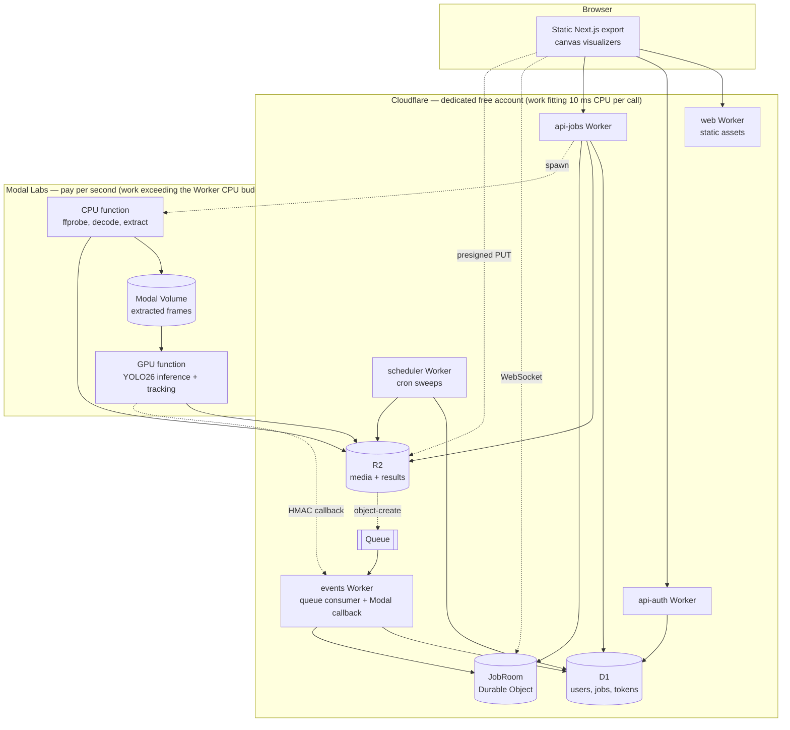
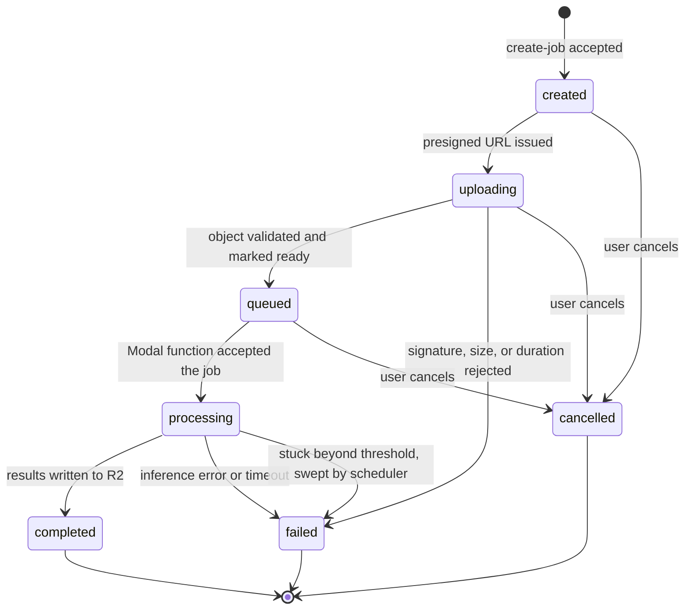

# SightForge Computer Vision Platform - Requirements

## Goal Capsule

- **Objective:** An authenticated user can upload an image or a short video, choose any of seven computer vision tasks, and see richly visualized structured results — on infrastructure that costs nothing at rest, scales to zero, and is reproducible from source.
- **Means:** Work that fits inside the 10 ms Worker CPU budget stays on the Cloudflare free plan (Workers, D1, R2, Durable Objects, Queues, cron); work that cannot fit moves to Modal Labs pay-per-use (CPU decode and probe, GPU inference).
- **Product authority:** Single-developer portfolio project. The evaluating audience is hiring managers and engineers assessing backend, full-stack, AI/ML, cloud, and infrastructure depth. No live public user base is expected; the system is nonetheless built to serve one.
- **Release shape:** One complete release. Every capability listed here ships in v1. There is no phased rollout and no deferred-to-v2 tier.
- **Open blockers:** None. All Outstanding Questions are classified `Deferred to Planning`.

---

## Product Contract

### Summary

SightForge is a serverless computer vision platform on Cloudflare and Modal Labs. Users register, upload images or clips of 30 seconds or less, configure one of seven YOLO26 tasks, and receive structured inference results pushed live over a WebSocket. The boundary between them is a CPU budget, not a CPU-versus-I/O split: Cloudflare keeps the work that fits inside 10 ms per invocation — token verification, the server-side fast hash, constant-time comparison, and leading-byte signature matching are deliberate in-budget exceptions — and Modal takes everything that cannot. The full monorepo — frontend, Workers, Modal functions, Terraform, and CI — ships under AGPL-3.0 with a documented permissive-model swap path.

### Problem Frame

A portfolio project is judged on whether its architecture holds up under questioning, not on feature count. Most machine learning demos fail that test in the same three places: they run one model behind a single always-on endpoint, they hand-wave authentication, and their infrastructure exists only as dashboard clicks nobody can reproduce.

The constraint that makes this project interesting is the budget. Cloudflare's free plan allows 10 ms of CPU per Worker invocation and 100,000 requests per day per account. That ceiling is low enough to eliminate the conventional answer to several problems at once — password hashing, media probing, and image decoding all exceed it — which forces an explicit compute boundary rather than an accidental one. Modal Labs supplies the compute on the other side of that boundary at roughly $0.00067 per three-second GPU inference against a $30 monthly credit, so the design pressure is architectural rather than financial.

The seven-task requirement compounds it. Detection, instance segmentation, semantic segmentation, classification, pose, oriented bounding boxes, and monocular depth have different output shapes, different eligibility for temporal tracking, and a roughly sevenfold spread in CPU latency. Treating them as one uniform "run the model" path would be the wrong abstraction, and the places where they genuinely diverge are where the design has to be explicit.

### Key Decisions

- **Ship the entire scope in a single release.** Time is not a constraint; a partial system does not demonstrate the thing being demonstrated. (session-settled: user-directed — chosen over phased delivery: v1 must contain every listed capability.)
- **Cloudflare free plan with Modal pay-per-use; no fixed monthly subscription.** Usage-priced compute is preferred over a recurring Workers Paid fee. (session-settled: user-directed — chosen over Workers Paid at $5/month: pay only for what is actually consumed.) Governs R2, R5, R70.
- **SightForge owns a dedicated Cloudflare account.** Free-plan quotas are account-scoped, so co-tenanting projects means one project's traffic can halt all of them. (session-settled: user-directed — chosen over sharing the operator's existing multi-project account: account is the only true isolation boundary Cloudflare offers below Enterprise.) Governs R1, R3.
- **YOLO26 is the sole model family, accepted under AGPL-3.0, behind a model-adapter interface.** No permissive family covers all seven tasks; the adapter records what would replace each one if the license ever became a constraint. (session-settled: user-directed — chosen over plain AGPL adoption, a private deployment, and a permissive-only multi-model stack: keeps the single-family story while making the license reversible.) Governs R34, R40, R107.
- **Password hardening runs in the browser; the Worker stores a fast hash.** No OWASP-grade KDF fits in 10 ms of Worker CPU, and this preserves offline brute-force cost regardless. (session-settled: user-directed — chosen over server-side scrypt on Workers Paid, a Modal hashing function, and passkeys: keeps custom email/password auth inside the free-plan budget without weakening the stored credential.) Governs R5, R6, R7.
- **Job status is pushed over a WebSocket held by a Durable Object.** Roughly two requests per job instead of thirty, against an account-wide daily cap. (session-settled: user-directed — chosen over adaptive polling: lower quota consumption and no polling lag.) Governs R29, R30.
- **The frontend is a static export served by Workers Static Assets.** Static asset requests are free and unlimited and consume none of the daily request budget. (session-settled: user-directed — chosen over `@opennextjs/cloudflare` SSR: zero request cost and no dependency on a deprecated or pre-production adapter.) Governs R53.
- **Video has two distinct modes with different defaults, not one shared frame rate.** Sampling that suits per-frame inference destroys tracking accuracy, so the two cannot share a default. (session-settled: user-directed — chosen over a single configurable rate: each mode gets defaults that are correct for it.) Governs R41, R42, R44.
- **Five Workers, split by who is allowed to call them.** The browser-facing API and the machine-facing callback have genuinely different authentication models. (session-settled: user-directed — chosen over two, three, or seven Workers: trust boundary is a more defensible split line than feature area.) Governs R3, R46.
- **Modal work is split into a CPU function and a GPU function within one App.** Video decode takes seconds and must not hold a GPU idle. (session-settled: user-approved — chosen over a single combined CPU+GPU function: the combined form is supported and cheap, but wastes accelerator time on I/O.) Governs R37, R38.
- **Workers are TypeScript; Python is confined to the inference service.** Each language sits where its runtime economics make sense rather than being unified for its own sake. (session-settled: user-directed — chosen over Python Workers for a single-language backend: Python Workers remain an open-beta interpreter on WebAssembly sharing the 128 MB isolate, against a 10 ms CPU ceiling.) Governs R120.
- **Production is the only deployed environment.** A second environment would consume a second free account and double the infrastructure and secret surface, for a project with no users to protect from a bad deploy. (session-settled: user-directed — chosen over separate dev and prod accounts: local emulation covers development, and infrastructure state is still keyed by environment so the decision stays reversible.) Governs R119.
- **Terraform manages only non-secret resources.** The Cloudflare provider offers no opt-in write-only argument pair, so any secret it manages is persisted to state. Governs R75, R80.
- **Sessions are hybrid, not purely stateless.** A short stateless access token avoids a database read per request; a stateful refresh token makes revocation real. Governs R8, R9.
- **Result payloads live in R2, never in D1.** D1 holds job metadata only, keeping it inside its 500 MB and daily-row ceilings. Governs R49, R50.

The compute boundary these decisions produce:

### Actors

A1. **Visitor** — unauthenticated. Can view the landing page, explore the public demo gallery, and register.

A2. **Authenticated user** — owns jobs, uploads media, configures and submits tasks, views results.

A3. **Operator** — the developer. Deploys, receives alerts, and holds the production approval gate.

A4. **Modal inference service** — a machine actor. Reads media, writes results, and calls back on completion. Authenticates by HMAC, never by user token.

A5. **Scheduler** — a machine actor. Enforces retention, detects stuck jobs, and evaluates alert conditions.

### Requirements

#### Platform and account topology

R1. SightForge runs in a Cloudflare account dedicated to it alone, created under the operator's existing login.

R2. Free-plan ceilings are treated as design constraints, recorded in the repository, and monitored against approach; the governing values are those below. The daily, storage, and cron rows are account-scoped and therefore shared across every Worker in the account, which is what makes account isolation load-bearing; the CPU, subrequest, script-size, and D1-query rows are per-invocation or per-script and reset on each Worker hop.

| Resource | Free-plan ceiling | Consequence for this design |

|---|---|---|

| Worker CPU per invocation | 10 ms | Sets the budget threshold; work exceeding it moves to Modal |

| Worker requests per day | 100,000 | Binds above roughly 3,300 jobs/day at 30 requests each; push keeps headroom |

| External subrequests per invocation | 50 | Bounds the event consumer's per-message fan-out |

| Cron triggers | 5 | Forces sweep consolidation into one Worker |

| Worker script, gzipped | 3 MB | Bounds per-Worker bundle size |

| D1 rows read / written per day | 5,000,000 / 100,000 | An indexed insert costs two writes |

| D1 queries per invocation | 50 | Bounds per-request query fan-out |

| D1 storage | 500 MB per database | Result payloads must live in R2 |

| Queue operations per day | 10,000 | Bounds upload-validation throughput |

| R2 storage | 10 GB | Sets the retention windows |

| Workers Logs per day, retained 3 days | 200,000 | Alerts cannot be evaluated from logs |

| Durable Object requests per day | 100,000 | A separate budget from the Worker request cap |

| Durable Object duration per day | 13,000 GB-s | Accrues while a socket is open unless hibernated |

R3. Every Cloudflare resource carries a `sightforge-` name prefix and an environment suffix, and the Worker set is exactly: `web`, `api-auth`, `api-jobs`, `events`, `scheduler`, plus two Durable Object classes — `JobRoom` for per-job live state and `Counter` for the per-subject rate-limit and quota counters that no other store can hold atomically.

R119. Production is the only deployed environment; development runs locally against the platform's local emulation. Infrastructure state is nonetheless keyed by environment from the outset, so adding a second environment later is additive rather than a state migration.

R120. Workers are written in TypeScript and the inference service in Python. No Worker is written in Python, because the Python Workers runtime is an interpreter compiled to WebAssembly that shares the 128 MB isolate and costs more CPU per unit of work than the 10 ms budget affords.

R4. The system degrades legibly rather than silently when a daily quota is exhausted: the static frontend detects a Cloudflare 1027 response or a Worker-bypassed route and renders an explicit capacity message, because no Worker-authored response is reachable in that state. The critical alert fires on the quota-approach condition before exhaustion, while the scheduled Worker can still be invoked.

#### Identity and session management

R5. The browser derives a key from the password using Argon2id in WebAssembly before transmission; the plaintext password never leaves the client.

R6. The pre-authentication salt lookup returns a salt for every syntactically valid email, deriving a deterministic HMAC-based pseudo-salt for addresses that are not registered, so the endpoint cannot be used to enumerate accounts. The response also carries the account's recorded derivation parameters — algorithm version, memory, iterations, and parallelism — which are stored per account at registration and re-recorded on any credential change, so the cost can be raised later without a forced reset. The client rejects any response whose parameters fall below a hardcoded floor, so the unauthenticated endpoint cannot be used to downgrade derivation cost.

R7. The server stores a salted fast hash of the client-derived value using a server-side random salt, so a database disclosure does not yield a replayable credential.

R8. Access tokens are stateless JWTs signed with a `kid`-tagged key, with a configurable time to live defaulting to 15 minutes, verified without a database read.

R9. Refresh tokens are stored server-side as hashes, rotate on every use, and a presented token that has already been consumed revokes its entire token family.

R10. Tokens are carried in a `__Host-`-prefixed, `HttpOnly`, `Secure`, `SameSite` cookie; no token is ever written to `localStorage` or `sessionStorage`.

R11. Registration validates email syntax and enforces a configurable password policy including a minimum length and a maximum length bound.

R12. Every authenticated endpoint verifies the token's signature, expiry, and pinned algorithm, rejecting tokens whose header declares any other algorithm.

R13. A user can read, modify, and delete only their own jobs, media, and results; ownership is checked on every access rather than inferred from an unguessable identifier.

R14. Failed authentication returns a single generic message and is throttled on both the target account and the request source, so neither a targeted lockout of a known account nor password spraying across many accounts falls outside every counter. The documented behavior states what a legitimate user experiences while their own account is under attack.

R15. Signing keys support a two-key overlap so a key can be rotated by deployment without invalidating live sessions.

R109. The client-derived credential value is treated as password-equivalent at every point before the server-side fast hash: it is never written to logs, error responses, analytics, or any store other than the hashing step, because it is directly replayable until hashed.

#### Media intake and validation

R16. Accepted formats are JPEG, PNG, and WebP for images, and MP4 with H.264 video for clips.

R17. Configurable limits default to 10 MB per image, 50 MB per video, and 30 seconds of video duration, and additionally bound maximum pixel dimensions and total pixel count, read from the image header and rejected before any full decode, so a small file cannot expand into an arbitrarily large decoded image. Every Modal function declares an explicit wall-clock timeout so a malformed input fails fast.

R18. Media is uploaded directly from the browser to R2 using a presigned PUT with a signed `Content-Type`, a short configurable expiry, and an object key chosen by the server that the client cannot influence.

R19. Object keys are user-scoped UUID paths; the client-supplied filename is never used as a key and is stored only as sanitized display metadata with paths stripped, unicode normalized, and traversal sequences rejected.

R20. Because R2 presigned PUT cannot express a maximum content length, size is enforced after upload from the size reported by the R2 event notification, and an oversized object is deleted and its job failed.

R21. Uploaded media is validated by reading its leading bytes and matching the format signature — `89 50 4E 47 0D 0A 1A 0A` for PNG, `FF D8 FF` for JPEG, `RIFF`/`WEBP` at offsets 0 and 8 for WebP, and `ftyp` at offset 4 for MP4 — with the declared content type treated as untrusted.

R22. Video duration and codec are confirmed authoritatively by `ffprobe` in the Modal CPU function before any GPU time is spent, with the Worker-side check acting only as a fast reject.

R23. A media object is not readable by inference or by the user until its database row is marked ready by the post-upload validator.

R24. An R2 lifecycle rule expires incomplete multipart uploads, and expires any object past a single conservative maximum age as a backstop independent of application logic. The rule matches on key prefix and object age only, because lifecycle rules cannot read object metadata or application state and the key is fixed at presign before validation status or job outcome exists.

#### Job lifecycle and status delivery

R25. A job moves through `created`, `uploading`, `queued`, `processing`, and terminates in `completed`, `failed`, or `cancelled`; no other states exist and no transition skips the terminal set.

R26. State transitions are written as a single D1 `batch()` call, because D1 rejects `BEGIN TRANSACTION` and `exec()` provides no rollback.

R27. Job creation accepts an `Idempotency-Key`, unique per user rather than globally, and replays the stored response for a repeated key, returns 422 when the same key arrives with a different request fingerprint, and returns 409 while the first request is still in flight.

R28. An idempotency lock is acquired by a single atomic insert against a unique constraint, never by a read followed by a write, and a lock whose lease has expired is reclaimable so a crashed invocation cannot wedge a key permanently.

R29. Job status reaches the browser over a WebSocket served by a per-job Durable Object, which holds the authoritative live state and fans out transitions as they occur, using the WebSocket Hibernation API so an idle connection accrues no duration against the daily budget.

R115. The WebSocket upgrade rejects any request whose `Origin` is not the frontend origin, and is authorized by a single-use, short-lived, job-scoped ticket issued after an ownership check rather than by the session cookie alone, because a handshake cannot carry the custom header the CSRF defense relies on.

R30. A polling status endpoint remains available as an automatic fallback when the WebSocket cannot be established, using adaptive backoff that widens as the job ages.

R31. Video jobs report progress as frames completed against frames total; image jobs report state only.

R32. The interface communicates serverless cold start honestly, showing an expected wait derived from the measured container start rather than an asserted figure, so the displayed estimate stays true as the image grows.

R33. A user can cancel a job that has not reached a terminal state, and cancellation is recorded rather than silently dropping the job.

#### Inference execution

R34. All seven tasks are supported: detection, instance segmentation, semantic segmentation, classification, pose estimation, oriented bounding box, and monocular depth estimation.

R35. The `ultralytics` dependency is floored at a version that carries every one of the seven tasks, since semantic segmentation and depth estimation were added after the initial YOLO26 release.

R36. Model variant is user-selectable per job across the available size tiers, with a configurable default per task.

R37. A Modal CPU function downloads the media, runs `ffprobe` validation, extracts frames at the mode's frame rate, and writes them to a Modal Volume, returning a manifest rather than the frames themselves.

R38. A Modal GPU function reads frames from the Volume, runs inference, writes structured results to R2, and reports completion; frames are never passed as function arguments, because Modal caps argument payloads well below the size of an extracted frame set.

R39. Model weights are held on a Modal Volume mounted into the inference container, not baked into the container image, because a parameterized inference class pools containers per task and an image carrying every task-by-variant weight would inflate every pool. The runtime must never fetch weights from an external registry on first use. Every weight is pinned to a specific published release and verified against a checksum recorded in the repository before it is written to the Volume, with the pipeline failing on mismatch, because checkpoints execute code when loaded.

R40. Inference is reached through a model-adapter interface that isolates YOLO26 behind a task-shaped contract. For each of the seven tasks the repository documents the full reversal surface, not the replacement model alone: the permissive model, the tracker substitution for the four tracking-eligible tasks, the class-vocabulary mapping, the pose skeleton topology, and the result-schema version bump each swap would require.

R117. At least one task ships a working non-default adapter implementation backed by its documented permissive alternative, exercised in the test suite, so the interface is proven against a second model rather than asserted to fit one.

R41. Per-frame video mode samples at a configurable rate defaulting within 2–10 frames per second, is available for all seven tasks, and produces independent results per frame with no identity across frames.

R42. Tracking mode runs at the source frame rate up to a configurable cap, is available only for detection, instance segmentation, pose, and oriented bounding box, and produces stable track identifiers.

R43. Classification, semantic segmentation, and depth estimation are per-frame only; the interface does not offer tracking for them and the API rejects the combination rather than silently ignoring it.

R44. Tracking configuration is derived from the effective frame rate rather than left at library defaults, because the tracker's buffer is measured in frames and a default tuned for 30 fps becomes an order of magnitude too permissive at low rates.

R45. Results record processing metadata: model variant, task, source frame rate, sampled frame rate, frames processed, inference duration, and container cold-start duration.

R46. The Modal completion callback is authenticated by an HMAC computed over the timestamp concatenated with the request body, so the timestamp cannot be advanced independently of the signature. Each callback carries a unique delivery identifier that is recorded and rejected on repeat, and a terminal transition is applied only from a non-terminal state, so a replay inside the time window cannot re-drive a completed, cancelled, or swept job. Two callback secrets are accepted concurrently during a rotation overlap window, so rotating the secret does not strand jobs already in flight across the third-party boundary.

R47. Inference failures are retried a configurable number of times before the job is marked failed, and the failure reason is recorded in a form the user can act on without exposing internals.

R48. GPU containers scale to zero; no container is kept warm, because a persistently warm accelerator would cost more per month than the entire compute budget.

R114. The task-by-variant weight matrix, wherever it is held, and the resulting container start cost are bounded by a declared cold-start budget, listed among the configurable operational values, so growth is a design input rather than a late discovery.

#### Result storage and retrieval

R49. Structured results are written to R2 as JSON under a user-scoped key, and D1 stores only the key, never the payload.

R50. Results are retrieved by the browser through a time-scoped, read-only presigned GET issued by the API after an ownership check.

R51. Every result document carries a schema version so the viewer can render older results after the shape evolves.

R52. Result documents for tracking mode are structured by track identity rather than as a flat per-frame list, so the payload remains navigable at hundreds of frames.

#### Frontend and visualization

R53. The frontend is a Next.js static export deployed to Workers Static Assets, with no server-rendered route on the critical path.

R54. The application provides a landing page, register and login pages, a job history dashboard with status and timestamps, a drag-and-drop upload interface with progress, a task configuration panel, and a results viewer.

R55. Each of the seven tasks has a purpose-built client-side visualization: boxes for detection, per-instance masks for instance segmentation, a per-pixel class overlay for semantic segmentation, a ranked label list for classification, a keypoint skeleton for pose, rotated quadrilaterals for oriented bounding boxes, and a colorized depth map with a metric scale.

R56. Tracking results render with persistent per-track color and identity across frames, so temporal association is visible rather than merely present in the data.

R57. A raw result inspector exposes the underlying JSON with structural navigation, so the structured output can be examined directly.

R58. Every view handles loading, error, and empty states explicitly, including the case where a job exists but its results have passed their retention window.

R59. The interface is responsive and degrades gracefully on mobile, where canvas overlays and the raw inspector are the constrained surfaces.

R60. The task configuration panel exposes every per-job configurable value — task, model variant, mode, frame rate, confidence threshold — rather than hiding defaults.

R116. An unauthenticated demo gallery is reachable in one click from the landing page, covering all seven tasks with pre-computed results rendered by the same viewer components and raw inspector as authenticated results, so an evaluator reaches a working result without registering or waiting on a cold start.

#### Accessibility

R61. The application meets WCAG 2.1 AA.

R62. Canvas overlays emit one focusable element per detected region as canvas fallback content in reading order, each named with class, confidence, position, and — in tracking mode — its track identifier, so assistive technology receives the temporal association that persistent color conveys to sighted users. This single mechanism carries keyboard access, focus visibility, and name/role/value together.

R63. Drawn overlays are dual-encoded so that color is never the sole carrier of meaning: class is conveyed by an attached text label and a line style, and masks by a distinguishable fill pattern rather than hue alone.

R64. Overlay strokes are drawn with a dark halo beneath a light stroke so that some contiguous edge maintains a 3:1 contrast ratio against arbitrary user imagery, whose adjacent color cannot be known in advance.

R65. Text drawn onto the canvas sits on an opaque label chip so its contrast is measured against a controlled background.

R66. Each visualization is accompanied by an equivalent data table outside the canvas element, grouped by track or by frame rather than rendered as one row per detection per frame.

#### Security controls

R67. CORS is restricted to the frontend origin; wildcard origins are never served on an authenticated endpoint.

R68. State-changing requests require a custom header, are rejected when `Sec-Fetch-Site` indicates a cross-site origin, and fall back to an `Origin` allow-list when fetch metadata is absent rather than failing open.

R69. No state-changing operation is reachable by GET.

R70. Rate limiting is enforced inside Workers against a durable counter, because the free plan provides a single edge rule limited to IP and path over a fixed ten-second window, which cannot express per-user or per-endpoint policy.

R71. Registration and login are protected by Turnstile.

R72. All API input is validated against an explicit schema at the boundary, and validation failure returns a structured error without echoing input.

R73. All user-controlled values are output-encoded at render time; result data is treated as untrusted when drawn or displayed.

R74. Secret comparison uses a constant-time primitive.

R110. Every HTML and API response carries a defined security header set: a Content-Security-Policy restricting script sources with no inline execution, Strict-Transport-Security, X-Content-Type-Options, a no-referrer Referrer-Policy, and a frame-ancestors restriction. The referrer policy is load-bearing because a presigned result URL is a bearer capability.

R111. A configurable per-user daily inference-job quota is enforced against the same durable counter as rate limiting, and a configurable cumulative inference spend ceiling halts new job dispatch and surfaces the same explicit capacity state as quota exhaustion, so open registration cannot drain the compute budget.

#### Secrets and configuration

R75. No secret value is committed to source, embedded at build time, or persisted to Terraform state.

R76. Secrets are injected out of band by CI after infrastructure apply, using the platform-native secret mechanism on each side.

R77. The repository documents a secret inventory naming every secret, its consumer, its least-privilege scope, its rotation procedure, and its injection path. The object-storage signing credential and the credentials issued to the inference service are scoped to a single environment's bucket with only the operations each side performs, so a disclosure does not bypass per-object ownership checks.

R78. Every operational value — token lifetimes, media limits, frame rates, retention windows, alert thresholds, model defaults, and rate limits — is configurable without a code change, with defaults declared in one place.

#### Infrastructure as code

R79. Terraform declares every Cloudflare resource whose lifecycle it can own: Worker shells, routes, D1, R2 with CORS and lifecycle rules, Queues, cron triggers, and rulesets. Two exclusions are recorded with their reasons rather than left implicit. Worker bindings are declared in each Worker's own deployment config, because the provider attaches bindings to the code version rather than the shell, so anything Terraform declared would be superseded by the next deploy. The Turnstile widget is created out of band, because the provider returns its secret key as a computed attribute that would otherwise be persisted to state, contradicting R80.

R80. Terraform declares no secret values; it manages resource existence and non-sensitive configuration only.

R81. Worker bundling is performed by Wrangler before Terraform applies, because the provider uploads module content verbatim rather than building it.

R82. Terraform state is held in a remote backend with locking, and the chosen backend is reachable at zero cost.

R83. Modal infrastructure is defined in Python decorators, which are the only definition mechanism Modal provides, and is deployed by CI rather than by Terraform.

R84. A documented bootstrap procedure covers the resources that must exist before the first Terraform apply, including account creation and the state backend itself.

#### CI/CD

R85. The frontend pipeline runs linting, type checking, unit tests, and the static export build.

R86. The Python pipeline runs `ruff`, `mypy`, and `pytest` across the inference service and shared Python utilities.

R118. The TypeScript pipeline runs linting, type checking, and unit tests for every Worker and shared package, executing Worker tests in a runtime-accurate harness rather than a plain Node environment, so behavior that depends on the Workers runtime is actually exercised.

R87. Dependency and secret scanning run on every pull request, and the pipeline fails on a detected secret.

R88. The Terraform pipeline runs `fmt`, `validate`, `tflint`, and Trivy in configuration-scan mode, and publishes the plan for review before apply. The scanner is named because two once-common choices are no longer maintained, and a scanner whose ruleset targets other cloud providers would produce noise rather than signal against a Cloudflare-only configuration.

R89. Production deployment is gated behind a GitHub Environment with the operator as a required reviewer, and deployment credentials are environment-scoped rather than repository-scoped.

R90. Workflows triggered by forked pull requests never receive deployment credentials, and the privileged path is separated from the untrusted-code path.

R91. Post-deployment smoke tests exercise registration, upload, an image inference job, and result retrieval against the deployed environment.

R92. Rollback is performed by redeploying a previously released commit, and the procedure is documented for both Cloudflare and Modal, because Modal managed rollback is unavailable on the plan in use and only a small number of prior versions are retained. The documented procedure is executed at least once against both platforms as a verification drill before the release is considered complete.

R93. Cloudflare and Modal credentials are long-lived API tokens stored as environment secrets, since neither platform accepts GitHub Actions OIDC for inbound authentication; the tokens are least-privilege and time-bounded where the platform allows.

#### Observability and alerting

R94. Every Worker and every Modal function emits structured JSON logs carrying a correlation identifier that follows a job across both platforms.

R95. Operational metrics are written to a durable analytics store rather than inferred from logs, because log retention on the free plan is short enough that alert evaluation cannot depend on it.

R96. Alerts are delivered to Slack by webhook and distinguish warning from critical severity.

R97. Alert conditions cover: inference failure rate above a threshold, Worker error rate spike, cleanup failure, a job stuck in a non-terminal state beyond its expected duration, approach of a daily account quota, and cumulative inference spend against remaining credit at both warning and critical thresholds.

R98. Alert evaluation runs on a schedule against the analytics store and the database, never against log search.

R99. Every alert names the affected job or resource and links to where the operator can act on it.

#### Data retention

R100. Input media is retained for a configurable period after job completion, defaulting to 7 days.

R101. Input media for failed jobs is retained for a longer configurable debug period, defaulting to 14 days.

R102. Completed results are retained for a configurable period, defaulting to 30 days.

R103. The scheduled database-driven sweep is authoritative for every state-dependent retention window, since those depend on job outcome and validation status that no lifecycle rule can see. The maximum-age lifecycle rule is the independent backstop beneath it, so an object orphaned by a failed database write is still reclaimed even though it is reclaimed later than the sweep would have.

R104. The scheduled work is consolidated into a single cron-triggered Worker that dispatches each sweep internally, because the free plan allows only five cron triggers per account.

R105. A user can delete their own job and its associated media and results before the retention window elapses.

R112. A user can delete their own account, cascading to every job, media object, result, refresh-token family, and idempotency record they own, with the same scheduled-sweep backstop that retention uses so an orphaned object is still reclaimed.

#### Repository and licensing

R106. The monorepo contains the frontend, the Worker packages, the Modal function package, shared utilities, Terraform configuration, test suites, CI definitions, container definitions, documentation, and development tooling.

R107. The repository is published under AGPL-3.0, and the running site links prominently to its source, satisfying the network-use obligation that the chosen model family carries. The repository records which packages inherit that obligation through the inference dependency and which carry the license by the author's election, so the compelled scope and the chosen scope are distinguishable.

R108. Documentation explains the client-side password derivation design and its rationale explicitly, so a reader evaluates it as a deliberate response to a platform constraint rather than as an error.

R113. The repository contains an architecture document covering the compute boundary rationale for each component, the per-job cost arithmetic with the calculation shown, and the specific free-plan constraint that forced each key decision.

### Key Flows

F1. Registration

- **Trigger:** A1 submits email and password on the register page.
- **Actors:** A1
- **Steps:** Turnstile verifies; the client generates the account salt and derives an Argon2id key; the browser transmits the derived value with the email; the Worker validates the email and policy, applies a server-side fast hash with a fresh random salt, and creates the user; a session is established and the visitor becomes A2.
- **Covers R5, R7, R10, R11, R71.**

F2. Login

- **Trigger:** A2 submits credentials.
- **Actors:** A2
- **Steps:** The client requests the salt for the email and always receives one; it derives the Argon2id key locally and submits it; the Worker recomputes the fast hash, compares in constant time, and on success issues an access token and a refresh token in cookies. Failure returns one generic message and increments an account-scoped throttle counter.
- **Covers R6, R8, R9, R14, R74.**

F3. Image inference, end to end

- **Trigger:** A2 selects an image, chooses a task and model variant, and submits.
- **Actors:** A2, A4, A5
- **Steps:** `api-jobs` creates a job under an idempotency key and returns a presigned PUT bound to a server-chosen key and content type; the browser uploads directly to R2 and opens a WebSocket to the job's Durable Object; R2 emits an object-create notification onto the Queue; `events` reads the leading bytes, checks the signature and the reported size, and marks the object ready; the job moves to queued and the Modal CPU function is spawned; the CPU function validates and stages the input, the GPU function runs inference and writes results to R2, then calls back to `events` with an HMAC-signed request; `events` records completion and the Durable Object pushes the terminal state; the browser fetches results through a presigned GET and renders them.
- **Covers R18, R20, R21, R23, R25, R27, R29, R37, R38, R46, R49, R50.**

F4. Video tracking job

- **Trigger:** A2 submits an MP4 with tracking mode on an eligible task.
- **Actors:** A2, A4
- **Steps:** As F3 through upload and validation; the CPU function runs `ffprobe` to confirm duration and codec, rejecting the job before any GPU spend if it fails; frames are extracted at the source rate up to the configured cap and written to a Volume; the GPU function runs inference with tracking configured for the effective frame rate and emits track-keyed results; progress is pushed as frames complete; the viewer renders persistent identity across frames.
- **Covers R22, R31, R42, R44, R45, R52, R56.**

F5. Scheduled maintenance

- **Trigger:** The single cron trigger fires on `scheduler`.
- **Actors:** A5, A3
- **Steps:** The Worker dispatches each sweep in turn — expire input media past its window, expire failed-job media past the debug window, expire results past their window, fail jobs stuck in a non-terminal state beyond threshold, reap consumed refresh tokens and expired idempotency records, and evaluate alert conditions against the analytics store and the database. Any triggered condition posts to Slack at its severity.
- **Covers R96, R97, R98, R100, R101, R102, R103, R104.**

### Acceptance Examples

AE1. **Covers R6.** Given no account exists for `nobody@example.com`, when the client requests the salt for it, then a well-formed deterministic salt is returned and the response is indistinguishable in shape and timing from that of a registered address.

AE2. **Covers R20.** Given a presigned PUT issued for a 10 MB image limit, when the client uploads a 40 MB object, then the upload itself succeeds at R2, the post-upload validator observes the reported size, deletes the object, and moves the job to `failed` with a size-limit reason.

AE3. **Covers R18.** Given a presigned PUT signed for `image/png`, when the client sends the request with `image/jpeg`, then R2 rejects the upload with a signature error and no object is created.

AE4. **Covers R43.** Given a user selects depth estimation, when they request tracking mode, then the API rejects the combination with an explicit message naming the four tracking-eligible tasks, rather than accepting the job and returning per-frame results.

AE5. **Covers R27, R28.** Given a job was created with idempotency key `K`, when the identical request arrives again after completion, then the stored response is replayed unchanged; when it arrives with a different payload under the same key, then 422 is returned; and when it arrives while the first is still in flight, then 409 is returned.

AE6. **Covers R9.** Given a refresh token has already been exchanged, when it is presented a second time, then the request is rejected and every token in its family is revoked, ending all sessions derived from that login.

AE7. **Covers R30.** Given the browser cannot establish a WebSocket, when a job is submitted, then the client transparently falls back to the polling status endpoint with backoff and the user sees the same progress states.

AE8. **Covers R25, R97.** Given a job has been `processing` beyond its expected duration, when the scheduler sweep runs, then the job is moved to `failed` with a timeout reason and a critical alert naming the job is posted to Slack.

AE9. **Covers R4.** Given the account's daily request quota is exhausted, when a user submits a job, then the static frontend recognizes the Cloudflare error response and renders an explicit capacity message rather than an opaque error. Given the quota is approaching exhaustion, when the scheduled evaluation runs, then a critical alert fires while Workers can still be invoked.

AE10. **Covers R58.** Given a completed job whose results have passed the retention window, when the user opens it, then the job and its metadata still render with an explicit expired-results state rather than an error or an empty viewer.

AE11. **Covers R62, R66.** Given a detection result is displayed, when the user navigates by keyboard alone, then focus moves through one element per detected region in reading order, each announcing class, confidence, and position, and the same data is reachable in a table outside the canvas.

AE12. **Covers R46.** Given a completion callback arrives at the public callback endpoint, when its HMAC signature is absent, malformed, or its timestamp falls outside the replay window, then the request is rejected and no job state changes. Given a validly signed callback is replayed inside its window, when its delivery identifier has already been recorded, then it is rejected and the job's terminal state is unchanged.

### Success Criteria

- A reader can reconstruct the whole system — every Cloudflare resource, every Modal function, every credential path — from the repository alone, without access to any dashboard.
- The compute boundary is defensible on questioning: for any piece of work, there is a stated reason it runs where it runs.
- Steady-state cost at zero traffic is zero, and the per-job cost is documented with the arithmetic shown.
- A first-time visitor reaches a rendered inference result without registering, waiting on a cold start, or reading instructions.
- Every one of the seven tasks is demonstrable end to end; none is stubbed, hidden behind a flag, or represented by a static sample.
- The result visualizations are operable and legible without sight or a mouse, which is part of what the evaluating audience assesses rather than an unstated personal standard.
- The AGPL obligation, the client-side hashing design, and the free-plan constraints that forced each are documented as deliberate decisions with their trade-offs stated.
- Recovery from a bad deploy is a documented procedure that has been executed at least once, not a theoretical capability.

### Scope Boundaries

#### Deferred for later

- A second deployed environment. Development runs locally; a staging environment would consume a second free Cloudflare account and double the infrastructure and secret surface. Infrastructure state is keyed by environment so this stays additive.
- A custom domain. Cloudflare-provided subdomains are used initially. Note that presigned URLs do not function on R2 custom domains, so introducing one affects media access paths rather than being purely cosmetic.
- Model training, fine-tuning, or dataset management. Pretrained weights only.
- Multi-user features: sharing, teams, public result links, or collaboration.
- Batch or bulk upload. One media item per job.

#### Outside this product identity

- Real-time or streaming inference. The system is asynchronous and job-shaped by design; live camera inference is a different product.
- A general-purpose inference API for third-party programmatic use. The audience is a human evaluating a demonstration.
- Tracking for classification, semantic segmentation, and depth estimation. This is a model-capability boundary, not a scheduling choice, and will not be worked around with a synthetic association layer.
- Paid tiers, quotas, or billing. There is no monetization surface.

### Dependencies and Assumptions

- The operator holds a Cloudflare login with at least seven days of tenure, which is required to create additional free accounts, and has fewer than five such accounts already.
- Ultralytics continues to publish YOLO26 weights for all seven tasks. Semantic segmentation and depth estimation are the newest two and carry more churn risk than the other five; the model-adapter interface (R40) is the hedge.
- Modal's Starter credit remains available. If it lapses, the architecture is unchanged and the cost becomes usage-priced from the first job.
- Cloudflare Queues, Workflows, and SQLite-backed Durable Objects remain on the free plan. All three moved to free recently enough that much third-party documentation still describes them as paid.
- Cold start, not inference, dominates per-job latency and cost. Design attention belongs on image build and weight placement rather than on model throughput.
- Some evaluating organizations prohibit installing or running AGPL-licensed software on employee workstations, so a portion of the intended audience may read the repository without cloning or running it.
- Traffic is low and bursty, assumed under 100 jobs per day. No requirement assumes sustained concurrency, and no design element is justified by scale. The quota-derived rationales demonstrate designing against a declared ceiling rather than responding to measured load; the ceilings themselves do not bind at this traffic.

### Outstanding Questions

#### Deferred to Planning

- What is the accessible equivalent for continuous per-pixel outputs — depth estimation and semantic segmentation — given that the per-region focusable mechanism and the per-detection table both assume discrete regions that neither task produces?
- Does a video job that fails partway expose the frames already processed, or is partial output always discarded? The progress display makes partial work visible while it runs, so the terminal state needs a stated answer either way.
- Should object keys be partitioned by lifecycle state so differentiated retention windows become expressible as lifecycle rules? That would require copy-and-delete on every state transition and would invalidate the keys already recorded against the job, which is why the sweep owns those windows instead.
- Which remote state backend to adopt, and whether object-storage-native locking behaves correctly against R2 in practice. Both candidate backends are free; the choice turns on a locking test that planning can run in minutes.
- Whether to adopt Terraform or OpenTofu. The licensing difference does not affect a solo project; the choice is ergonomic.
- The exact frame-extraction library. Timestamp fidelity varies significantly between the candidates, and the choice matters only if per-detection source timestamps are stored rather than frame indices.
- Whether to enable Modal's GPU memory snapshotting. It is an alpha capability with substantial published cold-start gains, and cold start is the dominant cost.
- Whether the confidence threshold and non-maximum-suppression settings are exposed per task or shared across tasks.
- The precise Argon2id parameters for the browser, balancing derivation time on a low-end mobile device against resistance.
- Whether the polling fallback shares the Durable Object as its state source or reads the database directly.

### Sources and Research

Research dossiers backing this contract, with per-claim source URLs, are retained outside the repository at the paths below. Twenty load-bearing platform claims were independently re-verified against primary sources before this document was written; eighteen confirmed, one narrowed, one identified as inference rather than documented fact.

- YOLO26 task coverage, per-task CPU and GPU latency, tracking eligibility, checkpoint sizes, export formats, and AGPL-3.0 obligations — `sightforge/yolo26.md`.
- Cloudflare free-plan limits across Workers, D1, R2, Queues, Workflows, Durable Objects, static assets, edge security, secrets, observability, account isolation, Terraform provider coverage, and Workers AI — `sightforge/cloudflare.md`.
- Modal Labs pricing and credits, CPU and GPU function composition, cold-start behavior and mitigations, invocation and callback patterns, limits, R2 integration, deployment and environments, and alternatives — `sightforge/modal.md`.
- Password hashing on Workers, JWT and session guidance, CSRF, presigned-upload validation, frame sampling versus tracking accuracy, idempotency, zero-cost Terraform state, GitHub Actions on public repositories, and WCAG 2.1 AA for canvas visualizations — `sightforge/security-ops.md`.

Key external authorities this contract binds to rather than restates: the OWASP Password Storage, Session Management, Cross-Site Request Forgery Prevention, Authentication, and File Upload cheat sheets; RFC 9700 for refresh token rotation and reuse detection; WCAG 2.1 AA success criteria 1.1.1, 1.4.1, 1.4.3, 1.4.11, 2.1.1, 2.4.7, and 4.1.2; the WHATWG canvas fallback-content requirement; and the Ultralytics licensing terms.
