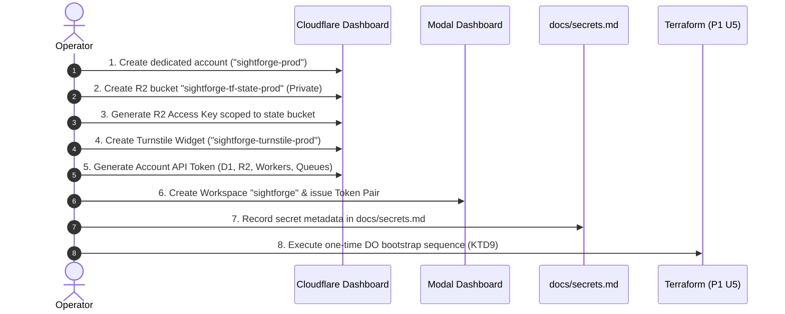

# Cloudflare & Modal Bootstrap Runbook

> **Scope:** Plan 1, Unit 4 (P1 U4)  
> **Requirements:** R1, R2, R3, R75, R76, R77, R79, R82, R84, R119, KTD4, KTD7, KTD9  
> **Classification:** Operational Runbook (Non-secret identifiers, scopes, and procedures only. Never commit credentials, recovery codes, or operator email addresses to this repository.)

---

## 1. Overview & Prerequisite Architecture

SightForge runs entirely within a dedicated Cloudflare free-tier account (`R1`) and a dedicated Modal workspace. Infrastructure is declared using Terraform (`P1 U5`), but foundational resources required to host Terraform's remote state backend and out-of-band credentials cannot provision themselves and must be bootstrapped first (`R84`).

### Free-Plan Design Ceilings (R2)

Operational ceilings for the Cloudflare free tier are declared in [`config/defaults.json`](../../config/defaults.json) and serve as strict design constraints:

| Resource                    | Free-Plan Ceiling        | Operational Impact / Mitigation                                                            |
| :-------------------------- | :----------------------- | :----------------------------------------------------------------------------------------- |
| **Worker CPU Time**         | 10 ms / invocation       | TypeScript compute strictly bounded; heavy inference offloaded to Modal (`R120`).          |
| **Worker Invocations**      | 100,000 requests / day   | Monitored via Analytics Engine; rate limits enforced via `Counter` Durable Object (`R70`). |
| **D1 Database Writes**      | 100,000 writes / day     | Minimal indexing ($1+N$ write budget); batch state transitions (`R26`).                    |
| **D1 Database Reads**       | 5,000,000 reads / day    | Cache-Control on public assets; point lookups by primary key / indexed fields.             |
| **D1 Storage Capacity**     | 500 MB (524,288,000 B)   | Job payload JSON and dense artifacts stored in R2, never in D1 (`KTD11`).                  |
| **R2 Storage Capacity**     | 10 GB (10,737,418,240 B) | Automated lifecycle rule expiring media and artifacts (`R24`).                             |
| **Cloudflare Queues**       | 10,000 operations / day  | Batched queue message consumption in `apps/events`.                                        |
| **Durable Object Duration** | 13,000 GB-s / day        | Ephemeral in-memory state; DO alarms hibernate idle rooms (`R46`).                         |

---

## 2. Step-by-Step Account Bootstrap Procedure



### Step 1: Create Dedicated Cloudflare Account (R1)

1. Log in to the Cloudflare dashboard using your existing operator credentials.
2. From the account dropdown, select **Add Account**.
3. Set the account name to `sightforge-prod`.
4. Select the **Free Plan**.
5. Navigate to **Account Settings > General** and copy the **Account ID**.
6. Store the Account ID in your local environment configuration (`CLOUDFLARE_ACCOUNT_ID`). _(Note: Account ID is a non-sensitive resource identifier)._

### Step 2: Create Private R2 Terraform State Bucket (R82, KTD4)

Because Terraform cannot create the backend bucket it uses to store its own state, create the state bucket manually:

1. Navigate to **R2 Object Storage > Overview > Create Bucket**.
2. Set Bucket Name to: `sightforge-tf-state-prod`.
3. **Security Settings (Mandatory):**
   - **Public Access:** Disabled (Do not enable "R2.dev subdomain" or custom domains).
   - **CORS Policy:** None (Do not add any CORS rules to the state bucket).
   - **Access Controls:** Private access only.

### Step 3: Issue Scoped R2 Access Key for Terraform State

1. In the R2 Overview, select **Manage R2 API Tokens > Create API Token**.
2. Set Token Name: `sightforge-tf-state-backend-key`.
3. Set Permissions: **Object Read & Write**.
4. Set Bucket Scoping: **Apply to specific buckets only** > Select `sightforge-tf-state-prod`.
5. Set TTL: Forever (or per organizational rotation schedule).
6. Copy the generated **Access Key ID** and **Secret Access Key**.
7. Store securely for Terraform backend initialization (`R2_ACCESS_KEY_ID`, `R2_SECRET_ACCESS_KEY`).

### Step 4: Create Cloudflare Turnstile Widget Out-of-Band (KTD7, R79, R80)

_Reason for Manual Provisioning:_ The Cloudflare Terraform provider returns the Turnstile secret key as a computed attribute in plaintext state files. To ensure Terraform state remains 100% secret-free (`R75`, `R80`), Turnstile is created out of band:

1. Navigate to **Turnstile > Add Site**.
2. Set Site Name: `sightforge-turnstile-prod`.
3. Set Domain: Add production frontend domain (and `localhost` for testing).
4. Set Widget Mode: **Managed** (Interactive challenge when needed).
5. Save the widget and record:
   - **Site Key (Public):** Configured in `apps/web` environment (`NEXT_PUBLIC_TURNSTILE_SITE_KEY`).
   - **Secret Key (Confidential):** Injected directly into `apps/api-auth` platform secrets (`TURNSTILE_SECRET_KEY`).

### Step 5: Issue Least-Privilege Cloudflare API Token (R77)

Create an account-level API token for Terraform and deployment tooling:

1. Navigate to **My Profile > API Tokens > Create Token > Custom Token**.
2. Set Token Name: `sightforge-deploy-token-prod`.
3. Configure the following **Account Permissions**:
   - `Account.Account Settings`: Read
   - `Account.D1`: Edit
   - `Account.R2 Storage`: Edit
   - `Account.Workers Scripts`: Edit
   - `Account.Workers Routes`: Edit
   - `Account.Workers KV Storage`: Edit
   - `Account.Workers Queue`: Edit
   - `Account.Account Rulesets`: Edit
   - `Account.Pipelines`: Edit _(for Analytics Engine)_
4. Account Resources: **Include > Specific Account > `sightforge-prod`**.
5. Create the token and record it as `CLOUDFLARE_API_TOKEN`.

### Step 6: Create Modal Workspace & API Tokens

1. Log in to [Modal](https://modal.com/) and create a dedicated workspace named `sightforge`.
2. Run `modal token new` or navigate to **Settings > API Tokens > New Token**.
3. Record the generated **Token ID** (`MODAL_TOKEN_ID`) and **Token Secret** (`MODAL_TOKEN_SECRET`).
4. These credentials allow CI and `apps/api-jobs` to dispatch GPU computer vision workloads.

---

## 3. The One-Time Durable Object Bootstrap Sequence (KTD9)

> **CRITICAL ARCHITECTURAL CONSTRAINT (KTD9):**  
> Cloudflare Workers requires that a Durable Object class must be uploaded in a deployed script before another Worker version can bind to its namespace. Attempting to deploy code with a binding before the target class is uploaded causes deployment failure.
>
> This cycle is resolved **once, by hand, at initial bootstrap** via the four edits below. This sequence must **NEVER** be incorporated into automated CI/CD pipelines.

```text
[Step 1: Export Class] ---> [Step 2: Deploy Shell] ---> [Step 3: Bind Namespace] ---> [Step 4: Re-Deploy]
```

### The 4-Step Bootstrap Sequence:

1. **Step 1 — Prepare Class Export & Exclude Binding:**
   - Verify [`packages/worker-kit/src/index.ts`](../../packages/worker-kit/src/index.ts) exports the `JobRoom` and `Counter` class stubs.
   - In [`apps/api-jobs/wrangler.jsonc`](../../apps/api-jobs/wrangler.jsonc), ensure DO migration block is present:
     ```jsonc
     "migrations": [{ "tag": "v1", "new_classes": ["JobRoom"] }]
     ```
   - Ensure any `durable_objects.bindings` in consuming configurations are temporarily commented out.

2. **Step 2 — Initial Class Upload:**
   - Deploy the Worker exporting the class:
     ```bash
     pnpm --filter sightforge-api-jobs exec wrangler deploy
     ```
   - Cloudflare registers the `JobRoom` export and provisions the DO class namespace.

3. **Step 3 — Enable Durable Object Bindings:**
   - In `apps/api-jobs/wrangler.jsonc`, uncomment the DO binding:
     ```jsonc
     "durable_objects": {
       "bindings": [
         { "name": "JOB_ROOM", "class_name": "JobRoom" }
       ]
     }
     ```
   - In `apps/api-auth/wrangler.jsonc`, configure the `Counter` DO binding if applicable.

4. **Step 4 — Final Deployment with Bound Namespace:**
   - Re-deploy the Workers:
     ```bash
     pnpm --filter sightforge-api-jobs exec wrangler deploy
     pnpm --filter sightforge-api-auth exec wrangler deploy
     ```
   - The namespace binding is now permanently bound. All future automated deployments (`P1 U6`, CI/CD) apply cleanly without repeating this sequence.

---

## 4. Verification Checklist

Before proceeding to **Plan 1, Unit 5 (Terraform Root & Worker Module)**, verify that:

- [ ] Cloudflare account `sightforge-prod` exists and Account ID is recorded.
- [ ] R2 bucket `sightforge-tf-state-prod` is created with private access and no CORS.
- [ ] R2 Access Key with scoped read/write permissions to the state bucket is generated.
- [ ] Turnstile widget `sightforge-turnstile-prod` is created; Site Key and Secret Key are inventoried.
- [ ] Cloudflare API token with minimal permissions is issued.
- [ ] Modal workspace `sightforge` and proxy tokens are generated.
- [ ] Secret inventory in [`docs/secrets.md`](../secrets.md) is updated.
- [ ] Zero secret values are committed to Git or stored in Terraform configuration files.
